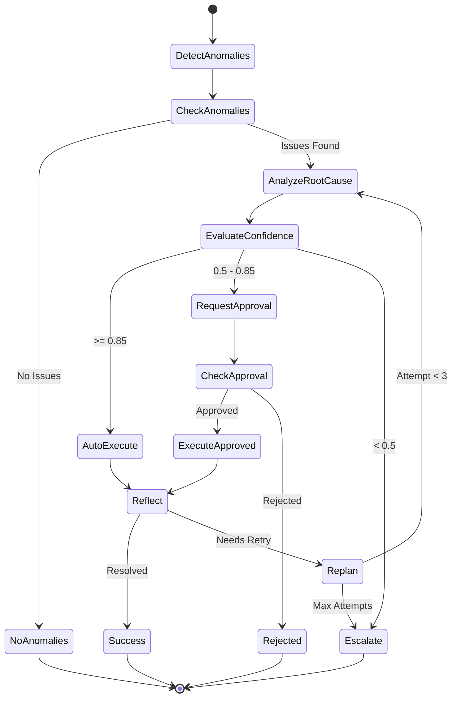

# BDP Agent

AWS Lambda 기반 서버리스 로그 분석 및 자동 복구 에이전트

## Overview

BDP Agent는 AWS 인프라의 로그를 주기적으로 분석하여 이상을 감지하고, LLM을 활용해 근본 원인을 분석한 후, 신뢰도 기반으로 자동 또는 수동 복구를 수행하는 지능형 에이전트입니다.

### Provider 구성

#### LLM Provider

| 환경 | Provider | 모델 | 용도 |
|------|----------|------|------|
| **On-Premise** | vLLM | 자체 호스팅 LLM | 프로덕션 분석 |
| **Public (Mock)** | Google Gemini | Gemini 2.5 Pro/Flash | 개발/테스트 |
| **로컬 테스트** | Mock LLM | 내장 Mock | AWS/LLM 없이 로직 테스트 |

#### AWS Provider

| 환경 | Provider | 용도 |
|------|----------|------|
| **Production** | AWS | 실제 AWS 서비스 호출 |
| **Public/로컬** | Mock | AWS 없이 전체 로직 테스트 |

### 주요 기능

- **LangGraph Agent**: 동적 ReAct 루프 기반 분석 에이전트
- **주기적 로그 감지**: 5-10분 간격으로 CloudWatch 및 RDS 통합 로그 분석
- **AI 기반 근본 원인 분석**: vLLM 또는 Gemini를 활용한 ReAct 패턴 분석
- **신뢰도 기반 자동화**:
  - 0.85+ : 자동 실행
  - 0.5-0.85 : 승인 요청
  - <0.5 : 재분석 필요
- **AWS 리소스 조정**: Lambda 재시작, RDS 파라미터 변경, Auto Scaling 조정
- **EventBridge 알림**: 외부 시스템 연동 (Slack, Teams 등)

## Architecture

### Hybrid Orchestration (Step Functions + LangGraph)

```
┌──────────────────────────────────────────────────────────────────────────┐
│                            MWAA (Airflow DAG)                             │
└─────────────────────────────────┬────────────────────────────────────────┘
                                  │
                                  ▼
┌──────────────────────────────────────────────────────────────────────────┐
│                    Step Functions (Outer Orchestration)                   │
│                                                                           │
│  ┌──────────┐      ┌────────────────────────────────┐      ┌───────────┐ │
│  │ Detect   │─────▶│     LangGraph Agent            │─────▶│ Execute   │ │
│  │ Anomaly  │      │     (Analysis Lambda)          │      │ Actions   │ │
│  └──────────┘      │  ┌──────────────────────────┐  │      └───────────┘ │
│       │            │  │      ReAct Loop          │  │           │        │
│       │            │  │  Think → Act → Observe   │  │           ▼        │
│       │            │  │    ▲              │      │  │     ┌───────────┐  │
│       │            │  │    └── Reflect ◀──┘      │  │     │ Reflect   │  │
│       │            │  └──────────────────────────┘  │     │ & Replan  │  │
│       │            │                                │     └─────┬─────┘  │
│       │            │  Tools: CloudWatch, RDS,       │           │        │
│       │            │         KnowledgeBase          │     ◀─────┘        │
│       │            └────────────────────────────────┘                    │
└───────┼──────────────────────────────────────────────────────────────────┘
        │
        ▼
┌──────────────┐  ┌──────────────┐  ┌──────────────┐
│  CloudWatch  │  │  vLLM/Gemini │  │  EventBridge │
│  + RDS Logs  │  │    (LLM)     │  │    (알림)    │
└──────────────┘  └──────────────┘  └──────────────┘
```

**핵심 설계 원칙**:
- **Step Functions**: 외부 워크플로우 오케스트레이션 (감지 → 분석 → 실행 → 승인)
- **LangGraph Agent**: 내부 동적 분석 (ReAct 루프, 도구 호출, 신뢰도 평가)

### 워크플로우 상세



## Project Structure

```
bdp-agent/
├── docs/
│   ├── ARCHITECTURE.md      # 상세 아키텍처 문서
│   ├── PROMPTS.md           # 프롬프트 템플릿 설계
│   ├── COST_OPTIMIZATION.md # 비용 최적화 전략
│   └── IMPLEMENTATION_GUIDE.md # 구현 가이드
├── examples/
│   ├── handlers/            # Lambda 핸들러 예제
│   ├── prompts/             # 프롬프트 템플릿
│   └── services/            # 비즈니스 로직 서비스
├── src/                     # 실제 구현 코드
├── step_functions/          # Step Functions 워크플로우
│   └── bdp_workflow.asl.json
├── infra/cdk/               # CDK 인프라 코드
└── tests/                   # 테스트 코드
```

## Quick Start

### Prerequisites

- Python 3.12+
- AWS CLI configured
- AWS CDK 2.x

### Installation

```bash
# 1. Clone repository
git clone https://github.com/lks21c/bdp-agent.git
cd bdp-agent

# 2. Create virtual environment
python -m venv .venv
source .venv/bin/activate  # Linux/Mac
# .venv\Scripts\activate   # Windows

# 3. Install dependencies
pip install -r requirements.txt

# 4. Deploy infrastructure
cd infra/cdk
cdk deploy
```

### Configuration

#### Environment Variables

**Mock Mode (Public/Local Testing)**

| Variable | Description | Default |
|----------|-------------|---------|
| `AWS_MOCK` | AWS Mock 모드 활성화 (`true`/`false`) | `false` |
| `LLM_MOCK` | LLM Mock 모드 활성화 (`true`/`false`) | `false` |

**LLM Configuration**

| Variable | Description | Default |
|----------|-------------|---------|
| `LLM_PROVIDER` | LLM 제공자 (`vllm` 또는 `gemini`) | `vllm` |
| `VLLM_BASE_URL` | vLLM 서버 엔드포인트 (On-Prem) | `http://localhost:8000/v1` |
| `VLLM_MODEL_NAME` | vLLM 모델 이름 | Required (vllm 사용 시) |
| `GEMINI_API_KEY` | Gemini API 키 (Public Mock) | Required (gemini 사용 시) |
| `GEMINI_MODEL_ID` | Gemini 모델 ID | `gemini-2.5-flash` |

**AWS Configuration**

| Variable | Description | Default |
|----------|-------------|---------|
| `RDS_CLUSTER_ARN` | RDS Aurora Serverless 클러스터 ARN | Required (AWS 모드) |
| `RDS_SECRET_ARN` | RDS 접속 정보가 담긴 Secrets Manager ARN | Required (AWS 모드) |
| `RDS_DATABASE` | 데이터베이스 이름 | `unified_logs` |
| `DEDUP_TABLE` | DynamoDB 중복 제거 테이블 이름 | `bdp-anomaly-tracking` |

**Quick Start for Mock Mode**

```bash
# AWS와 LLM 없이 로컬에서 로직 테스트
export AWS_MOCK=true
export LLM_MOCK=true
python -m examples.services.aws_client  # AWS Mock 테스트
python -m examples.services.llm_client  # LLM Mock 테스트
```

#### DynamoDB Tables

| Table | Purpose | Key |
|-------|---------|-----|
| `bdp-anomaly-tracking` | 중복 제거 (TTL 7일) | `signature` |
| `bdp-workflow-state` | 워크플로우 상태 | `workflow_id`, `timestamp` |
| `bdp-remediation-history` | 감사 로그 | `remediation_id` |

## Lambda Functions

| Function | Memory | Timeout | Description |
|----------|--------|---------|-------------|
| `bdp-detection` | 512MB | 60s | 로그 이상 감지 |
| `bdp-analysis` | 1024MB | 120s | Bedrock 근본 원인 분석 |
| `bdp-remediation` | 512MB | 60s | 복구 조치 실행 |
| `bdp-approval` | 256MB | 30s | 승인 요청 처리 |
| `bdp-notification` | 256MB | 30s | EventBridge 알림 |

## Cost Estimation

### Monthly Cost (~$11/month for 1M events, excluding LLM)

| Component | Cost |
|-----------|------|
| Lambda (ARM64) | ~$5 |
| Step Functions | ~$3 |
| DynamoDB (On-demand) | ~$2 |
| EventBridge | ~$1 |

### LLM 비용

| Provider | 환경 | 비용 모델 |
|----------|------|----------|
| **vLLM (On-Prem)** | 프로덕션 | 자체 인프라 비용 (GPU 서버) |
| **Gemini 2.5 Pro** | Mock/개발 | ~$0.00125/1K input, ~$0.005/1K output |
| **Gemini 2.5 Flash** | Mock/개발 | ~$0.00015/1K input, ~$0.0006/1K output |

### Cost Optimization Strategies

1. **CloudWatch Field Indexing**: 67% 스캔 비용 감소
2. **Hierarchical Summarization**: 80-90% 토큰 절감
3. **ARM64/Graviton2**: 20-34% Lambda 비용 절감
4. **Provisioned Concurrency**: Cold start 제거 (MWAA 트리거 사용 시)

## Confidence-Based Decision Flow

| Confidence | Action | Use Case |
|------------|--------|----------|
| >= 0.85 | Auto Execute | 명확한 원인, 안전한 조치 |
| 0.5 - 0.85 | Request Approval | 중간 확신, 리스크 있는 조치 |
| < 0.5 | Escalate | 추가 분석 필요 |

## Supported Remediation Actions

- `lambda_restart`: Lambda 함수 재시작
- `rds_parameter`: RDS 파라미터 변경
- `auto_scaling`: Auto Scaling 설정 조정
- `eventbridge_event`: 이벤트 발행 (알림)
- `investigate`: 추가 정보 수집 요청

## Documentation

- [Architecture Guide](docs/ARCHITECTURE.md) - 상세 시스템 아키텍처
- [Prompt Templates](docs/PROMPTS.md) - AI 프롬프트 설계
- [Cost Optimization](docs/COST_OPTIMIZATION.md) - 비용 최적화 전략
- [Implementation Guide](docs/IMPLEMENTATION_GUIDE.md) - 단계별 구현 가이드

## Development

### Running Tests

```bash
# Unit tests
pytest tests/unit/

# Integration tests
pytest tests/integration/

# All tests with coverage
pytest --cov=src tests/
```

### Code Quality

```bash
# Linting
ruff check src/

# Type checking
mypy src/

# Formatting
black src/
```

## Contributing

1. Fork the repository
2. Create a feature branch (`git checkout -b feature/amazing-feature`)
3. Commit your changes (`git commit -m 'feat: Add amazing feature'`)
4. Push to the branch (`git push origin feature/amazing-feature`)
5. Open a Pull Request

## License

This project is licensed under the MIT License - see the [LICENSE](LICENSE) file for details.
