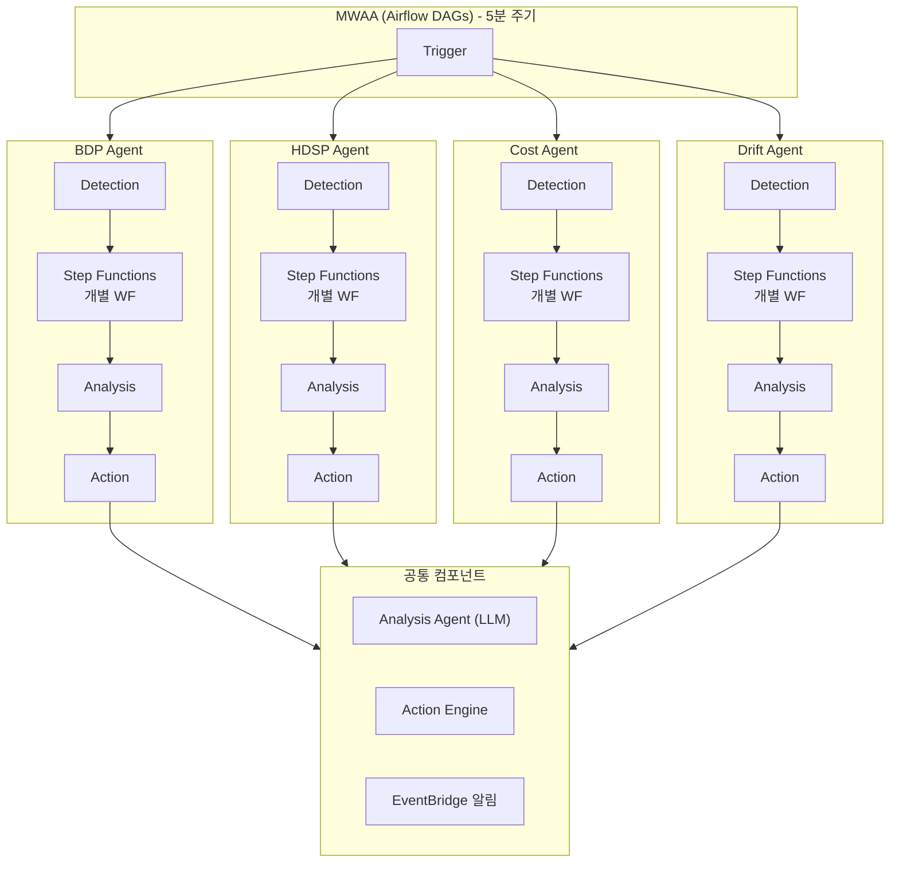
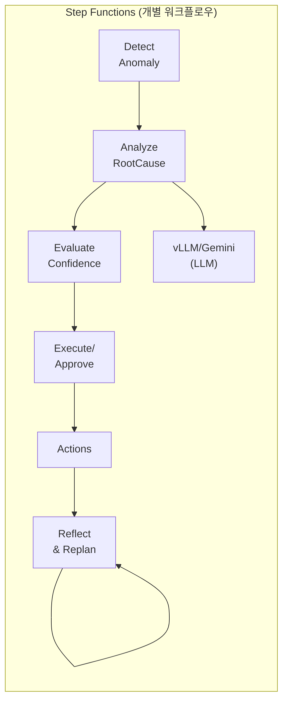
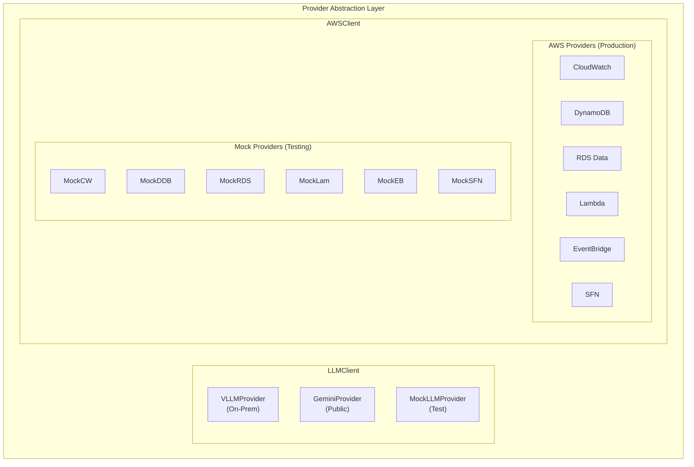
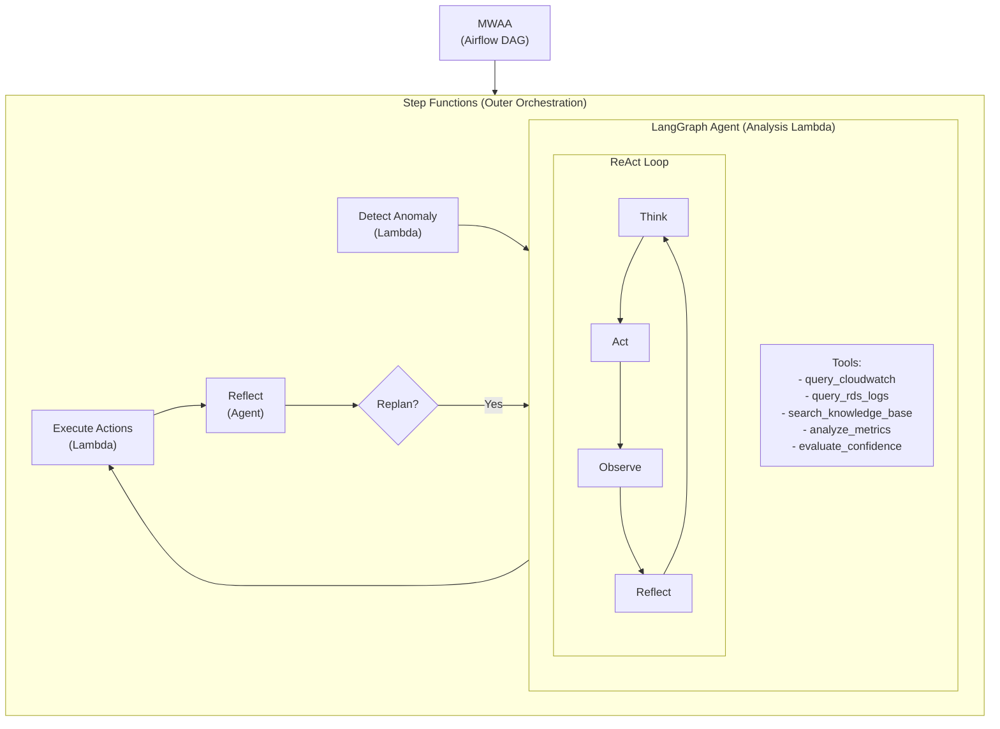
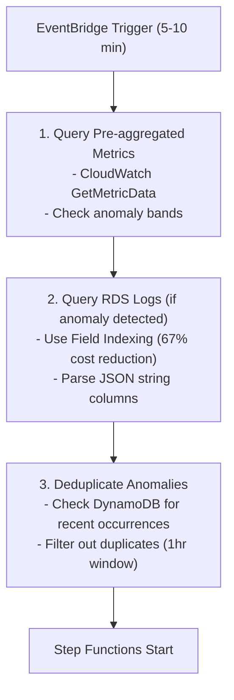
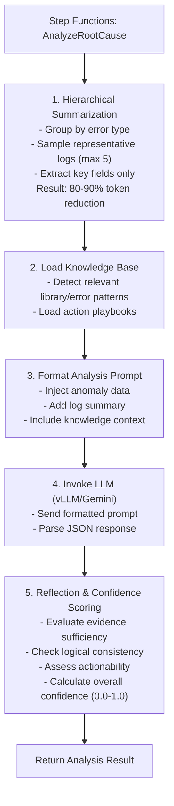
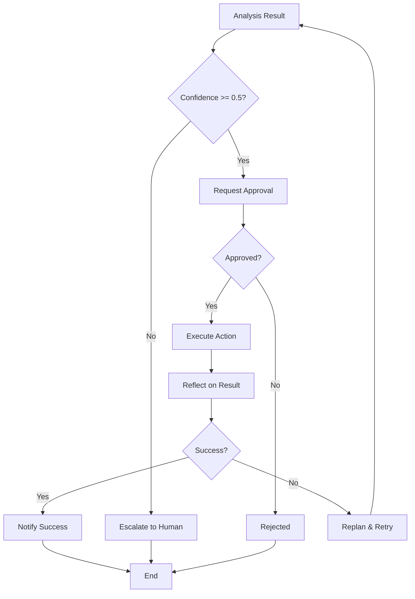
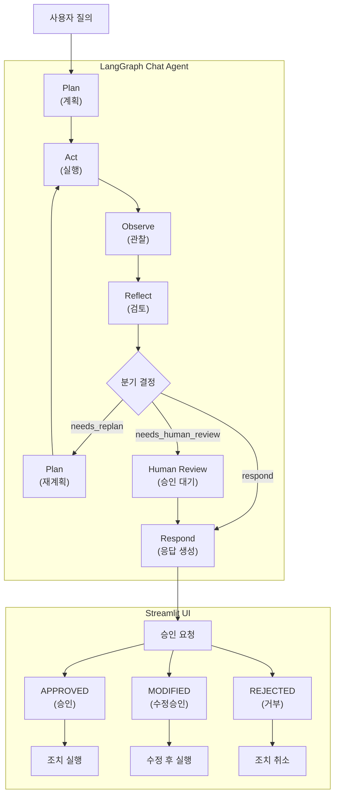

# BDP Agent Architecture

## Overview

BDP (Big Data Platform) Agent는 AWS Lambda 기반 서버리스 아키텍처로 구현된 **멀티 에이전트 이상 탐지 및 자동 복구 플랫폼**입니다.

### 멀티 에이전트 아키텍처

BDP Agent는 **4개의 독립적인 서브 에이전트**로 구성되어 있으며, 각 에이전트는 MWAA(Airflow)에서 5분 주기로 개별 호출됩니다.

| Agent | 대상 | 탐지 방식 | Lambda |
|-------|------|----------|--------|
| **BDP Agent** | AWS 인프라 | CloudWatch Logs/Metrics | `bdp-detection` |
| **HDSP Agent** | On-Prem K8s | Prometheus 메트릭 | `bdp-hdsp-detection` |
| **Cost Agent** | AWS 비용 | Cost Explorer + Luminol | `bdp-cost-detection` |
| **Drift Agent** | AWS 설정 | Git Baseline 비교 | `bdp-drift-detection` |

각 에이전트는 **독립적인 Step Functions 워크플로우**를 통해 탐지 → 분석 → 복구 조치를 수행합니다.

### Provider Abstraction Pattern

BDP Agent는 Provider Abstraction 패턴을 사용하여 LLM과 AWS 서비스를 추상화합니다. 이를 통해 프로덕션(On-Premise/AWS)과 테스트(Public/Mock) 환경에서 동일한 코드로 동작합니다.

#### LLM Provider

| 환경 | Provider | 설명 | 환경 변수 |
|------|----------|------|----------|
| **On-Premise** | VLLMProvider | 자체 호스팅 LLM 서버 (OpenAI Compatible API) | `LLM_PROVIDER=vllm` |
| **Public** | GeminiProvider | Google Gemini 2.5 Pro/Flash API | `LLM_PROVIDER=gemini` |
| **Mock** | MockLLMProvider | 테스트용 내장 Mock | `LLM_MOCK=true` |

#### AWS Provider

| 환경 | Provider | 설명 | 환경 변수 |
|------|----------|------|----------|
| **Production** | AWS*Provider | 실제 AWS 서비스 호출 | (기본값) |
| **Mock** | Mock*Provider | AWS 없이 로직 테스트 | `AWS_MOCK=true` |

**Mock 지원 AWS 서비스:**
- CloudWatch (Metrics, Logs, Anomaly Detection)
- DynamoDB (Deduplication, Workflow State)
- RDS Data API (Unified Logs)
- Lambda (Function Invocation)
- EventBridge (Event Publishing)
- Step Functions (Workflow Execution)

### 핵심 특징
- **LangGraph Agent**: 동적 ReAct 루프, Reflect & Replan 패턴
- **하이브리드 오케스트레이션**: Step Functions (외부 워크플로우) + LangGraph (내부 에이전트)
- **승인 기반 실행**: 모든 조치는 승인 후 실행 (0.5+ 승인 요청, <0.5 에스컬레이션)
- **비용 최적화**: Field Indexing, Hierarchical Summarization, Deduplication
- **서버리스**: Lambda + Step Functions + MWAA

---

## System Architecture

### 멀티 에이전트 오케스트레이션



### 개별 에이전트 워크플로우



---

## Component Details

### 1. Detection Layer (에이전트별)

#### 1.1 BDP Agent - AWS 로그/메트릭 감지

| Lambda | 속성 |
|--------|-----|
| **Function** | `bdp-detection` |
| **Runtime** | Python 3.12 |
| **Architecture** | ARM64 (Graviton2) |
| **Memory** | 512MB |
| **Timeout** | 60s |
| **Trigger** | MWAA (bdp_detection_dag) |

**주요 기능**:
1. CloudWatch Anomaly Detection 결과 조회
2. RDS 통합로그 쿼리 (Field Indexing 사용)
3. CloudWatch Logs 필터링
4. Deduplication (DynamoDB 기반)

**탐지 타입**:
- `log_anomaly`: 로그 패턴 이상 탐지
- `metric_anomaly`: 메트릭 이상 탐지
- `error_spike`: 에러 급증 탐지

---

#### 1.2 HDSP Agent - On-Prem K8s 장애 감지

| Lambda | 속성 |
|--------|-----|
| **Function** | `bdp-hdsp-detection` |
| **Runtime** | Python 3.12 |
| **Architecture** | ARM64 (Graviton2) |
| **Memory** | 512MB |
| **Timeout** | 60s |
| **Trigger** | MWAA (bdp_hdsp_detection_dag) |

**주요 기능**:
1. Prometheus 메트릭 수집 (VictoriaMetrics/Thanos 연동)
2. Pod/Node 상태 모니터링
3. CPU/Memory 이상 탐지
4. OOMKill, CrashLoopBackOff 감지

**탐지 타입**:
- `pod_failure`: Pod 장애 탐지 (CrashLoopBackOff, OOMKilled)
- `node_pressure`: Node 리소스 압박 탐지
- `resource_anomaly`: CPU/Memory 비정상 사용량

---

#### 1.3 Cost Agent - 비용 이상 탐지

| Lambda | 속성 |
|--------|-----|
| **Function** | `bdp-cost-detection` |
| **Runtime** | Python 3.12 |
| **Architecture** | ARM64 (Graviton2) |
| **Memory** | 512MB |
| **Timeout** | 60s |
| **Trigger** | MWAA (bdp_cost_detection_dag) |

**주요 기능**:
1. AWS Cost Explorer API 조회
2. LinkedIn Luminol 기반 시계열 이상 탐지
3. 서비스별 비용 급증 감지
4. 근본 원인 분석 (어떤 리소스가 급증했는지)

**탐지 타입**:
- `cost_spike`: 일별 비용 급증 탐지
- `service_anomaly`: 서비스별 비용 이상 탐지
- `resource_cost_drift`: 리소스별 비용 변동 탐지

---

#### 1.4 Drift Agent - 설정 드리프트 감지

| Lambda | 속성 |
|--------|-----|
| **Function** | `bdp-drift-detection` |
| **Runtime** | Python 3.12 |
| **Architecture** | ARM64 (Graviton2) |
| **Memory** | 512MB |
| **Timeout** | 120s |
| **Trigger** | MWAA (bdp_drift_detection_dag) |

**주요 기능**:
1. GitLab API를 통한 기준선 JSON 파일 조회
2. AWS Describe APIs를 통한 현재 구성 조회 (EKS, MSK, S3, EMR, MWAA)
3. JSON Diff 기반 드리프트 탐지
4. 심각도 분류 및 EventBridge 알림

**탐지 타입**:
- `config_drift`: 구성 드리프트 탐지
- `security_drift`: 보안 설정 변경 탐지
- `compliance_drift`: 컴플라이언스 위반 탐지

#### 데이터 소스 통합

```python
# RDS 통합로그 스키마 예시
{
    "id": "log-uuid",
    "timestamp": "2024-01-15T10:30:00Z",
    "service_name": "api-gateway",
    "log_level": "ERROR",
    "message": "Connection timeout",
    "metadata": "{\"request_id\": \"abc-123\", \"user_id\": \"user-456\"}"  # JSON string
}
```

### 2. Analysis Layer

#### Lambda: bdp-analysis
| 속성 | 값 |
|------|-----|
| Runtime | Python 3.12 |
| Architecture | ARM64 |
| Memory | 1024MB |
| Timeout | 120s |
| Trigger | Step Functions |

**주요 기능**:
1. Hierarchical Log Summarization (토큰 80-90% 절감)
2. Knowledge Base 로딩 (Mini RAG)
3. vLLM 또는 Gemini 분석 요청
4. Reflection Engine을 통한 신뢰도 평가

#### LLM Integration

**vLLM (On-Premise)** - OpenAI Compatible API:
```python
# vLLM 설정
VLLM_BASE_URL = "http://your-vllm-server:8000/v1"
VLLM_MODEL_NAME = "your-model-name"

# 분석 요청 구조 (OpenAI Compatible)
{
    "model": VLLM_MODEL_NAME,
    "max_tokens": 4096,
    "temperature": 0.3,
    "messages": [
        {"role": "user", "content": formatted_prompt}
    ]
}
```

**Gemini (Public Mock)** - Google AI API:
```python
# Gemini 설정
GEMINI_MODEL_ID = "gemini-2.5-pro"  # 또는 "gemini-2.5-flash"

# 분석 요청 구조
{
    "contents": [
        {"role": "user", "parts": [{"text": formatted_prompt}]}
    ],
    "generationConfig": {
        "maxOutputTokens": 4096,
        "temperature": 0.3
    }
}
```

### 3. 복구 조치 레이어 (Action Layer)

#### Lambda: bdp-action
| 속성 | 값 |
|------|-----|
| Runtime | Python 3.12 |
| Architecture | ARM64 |
| Memory | 512MB |
| Timeout | 60s |
| Trigger | Step Functions |

**지원 액션**:

| Action Type | 설명 | 예시 파라미터 |
|-------------|------|---------------|
| `lambda_restart` | Lambda 함수 재시작 | `{"function_name": "api-handler"}` |
| `rds_parameter` | RDS 파라미터 변경 | `{"parameter_name": "max_connections", "new_value": "200"}` |
| `auto_scaling` | Auto Scaling 조정 | `{"resource_type": "ECS", "action": "scale_up", "amount": 2}` |
| `eventbridge_event` | 이벤트 발행 | `{"event_type": "ALERT", "detail": {...}}` |

### 4. State Management

#### DynamoDB Tables

**bdp-anomaly-tracking**
```
PK: signature (String) - Anomaly 해시
Attributes:
  - last_seen (String)
  - anomaly_type (String)
  - occurrence_count (Number)
  - ttl (Number) - 7일 후 자동 삭제
```

**bdp-workflow-state**
```
PK: workflow_id (String)
SK: timestamp (String)
Attributes:
  - phase (String)
  - analysis_result (Map)
  - action_status (String)
```

**bdp-action-history**
```
PK: resource_id (String)
SK: execution_time (String)
Attributes:
  - action_type (String)
  - parameters (Map)
  - result (Map)
  - rollback_available (Boolean)
```

---

## Provider Architecture

### Provider Pattern Overview



### Environment Configuration

```bash
# 프로덕션 환경 (On-Premise vLLM + AWS)
export LLM_PROVIDER=vllm
export VLLM_BASE_URL=http://your-vllm-server:8000/v1
export VLLM_MODEL_NAME=your-model-name
# AWS_MOCK은 설정하지 않음 (기본값: AWS 사용)

# 개발 환경 (Public Gemini + Mock AWS)
export LLM_PROVIDER=gemini
export GEMINI_API_KEY=your-api-key
export GEMINI_MODEL_ID=gemini-2.5-flash
export AWS_MOCK=true

# 로컬 테스트 환경 (전체 Mock)
export LLM_MOCK=true
export AWS_MOCK=true
```

### Provider Selection Logic

```python
# LLMClient 초기화
if os.environ.get('LLM_MOCK', '').lower() == 'true':
    provider = MockLLMProvider()     # 외부 의존성 없음
elif os.environ.get('LLM_PROVIDER') == 'gemini':
    provider = GeminiProvider()      # Google Gemini API
else:
    provider = VLLMProvider()        # On-Prem vLLM 서버

# AWSClient 초기화
if os.environ.get('AWS_MOCK', '').lower() == 'true':
    cloudwatch = MockCloudWatchProvider()
    dynamodb = MockDynamoDBProvider()
    # ... 모든 AWS 서비스 Mock 사용
else:
    cloudwatch = AWSCloudWatchProvider()
    dynamodb = AWSDynamoDBProvider()
    # ... 실제 AWS 서비스 사용
```

---

## Agent Framework (LangGraph)

### Why LangGraph?

현재 Step Functions 기반 아키텍처는 **정적 워크플로우**로, 분기와 루프가 미리 정의되어 있습니다. 그러나 ReAct 패턴과 Reflect/Replan 루프는 **LLM이 다음 행동을 동적으로 결정**하는 에이전트 패턴이 더 적합합니다.

| 구분 | Step Functions | LangGraph |
|------|----------------|-----------|
| 워크플로우 유형 | 정적 (사전 정의) | 동적 (LLM 결정) |
| 분기 조건 | 명시적 Choice 상태 | LLM 추론 기반 |
| 도구 호출 | Lambda 단위 | 세분화된 Tool 단위 |
| 재시도/Replan | 고정 로직 | 적응형 |
| 적합 영역 | 오케스트레이션, 승인, 실행 | 분석, 추론, 계획 |

### Hybrid Architecture

Step Functions와 LangGraph를 결합하여 각 컴포넌트의 강점을 활용합니다.



### LangGraph Agent 구성

#### State Definition

```python
from typing import TypedDict, Annotated, Sequence
from langchain_core.messages import BaseMessage
import operator

class AgentState(TypedDict):
    """LangGraph Agent 상태 정의."""
    messages: Annotated[Sequence[BaseMessage], operator.add]
    anomaly_data: dict           # 감지된 이상 현상 정보
    log_summary: str             # 계층적 요약된 로그
    analysis_result: dict        # 분석 결과
    confidence_score: float      # 신뢰도 점수
    action_plan: dict            # 복구 조치 계획
    iteration_count: int         # 현재 반복 횟수
    max_iterations: int          # 최대 반복 횟수
```

#### Tool Definitions

```python
from langchain_core.tools import tool

@tool
def query_cloudwatch_metrics(namespace: str, metric_name: str, period: int) -> dict:
    """CloudWatch 메트릭을 조회합니다."""
    pass

@tool
def query_rds_logs(service_filter: list, severity: str, time_range_minutes: int) -> list:
    """RDS 통합 로그를 조회합니다 (Field Indexing 사용)."""
    pass

@tool
def search_knowledge_base(query: str, top_k: int = 5) -> list:
    """지식 베이스에서 관련 문서를 검색합니다."""
    pass

@tool
def analyze_patterns(logs: list, metrics: dict) -> dict:
    """로그와 메트릭 패턴을 분석합니다."""
    pass

@tool
def evaluate_confidence(analysis: dict, evidence: list) -> float:
    """분석 결과의 신뢰도를 평가합니다."""
    pass

@tool
def propose_action(root_cause: str, context: dict) -> dict:
    """복구 조치를 제안합니다."""
    pass
```

#### Graph Definition

```python
from langgraph.graph import StateGraph, END
from langgraph.prebuilt import ToolNode

def create_analysis_agent():
    """LangGraph 분석 에이전트 생성."""

    # 노드 정의
    def think_node(state: AgentState) -> AgentState:
        """현재 상태를 분석하고 다음 행동 결정."""
        pass

    def act_node(state: AgentState) -> AgentState:
        """도구를 사용하여 정보 수집."""
        pass

    def observe_node(state: AgentState) -> AgentState:
        """도구 실행 결과 관찰."""
        pass

    def reflect_node(state: AgentState) -> AgentState:
        """분석 결과 검토 및 신뢰도 평가."""
        pass

    def should_continue(state: AgentState) -> str:
        """계속 분석할지 결정."""
        if state["confidence_score"] >= 0.7:
            return "complete"
        if state["iteration_count"] >= state["max_iterations"]:
            return "complete"
        return "continue"

    # 그래프 구성
    workflow = StateGraph(AgentState)

    workflow.add_node("think", think_node)
    workflow.add_node("act", ToolNode(tools))
    workflow.add_node("observe", observe_node)
    workflow.add_node("reflect", reflect_node)

    workflow.set_entry_point("think")
    workflow.add_edge("think", "act")
    workflow.add_edge("act", "observe")
    workflow.add_edge("observe", "reflect")

    workflow.add_conditional_edges(
        "reflect",
        should_continue,
        {
            "continue": "think",
            "complete": END
        }
    )

    return workflow.compile()
```

### Step Functions Integration

LangGraph Agent는 Lambda 내부에서 실행되며, Step Functions는 외부 오케스트레이션을 담당합니다.

```json
{
  "Comment": "BDP Agent Hybrid Workflow",
  "StartAt": "DetectAnomalies",
  "States": {
    "DetectAnomalies": {
      "Type": "Task",
      "Resource": "arn:aws:lambda:...:bdp-detection",
      "Next": "CheckAnomalies"
    },
    "CheckAnomalies": {
      "Type": "Choice",
      "Choices": [
        {
          "Variable": "$.anomalies_detected",
          "BooleanEquals": true,
          "Next": "AnalyzeWithAgent"
        }
      ],
      "Default": "NoAnomalies"
    },
    "AnalyzeWithAgent": {
      "Type": "Task",
      "Resource": "arn:aws:lambda:...:bdp-analysis",
      "Comment": "LangGraph Agent runs inside this Lambda",
      "Next": "EvaluateConfidence"
    },
    "EvaluateConfidence": {
      "Type": "Choice",
      "Choices": [
        {
          "Variable": "$.confidence_score",
          "NumericGreaterThanEquals": 0.5,
          "Next": "RequestApproval"
        }
      ],
      "Default": "Escalate"
    }
  }
}
```

### LangGraph vs 다른 Agent Framework 비교

| Framework | 장점 | 단점 | BDP Agent 적합도 |
|-----------|------|------|------------------|
| **LangGraph** | 상태 기반 그래프, 루프 지원, LangChain 호환 | 학습 곡선 | ⭐⭐⭐ 최적 |
| Claude Agent SDK | Anthropic 최적화, 간단한 API | Claude 전용 | ⭐⭐ vLLM 미지원 |
| CrewAI | 멀티 에이전트 협업 | 단일 에이전트에 과도 | ⭐ 과도한 복잡도 |
| AutoGen | 대화형 협업 | 설정 복잡 | ⭐ 부적합 |

### 구현 로드맵

| Phase | 내용 | 우선순위 |
|-------|------|----------|
| Phase 1 | LangGraph 기본 통합, Tool 정의 | 높음 |
| Phase 2 | ReAct 루프 구현, 신뢰도 평가 | 높음 |
| Phase 3 | Reflect & Replan 루프 | 중간 |
| Phase 4 | Knowledge Base 연동 (RAG) | 중간 |
| Phase 5 | 멀티 에이전트 확장 (필요시) | 낮음 |

---

## Data Flow

### 1. Detection Flow



### 2. Analysis Flow



### 3. 복구 조치 결정 흐름 (Action Decision Flow)

모든 복구 조치는 **승인 후 실행** 방식으로 동작합니다.



---

## Human-in-the-Loop (HITL) Architecture

### 개요

BDP Agent는 Chat Agent 기반의 **대화형 Human-in-the-Loop 인터페이스**를 제공합니다. LangGraph ReAct 워크플로우 내에서 신뢰도 기반 승인 요청을 생성하고, 외부 Streamlit UI를 통해 사용자 승인/거부/수정을 처리합니다.

> **현재 상태**: HITL 백엔드 로직은 완전 구현됨. Streamlit UI는 설정만 존재하며 향후 구현 예정.

### HITL 워크플로우



### 승인 상태 (Approval States)

| 상태 | 설명 | 후속 동작 |
|------|------|-----------|
| `PENDING` | 사용자 승인 대기 중 | 에이전트 일시 정지, UI에서 사용자 응답 대기 |
| `APPROVED` | 승인됨 | 권장 조치 실행 |
| `REJECTED` | 거부됨 | 조치 취소, 에이전트 종료 |
| `MODIFIED` | 파라미터 수정 후 승인 | 수정된 파라미터로 조치 실행 |

### HITL 트리거 조건

Human Review 단계는 다음 조건에서 자동 트리거됩니다:

| 조건 | 설명 | 임계값 |
|------|------|--------|
| **낮은 신뢰도** | 분석 결과 신뢰도가 임계값 미만 | `confidence < 0.5` (기본값) |
| **LLM 에러** | LLM 호출 실패 또는 파싱 에러 | 에러 발생 시 |
| **최대 반복 도달** | ReAct 루프 최대 반복 횟수 도달 | `iteration >= 5` (기본값) |
| **명시적 요청** | 위험한 조치에 대한 명시적 승인 필요 | `require_approval_for_actions=True` |

### 승인 대상 액션 타입

분석 결과에서 자동 추출되는 액션 타입:

| Action Type | 트리거 키워드 | 예상 영향 | 위험도 |
|-------------|--------------|----------|--------|
| `pod_restart` | "restart", "재시작" | Pod 재시작 시 일시적 서비스 중단 가능 | 중간 |
| `resource_adjustment` | "memory", "메모리" | 리소스 조정 후 Pod 재시작 필요 | 중간 |
| `auto_scaling` | "scaling", "스케일" | 인스턴스 수 변경에 따른 비용 영향 | 중간 |
| `investigate` | "error", "오류" | 영향 없음 - 조사만 수행 | 낮음 |
| `notify` | 기본값 | 영향 없음 - 알림만 발송 | 낮음 |

### Streamlit UI 통합

> **현재 상태**: 설정은 존재하나 UI 미구현. 향후 구현 예정.

#### 환경 변수

| 변수 | 기본값 | 설명 |
|------|--------|------|
| `STREAMLIT_PORT` | 8501 | Streamlit 서버 포트 |
| `CHAT_APPROVAL_TIMEOUT` | 10 | 승인 요청 타임아웃 (분) |
| `CHAT_SESSION_TIMEOUT` | 30 | 세션 타임아웃 (분) |
| `CHAT_MAX_HISTORY` | 100 | 최대 대화 히스토리 수 |
| `CHAT_MAX_ITERATIONS` | 5 | ReAct 루프 최대 반복 횟수 |
| `CHAT_CONFIDENCE_THRESHOLD` | 0.5 | HITL 트리거 신뢰도 임계값 |

#### Async Streaming API

Chat Agent는 실시간 UI 업데이트를 위한 비동기 스트리밍을 지원합니다:

```python
async for event in chat_agent.stream(user_input):
    match event["type"]:
        case "state_update":
            # phase: planning → acting → observing → reflecting
            update_ui(event["node"], event["phase"], event["data"])
        case "approval_request":
            # 승인 요청 이벤트
            show_approval_dialog(event["approval"])
```

**스트리밍 이벤트 타입:**
- `state_update`: 실행 단계(phase) 변경 및 중간 결과
- `approval_request`: 승인 요청 생성 시 전체 승인 정보 포함
- `tool_execution`: 도구 실행 결과 (성공/실패, 실행 시간)
- `confidence_update`: 신뢰도 점수 업데이트

### 컴포넌트 구조

```
src/common/chat/
├── config.py              # ChatConfig - HITL 및 UI 설정
├── state.py               # ApprovalStatus, ApprovalRequest, ChatState
├── agent.py               # ChatAgent.handle_approval(), stream()
└── nodes/
    ├── plan.py            # Plan 노드 - 실행 계획 수립
    ├── act.py             # Act 노드 - Tool 실행
    ├── observe.py         # Observe 노드 - 결과 관찰
    ├── reflect.py         # Reflect 노드 - HITL 트리거 판단
    ├── human_review.py    # Human Review 노드 - 승인 요청 생성/처리
    └── respond.py         # Respond 노드 - 최종 응답 생성
```

| 컴포넌트 | 파일 | 역할 |
|----------|------|------|
| `ChatConfig` | `config.py` | HITL 설정 관리 (타임아웃, 임계값, UI 옵션) |
| `ApprovalRequest` | `state.py` | 승인 요청 데이터 모델 |
| `ApprovalStatus` | `state.py` | 승인 상태 열거형 (PENDING, APPROVED, REJECTED, MODIFIED) |
| `human_review_node` | `nodes/human_review.py` | 승인 요청 생성 및 처리 |
| `reflect_node` | `nodes/reflect.py` | 분석 검토 및 HITL 트리거 판단 |
| `ChatAgent` | `agent.py` | 승인 처리 (`handle_approval`) 및 스트리밍 (`stream`) |

### 승인 응답 예시

분석 완료 시 사용자에게 표시되는 승인 프롬프트:

```
분석이 완료되었습니다.

**분석 결과:**
API Gateway에서 Connection Timeout 오류가 급증하고 있습니다.
근본 원인: Backend 서비스의 메모리 부족으로 인한 응답 지연

**권장 조치:** resource_adjustment
**신뢰도:** 72.50%
**예상 영향:** 리소스 조정 후 Pod 재시작 필요

이 조치를 실행하시겠습니까?
- [승인]: 권장 조치 실행
- [수정 후 승인]: 파라미터 수정 후 실행
- [거부]: 조치 취소
- [추가 분석 요청]: 더 자세한 분석 수행
```

### Quick Actions

Streamlit UI에서 제공되는 빠른 액션 목록:

| Quick Action | 설명 |
|--------------|------|
| 자원 현황 | 현재 인프라 자원 상태 조회 |
| 최근 이상 징후 | 최근 감지된 이상 현상 목록 |
| 비용 분석 | AWS 비용 현황 및 이상 탐지 |
| 설정 검사 | 설정 드리프트 검사 |

---

## AWS Resources Summary

### Lambda Functions

#### Detection Lambda (에이전트별)

| Function | Memory | Timeout | Architecture | Trigger |
|----------|--------|---------|--------------|---------|
| bdp-detection | 512MB | 60s | ARM64 | MWAA (bdp_detection_dag) |
| bdp-hdsp-detection | 512MB | 60s | ARM64 | MWAA (bdp_hdsp_detection_dag) |
| bdp-cost-detection | 512MB | 60s | ARM64 | MWAA (bdp_cost_detection_dag) |
| bdp-drift-detection | 512MB | 120s | ARM64 | MWAA (bdp_drift_detection_dag) |

#### 공통 Lambda

| Function | Memory | Timeout | Architecture | Trigger |
|----------|--------|---------|--------------|---------|
| bdp-analysis | 1024MB | 120s | ARM64 | Step Functions |
| bdp-action | 512MB | 60s | ARM64 | Step Functions |
| bdp-approval | 256MB | 30s | ARM64 | API Gateway |

### DynamoDB Tables

| Table | Billing | TTL | Purpose |
|-------|---------|-----|---------|
| bdp-anomaly-tracking | On-Demand | 7 days | Deduplication |
| bdp-workflow-state | On-Demand | 30 days | Workflow state |
| bdp-action-history | On-Demand | 90 days | Audit trail |
| bdp-config-drift-tracking | On-Demand | 90 days | Config drift history |
| bdp-cost-anomaly-tracking | On-Demand | 90 days | Cost anomaly history |

### MWAA (Amazon Managed Workflows for Apache Airflow)

| DAG | Schedule | Target Lambda | Description |
|-----|----------|---------------|-------------|
| bdp_detection_dag | `*/5 * * * *` | bdp-detection | AWS 로그/메트릭 감지 |
| bdp_hdsp_detection_dag | `*/5 * * * *` | bdp-hdsp-detection | K8s 장애 감지 |
| bdp_cost_detection_dag | `*/5 * * * *` | bdp-cost-detection | 비용 이상 감지 |
| bdp_drift_detection_dag | `*/5 * * * *` | bdp-drift-detection | 설정 드리프트 감지 |

### Step Functions

| State Machine | Purpose |
|---------------|---------|
| bdp-main-workflow | BDP Agent 워크플로우 (detection → analysis → action) |
| bdp-hdsp-workflow | HDSP Agent 워크플로우 (K8s 장애 감지) |
| bdp-cost-workflow | Cost Agent 워크플로우 (비용 이상 탐지) |
| bdp-drift-workflow | Drift Agent 워크플로우 (설정 드리프트 감지) |
| bdp-approval-workflow | Human approval sub-workflow (공통) |

### IAM Roles

| Role | Permissions |
|------|-------------|
| bdp-detection-role | CloudWatch Logs, RDS Data API, DynamoDB |
| bdp-analysis-role | VPC (vLLM 접근), Secrets Manager (API Keys), S3 (knowledge base), DynamoDB |
| bdp-action-role | Lambda, RDS, Auto Scaling, EventBridge |

> **Note**: vLLM 사용 시 Lambda가 On-Prem 서버에 접근하려면 VPC 설정 및 적절한 네트워크 구성이 필요합니다.

---

## Security Considerations

### IAM Best Practices
- 최소 권한 원칙 적용
- 리소스 기반 정책으로 범위 제한
- 크로스 계정 접근 시 AssumeRole 사용

### Data Protection
- DynamoDB 암호화 활성화 (AWS managed key)
- CloudWatch Logs 암호화
- Lambda 환경 변수 암호화 (KMS)

### Audit & Compliance
- CloudTrail로 API 호출 로깅
- action-history 테이블로 변경 추적
- Step Functions 실행 로그 보존

---

## Scalability & Reliability

### Auto Scaling
- Lambda 동시성 자동 확장
- DynamoDB On-Demand 용량 모드
- Step Functions 무제한 동시 실행

### Error Handling
- Lambda 재시도 (Step Functions Retry)
- DLQ (Dead Letter Queue) 설정
- 장애 시 Slack/Teams 알림

### Disaster Recovery
- Multi-AZ DynamoDB
- Lambda 코드 S3 버저닝
- CloudFormation/CDK IaC

---

## Monitoring

### CloudWatch Metrics
- Lambda: Invocations, Duration, Errors, Throttles
- Step Functions: ExecutionsFailed, ExecutionsSucceeded
- DynamoDB: ReadCapacityUnits, WriteCapacityUnits

### CloudWatch Alarms
- Lambda 에러율 > 5%
- Step Functions 실패율 > 10%
- LLM API 지연 > 10초 (vLLM/Gemini)

### Dashboards
- 이상 감지 현황
- 자동 복구 성공률
- 비용 추이
