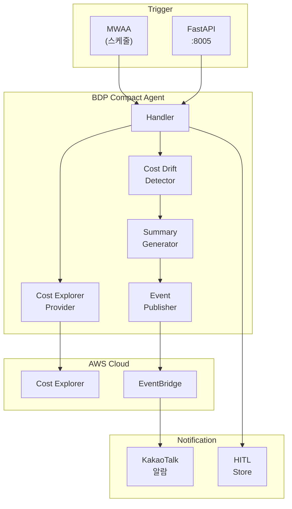
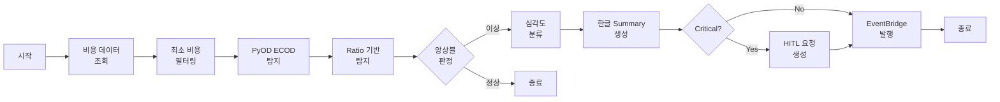

# BDP Compact Agent - Cost Drift Detection

> **⚠️ DEPRECATED**: 이 문서는 더 이상 유지보수되지 않습니다.
>
> **새 문서 위치**: [docs/bdp_cost_agent/](bdp_cost_agent/README.md)
>
> 새 문서에는 다음 내용이 추가되었습니다:
> - Pattern-Aware Detection (요일/추세 패턴 인식)
> - 더 체계적인 문서 구조
> - 상세한 배포 가이드

---

> **서브 에이전트**: BDP Compact (비용 드리프트 탐지 경량 Agent)
>
> PyOD ECOD 기반 Cost Explorer 비용 드리프트 탐지 시스템.
> 한글 Rich Summary 및 KakaoTalk 알람 지원.

## 목차

1. [개요](#개요)
2. [아키텍처](#아키텍처)
3. [주요 컴포넌트](#주요-컴포넌트)
4. [탐지 알고리즘](#탐지-알고리즘)
5. [계정 설정](#계정-설정)
6. [심각도 분류](#심각도-분류)
7. [한글 Rich Summary](#한글-rich-summary)
8. [환경 변수](#환경-변수)
9. [EventBridge 이벤트](#eventbridge-이벤트)
10. [API 엔드포인트](#api-엔드포인트)
11. [배포](#배포)
12. [테스트](#테스트)
13. [관련 문서](#관련-문서)

---

## 개요

BDP Compact Agent는 AWS Cost Explorer를 통해 비용 변화를 모니터링하고, PyOD ECOD 알고리즘 기반으로 비용 드리프트를 탐지하는 경량 에이전트입니다.

### 주요 기능

- **계정별 Lambda 배포**: 각 AWS 계정에 개별 Lambda 배포 (Lambda 실행 역할 권한 사용)
- **PyOD ECOD 탐지**: Parameter-free 이상 탐지 알고리즘 (Python 3.11+ 지원)
- **앙상블 탐지**: ECOD + Ratio 기반 복합 판정
- **한글 Rich Summary**: 사람이 읽기 쉬운 한글 알람 메시지 생성
- **KakaoTalk 알람**: EventBridge → KakaoTalk 연동 알람 발송
- **HITL 통합**: Critical 이상 탐지시 Human-in-the-Loop 요청 자동 생성
- **Lambda + FastAPI**: 동일 코드로 서버리스/컨테이너 배포 지원

### Cost Agent와의 차이점

| 항목 | Cost Agent | BDP Compact Agent |
|------|------------|-------------------|
| **탐지 알고리즘** | Luminol (deprecated) | PyOD ECOD (active maintenance) |
| **Python 버전** | 3.9+ | 3.11+ |
| **탐지 방식** | Ratio/StdDev/Trend/Luminol 복합 | ECOD + Ratio 앙상블 |
| **Summary 언어** | 영문 | 한글 Rich Summary |
| **알람 채널** | EventBridge → Slack/Email | EventBridge → KakaoTalk |
| **HITL 지원** | 미지원 | PROMPT_INPUT 타입 지원 |
| **배포 형태** | Lambda only | Lambda + FastAPI (port 8005) |

---

## 아키텍처

### 시스템 구성



### 탐지 플로우



---

## 주요 컴포넌트

| 컴포넌트 | 파일 | 설명 |
|---------|------|------|
| **Handler** | `src/agents/bdp_cost/handler.py` | Lambda/FastAPI 진입점, 전체 플로우 조율 |
| **Anomaly Detector** | `src/agents/bdp_cost/services/anomaly_detector.py` | PyOD ECOD 기반 비용 드리프트 탐지기 |
| **Cost Explorer Provider** | `src/agents/bdp_cost/services/cost_explorer_provider.py` | Cost Explorer 접근 (Lambda 실행 역할 권한 사용) |
| **Summary Generator** | `src/agents/bdp_cost/services/summary_generator.py` | 한글 Rich Summary 생성기 |
| **Event Publisher** | `src/agents/bdp_cost/services/event_publisher.py` | EventBridge 이벤트 발행기 |
| **Server** | `src/agents/bdp_cost/server.py` | FastAPI 서버 (port 8005) |

---

## 탐지 알고리즘

### PyOD ECOD (Empirical Cumulative Distribution Functions)

BDP Compact는 [PyOD](https://github.com/yzhao062/pyod) 라이브러리의 ECOD 알고리즘을 기본 탐지기로 사용합니다.

**ECOD 특징**:
- **Parameter-free**: 하이퍼파라미터 튜닝 불필요
- **Fast**: O(n) 학습/추론 시간복잡도
- **Multivariate**: 다변량 이상 탐지에 효과적
- **Active Maintenance**: Python 3.11+ 지원 (Luminol 대비 장점)

```python
from pyod.models.ecod import ECOD

# 비용 데이터 준비
X = np.array(costs).reshape(-1, 1)

# ECOD 모델 학습
clf = ECOD(contamination=0.1)  # 이상치 비율 10% 추정
clf.fit(X)

# 이상 탐지
labels = clf.labels_      # 0: 정상, 1: 이상
scores = clf.decision_scores_  # 이상 점수
```

### Ratio 기반 탐지 (Fallback/앙상블)

ECOD와 함께 Ratio 기반 탐지를 앙상블로 사용합니다.

```python
# 현재 비용 / 과거 평균
ratio = current_cost / historical_average

# 임계값 판정 (기본: 1.5배)
is_anomaly = ratio > ratio_threshold or ratio < (1 / ratio_threshold)
```

### 앙상블 판정

| 탐지 결과 | 최종 판정 | 신뢰도 |
|-----------|----------|--------|
| ECOD: 이상, Ratio: 이상 | **이상** | 신뢰도 × 1.2 (앙상블 보정) |
| ECOD: 이상, Ratio: 정상 | **이상** | ECOD 신뢰도 사용 |
| ECOD: 정상, Ratio: 이상 | **이상** | Ratio 신뢰도 사용 |
| ECOD: 정상, Ratio: 정상 | **정상** | - |

### 트렌드 분석

선형 회귀로 비용 추세를 분석합니다.

```python
# 선형 회귀 기울기
slope = np.polyfit(x, costs, 1)[0]
slope_ratio = slope / np.mean(costs)

# 트렌드 분류
if slope_ratio > 0.05:   return "increasing"
elif slope_ratio < -0.05: return "decreasing"
else:                     return "stable"
```

### 스파이크 지속 기간

평균 대비 120% 이상인 날이 연속으로 몇 일인지 계산합니다.

```python
threshold = historical_average * 1.2  # 20% 이상 상승
spike_duration = count_consecutive_days_above_threshold(costs, threshold)
```

---

## 계정 설정

### 환경 변수 설정

각 AWS 계정에 배포되는 Lambda는 자체 실행 역할의 권한을 사용합니다.

| 변수명 | 설명 | 기본값 |
|--------|------|--------|
| `BDP_ACCOUNT_NAME` | 계정 식별 이름 (로그/알람용) | `default` |

### Lambda 실행 역할 권한

Lambda 실행 역할에 Cost Explorer 읽기 권한이 필요합니다:

```json
{
  "Version": "2012-10-17",
  "Statement": [
    {
      "Effect": "Allow",
      "Action": [
        "ce:GetCostAndUsage",
        "ce:GetCostForecast"
      ],
      "Resource": "*"
    }
  ]
}
```

### 배포 구조

각 AWS 계정에 개별 Lambda가 배포됩니다:

```
Account A (111111111111)
├── Lambda: bdp-cost-agent
└── IAM Role: bdp-cost-execution-role
    └── Cost Explorer 읽기 권한

Account B (222222222222)
├── Lambda: bdp-cost-agent
└── IAM Role: bdp-cost-execution-role
    └── Cost Explorer 읽기 권한
```

> **참고**: Cross-account 권한 획득(STS AssumeRole)이 불필요합니다.
> 각 Lambda는 자체 계정의 Cost Explorer API에 직접 접근합니다.

---

## 심각도 분류

| 심각도 | 조건 | Emoji | 조치 |
|--------|------|-------|------|
| **CRITICAL** | confidence ≥ 0.9 **또는** 변화율 ≥ 200% | 🚨 | KakaoTalk 즉시 알람 + HITL 요청 |
| **HIGH** | confidence ≥ 0.7 **또는** 변화율 ≥ 100% | ⚠️ | KakaoTalk 즉시 알람 |
| **MEDIUM** | confidence ≥ 0.5 **또는** 변화율 ≥ 50% | 📊 | 일일 리포트 포함 |
| **LOW** | 기타 이상 | ℹ️ | 로그 기록 |

---

## 한글 Rich Summary

### 단일 이상 탐지 메시지

```
아테나(bdp-prod) 비용이 일평균 25만원인데 1월 14일에 58만원으로
132% 치솟았고 이 상승 추세가 3일 지속되었습니다.

[계정: bdp-prod | 심각도: 높음]
```

### 일괄 이상 탐지 메시지

```
총 5건의 비용 이상이 탐지되었습니다.

• 심각: 1건
• 높음: 2건
• 보통: 1건
• 낮음: 1건

영향 계정: bdp-prod

주요 항목:
  🚨 Athena(bdp-prod): 58만원 (+132.0%)
  ⚠️ Lambda(bdp-prod): 12만원 (+85.3%)
  ⚠️ EC2(bdp-prod): 150만원 (+67.2%)
  📊 S3(bdp-prod): 8만원 (+52.1%)
  ℹ️ DynamoDB(bdp-prod): 5만원 (+35.0%)
```

### 비용 포맷팅 규칙

| 조건 | 포맷 | 예시 |
|------|------|------|
| ≥ 1억원 | `{x}억원` | 1.5억원 |
| ≥ 1만원 | `{x}만원` | 58만원 |
| < 1만원 | `{x}원` | 5,000원 |
| USD ≥ $1M | `${x}M` | $1.5M |
| USD ≥ $1K | `${x}K` | $58K |
| USD < $1K | `${x}` | $500.00 |

---

## 환경 변수

### 핵심 설정

| 변수명 | 설명 | 기본값 |
|--------|------|--------|
| `BDP_PROVIDER` | Provider 타입 (real/localstack/mock) | `mock` |
| `BDP_ACCOUNT_NAME` | 계정 식별 이름 (로그/알람용) | `default` |
| `BDP_SENSITIVITY` | 탐지 민감도 (0.0-1.0) | `0.7` |
| `BDP_CURRENCY` | 통화 단위 (KRW/USD) | `KRW` |
| `BDP_MIN_COST_THRESHOLD` | 최소 비용 임계값 | `10000` |
| `BDP_HITL_ON_CRITICAL` | Critical시 HITL 요청 생성 | `true` |

### EventBridge 설정

| 변수명 | 설명 | 기본값 |
|--------|------|--------|
| `EVENT_PROVIDER` | Event Provider (real/mock) | `mock` |
| `EVENT_BUS` | EventBridge 버스 이름 | `cd1-agent-events` |
| `AWS_REGION` | AWS 리전 | `ap-northeast-2` |

### HITL 설정

| 변수명 | 설명 | 기본값 |
|--------|------|--------|
| `RDS_PROVIDER` | RDS Provider (real/mock) | `mock` |

### LocalStack 설정 (테스트용)

| 변수명 | 설명 | 기본값 |
|--------|------|--------|
| `LOCALSTACK_ENDPOINT` | LocalStack 엔드포인트 | `http://localhost:4566` |

---

## EventBridge 이벤트

### 이벤트 구조

```json
{
  "version": "0",
  "source": "cd1-agent.bdp-cost",
  "detail-type": "Cost Drift Batch Detected",
  "detail": {
    "alert_type": "cost_drift_batch",
    "severity": "🚨",
    "severity_level": "critical",
    "title": "🚨 비용 드리프트 탐지: 5건",
    "message": "총 5건의 비용 이상이 탐지되었습니다...",
    "affected_services": [
      {
        "service_name": "Amazon Athena",
        "account_id": "111111111111",
        "account_name": "bdp-prod",
        "current_cost": 580000,
        "historical_average": 250000,
        "change_percent": 132.0,
        "confidence_score": 0.92,
        "spike_duration_days": 3,
        "trend_direction": "increasing",
        "severity": "critical"
      }
    ],
    "action_required": true,
    "hitl_request_id": "uuid-if-triggered",
    "account_name": "bdp-prod",
    "detection_timestamp": "2024-01-15T10:30:00Z"
  }
}
```

### EventBridge Rule 예시

```json
{
  "source": ["cd1-agent.bdp-cost"],
  "detail-type": ["Cost Drift Detected", "Cost Drift Batch Detected"],
  "detail": {
    "action_required": [true]
  }
}
```

---

## API 엔드포인트

### FastAPI Server (port 8005)

| Method | Endpoint | 설명 |
|--------|----------|------|
| `POST` | `/api/v1/detect` | 비용 드리프트 탐지 실행 |
| `GET` | `/api/v1/status` | 에이전트 상태 조회 |
| `GET` | `/api/v1/account` | 현재 계정 정보 조회 |
| `GET` | `/api/v1/hitl/pending` | 대기 중인 HITL 요청 조회 |
| `POST` | `/api/v1/hitl/{request_id}/respond` | HITL 요청 응답 |

### 탐지 요청 예시

```bash
curl -X POST http://localhost:8005/api/v1/detect \
  -H "Content-Type: application/json" \
  -d '{
    "days": 14,
    "min_cost_threshold": 10000,
    "publish_alerts": true
  }'
```

### 탐지 응답 예시

```json
{
  "detection_type": "cost_drift",
  "period_days": 14,
  "accounts_analyzed": 1,
  "services_analyzed": 10,
  "anomalies_detected": true,
  "total_anomalies": 5,
  "severity_breakdown": {
    "critical": 1,
    "high": 2,
    "medium": 1,
    "low": 1
  },
  "summary": "총 5건의 비용 이상이 탐지되었습니다...",
  "results": [
    {
      "service_name": "Amazon Athena",
      "account_id": "111111111111",
      "account_name": "bdp-prod",
      "severity": "critical",
      "confidence_score": 0.92,
      "current_cost": 580000,
      "historical_average": 250000,
      "change_percent": 132.0,
      "spike_duration_days": 3,
      "trend_direction": "increasing",
      "spike_start_date": "2024-01-12",
      "detection_method": "ensemble",
      "summary": "아테나(bdp-prod) 비용이..."
    }
  ],
  "hitl_request_id": "uuid-if-critical",
  "detection_timestamp": "2024-01-15T10:30:00Z"
}
```

---

## 배포

### Lambda Layer 빌드

```bash
# Standalone Wheel + Lambda Layer 빌드
./scripts/build-bdp-cost.sh

# 출력 파일:
# - dist/bdp_cost/bdp_cost-1.0.0-py3-none-any.whl
# - dist/bdp_cost/lambda-layer.zip
```

### Lambda 설정

| 속성 | 값 |
|------|-----|
| **Runtime** | Python 3.12 |
| **Architecture** | ARM64 (Graviton2) |
| **Memory** | 512MB |
| **Timeout** | 120s |
| **Handler** | `bdp_cost.handler.handler` |
| **Layer** | `dist/bdp_cost/lambda-layer.zip` |

### FastAPI 서버 실행

```bash
# 개발 모드
python -m src.agents.bdp_cost.server

# 또는
uvicorn src.agents.bdp_cost.server:app --port 8005 --reload

# Production
uvicorn src.agents.bdp_cost.server:app --host 0.0.0.0 --port 8005 --workers 4
```

### Docker 배포

```dockerfile
FROM python:3.12-slim

WORKDIR /app
COPY dist/bdp_cost/bdp_cost-1.0.0-py3-none-any.whl .
RUN pip install bdp_cost-1.0.0-py3-none-any.whl

EXPOSE 8005
CMD ["uvicorn", "bdp_cost.server:app", "--host", "0.0.0.0", "--port", "8005"]
```

---

## 테스트

### 단위 테스트

```bash
# 전체 테스트
pytest tests/agents/bdp_cost/ -v

# 탐지 알고리즘 테스트
pytest tests/agents/bdp_cost/test_anomaly_detector.py -v

# Summary 생성 테스트
pytest tests/agents/bdp_cost/test_summary_generator.py -v
```

### Mock 모드 테스트

```bash
# 환경 변수 설정
export BDP_PROVIDER=mock
export EVENT_PROVIDER=mock
export RDS_PROVIDER=mock

# Handler 테스트
python -c "
from src.agents.bdp_cost.handler import handler

result = handler({'days': 14}, None)
print(result)
"
```

### LocalStack 통합 테스트

```bash
# LocalStack 시작
docker-compose -f docker/localstack/docker-compose.yml up -d

# LocalStack 환경 변수 설정
export BDP_PROVIDER=localstack
export LOCALSTACK_ENDPOINT=http://localhost:4566

# 테스트 데이터 로드
python scripts/load_localstack_data.py

# 통합 테스트
pytest tests/agents/bdp_cost/test_integration.py -v
```

### API 테스트

```bash
# 서버 시작
python -m src.agents.bdp_cost.server &

# 상태 확인
curl http://localhost:8005/api/v1/status

# 탐지 실행
curl -X POST http://localhost:8005/api/v1/detect \
  -H "Content-Type: application/json" \
  -d '{"days": 14}'

# 계정 정보 조회
curl http://localhost:8005/api/v1/account
```

---

## 관련 문서

- [Architecture Guide](ARCHITECTURE.md) - 전체 시스템 아키텍처
- [Cost Anomaly Detection](COST_ANOMALY_DETECTION.md) - 기존 Cost Agent (Luminol 기반)
- [BDP Detection](BDP_DETECTION.md) - BDP Agent (로그/메트릭 탐지)
- [HITL System](HITL_SYSTEM.md) - Human-in-the-Loop 시스템

## 참고

- [PyOD Documentation](https://pyod.readthedocs.io/) - Python Outlier Detection 라이브러리
- [ECOD Paper](https://arxiv.org/abs/2201.00382) - ECOD 알고리즘 논문
- [AWS Cost Explorer API](https://docs.aws.amazon.com/cost-management/latest/APIReference/)
