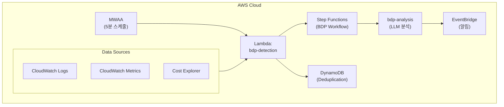
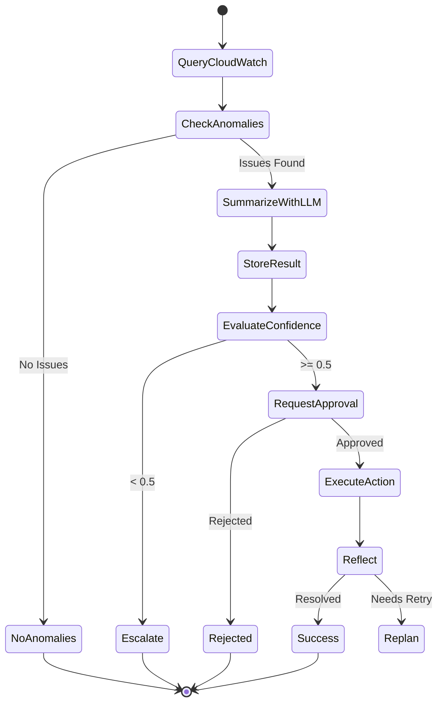

# BDP Agent - AWS 인프라 장애 감지

## Overview

BDP (Big Data Platform) Agent는 AWS 인프라의 장애를 감지하고 분석하는 서브 에이전트입니다. CloudWatch Logs와 Metrics를 수집하여 에러 패턴, 메트릭 이상, 비용 급증 등을 실시간으로 모니터링합니다.

## Architecture



## Lambda: bdp-detection

| 속성 | 값 |
|------|-----|
| **Function** | `bdp-detection` |
| **Runtime** | Python 3.12 |
| **Architecture** | ARM64 (Graviton2) |
| **Memory** | 512MB |
| **Timeout** | 60s |
| **Trigger** | MWAA (bdp_detection_dag) |

## 탐지 타입

### 1. 로그 이상 탐지 (log_anomaly)

**탐지 조건**:
- CloudWatch Logs에서 `error`, `exception`, `failed`, `timeout` 패턴 검색
- 1시간 내 100개 에러 로그 제한
- 5개 이상 에러 발견 시 LLM 분석 트리거

```python
# CloudWatch Logs Insights 쿼리
query = """
    fields @timestamp, @message, @logStream
    | filter @message like /(?i)(error|exception|failed|timeout)/
    | sort @timestamp desc
    | limit 100
"""

# LLM을 사용한 로그 요약
log_summary = llm_client.generate(
    prompt=build_log_summarization_prompt(
        logs=logs,
        max_summary_tokens=500,
        focus_areas=["errors", "patterns", "timing"],
    ),
    temperature=0.3,
)
```

**탐지 로직**:
```python
def _detect_log_anomalies(self, body: Dict[str, Any]) -> Dict[str, Any]:
    logs = self.aws_client.query_cloudwatch_logs(
        log_group=log_group,
        query=query,
        start_time=start_time,
        end_time=end_time,
    )

    if len(logs) >= 5:
        self._trigger_analysis(anomaly_record)

    return {
        "anomalies_detected": True,
        "anomaly_count": len(logs),
        "log_summary": log_summary,
    }
```

### 2. 메트릭 이상 탐지 (metric_anomaly)

**탐지 조건**:
- Z-score 기반 통계적 이상 탐지
- |Z-score| > 2.0 일 때 이상으로 판정
- 24시간 데이터 기반 평균/표준편차 계산

```python
# Z-score 기반 이상 탐지
values = [dp.get("Average", 0) for dp in datapoints]
mean = sum(values) / len(values)
variance = sum((v - mean) ** 2 for v in values) / len(values)
stddev = variance ** 0.5

latest_value = values[-1]
z_score = (latest_value - mean) / stddev if stddev > 0 else 0

is_anomaly = abs(z_score) > 2.0
```

**심각도 분류**:
| Z-score | Severity |
|---------|----------|
| > 3.0 | Critical |
| > 2.5 | High |
| > 2.0 | Medium |

### 3. 비용 이상 탐지 (cost_anomaly)

**탐지 조건**:
- Luminol 기반 시계열 이상 탐지
- 30일 히스토리 데이터 분석
- 서비스별 비용 변동 모니터링

```python
# Luminol 기반 비용 이상 탐지
cost_data = self.cost_client.get_historical_costs_for_detector(days=30)
results = self.cost_detector.analyze_batch(cost_data)

anomalies = [r for r in results if r.is_anomaly]

# Critical/High severity에 대해 분석 트리거
critical = [a for a in anomalies if a.severity in ("critical", "high")]
if critical:
    self._trigger_analysis(anomaly_records[0])
```

### 4. 스케줄 탐지 (scheduled)

**탐지 조건**:
- MWAA에서 5분 주기로 트리거
- 모든 탐지 유형 일괄 실행
- 서비스별 로그 그룹 순회

```python
def _run_scheduled_detection(self, body: Dict[str, Any]) -> Dict[str, Any]:
    results = {
        "log_detection": {},
        "metric_detection": {},
        "cost_detection": {},
        "total_anomalies": 0,
    }

    services = body.get("services", [
        {"name": "lambda", "log_group": "/aws/lambda/bdp-agent"},
    ])

    # 각 서비스별 로그 탐지
    for service in services:
        log_result = self._detect_log_anomalies({...})
        results["log_detection"][service["name"]] = log_result

    # 비용 탐지
    cost_result = self._detect_cost_anomalies({"days": 30})
    results["cost_detection"] = cost_result

    return results
```

## Provider Abstraction

BDP Agent는 Provider Abstraction 패턴을 사용하여 환경별 유연한 실행을 지원합니다.

### LLM Provider

| 환경 | Provider | 설명 | 환경 변수 |
|------|----------|------|----------|
| **On-Premise** | VLLMProvider | 자체 호스팅 LLM 서버 (OpenAI Compatible API) | `LLM_PROVIDER=vllm` |
| **Public** | GeminiProvider | Google Gemini 2.5 Pro/Flash API | `LLM_PROVIDER=gemini` |
| **Mock** | MockLLMProvider | 테스트용 내장 Mock | `LLM_MOCK=true` |

### AWS Provider

| 환경 | Provider | 설명 | 환경 변수 |
|------|----------|------|----------|
| **Production** | AWS*Provider | 실제 AWS 서비스 호출 | (기본값) |
| **Mock** | Mock*Provider | AWS 없이 로직 테스트 | `AWS_MOCK=true` |

## 환경 변수

| Variable | Description | Default |
|----------|-------------|---------|
| `LLM_PROVIDER` | LLM 제공자 (vllm/gemini) | `vllm` |
| `LLM_MOCK` | Mock LLM 사용 여부 | `false` |
| `AWS_MOCK` | Mock AWS 서비스 사용 여부 | `false` |
| `DYNAMODB_TABLE` | 탐지 결과 저장 테이블 | Required |
| `EVENT_BUS` | EventBridge 이벤트 버스 | Required |
| `LOG_GROUPS` | 모니터링 대상 로그 그룹 (콤마 구분) | `/aws/lambda/bdp-agent` |
| `TIME_RANGE_HOURS` | 로그 조회 시간 범위 | `1` |
| `COST_ANALYSIS_DAYS` | 비용 분석 기간 | `30` |
| `Z_SCORE_THRESHOLD` | 메트릭 이상 판정 임계값 | `2.0` |
| `LOG_ANOMALY_THRESHOLD` | 분석 트리거 로그 개수 | `5` |

## 알림 및 에스컬레이션

### 심각도 분류

| Severity | 조건 | 대응 |
|----------|------|------|
| **Critical** | Z-score > 3.0, Critical 비용 이상 | 즉시 알림 + 자동 분석 |
| **High** | Z-score > 2.5, 10+ 에러 로그 | 5분 내 알림 |
| **Medium** | Z-score > 2.0, 5+ 에러 로그 | 15분 내 알림 |
| **Low** | 기타 이상 징후 | 일일 리포트 포함 |

### EventBridge 알림

```json
{
  "source": "bdp.detection",
  "detail-type": "AnomalyDetected",
  "detail": {
    "signature": "log_lambda_2024-01-15",
    "anomaly_type": "log_pattern",
    "service_name": "lambda",
    "first_seen": "2024-01-15T10:25:00Z",
    "last_seen": "2024-01-15T10:30:00Z",
    "occurrence_count": 15,
    "severity": "high",
    "summary": "Lambda function timeout errors detected...",
    "sample_logs": [...]
  }
}
```

## Step Functions 워크플로우

BDP Agent는 독립적인 Step Functions 워크플로우(`bdp-workflow`)를 사용합니다.



## 저장 구조

### DynamoDB 스키마

```json
{
  "pk": "ANOMALY#log_lambda_2024-01-15",
  "sk": "DETECTION#2024-01-15T10:30:00Z",
  "type": "detection",
  "signature": "log_lambda_2024-01-15",
  "anomaly_type": "log_pattern",
  "service_name": "lambda",
  "first_seen": "2024-01-15T10:25:00Z",
  "last_seen": "2024-01-15T10:30:00Z",
  "occurrence_count": 15,
  "severity": "high",
  "sample_logs": [...],
  "metrics_snapshot": {}
}
```

## 지원 복구 조치

| Action | 설명 | 예시 |
|--------|------|------|
| `lambda_restart` | Lambda 함수 재배포 | Cold Start 유도 |
| `log_analysis` | 상세 로그 분석 요청 | 근본 원인 분석 |
| `scaling_adjustment` | Auto Scaling 조정 권장 | Concurrency 증가 |
| `investigate` | 추가 조사 요청 | 메트릭 상세 분석 |

> **Note**: 모든 복구 조치는 승인 기반으로 실행됩니다. 신뢰도 0.5 이상일 때 승인 요청, 미만일 때 에스컬레이션됩니다.

## 관련 문서

- [Architecture Guide](ARCHITECTURE.md) - 전체 시스템 아키텍처
- [HDSP Detection](HDSP_DETECTION.md) - On-Prem K8s 장애 감지 (HDSP Agent)
- [Cost Anomaly Detection](COST_ANOMALY_DETECTION.md) - 비용 이상 탐지 (Cost Agent)
- [Config Drift Detection](CONFIG_DRIFT_DETECTION.md) - 설정 드리프트 감지 (Drift Agent)
- [Prompts](PROMPTS.md) - LLM 프롬프트 템플릿
