# Drift Agent - AWS Configuration Drift Detection

> **서브 에이전트**: Drift Agent (변경관리 Agent)
>
> 로컬 기준선 대비 AWS 리소스 구성 드리프트 탐지 시스템.

## 목차

1. [개요](#개요)
2. [아키텍처](#아키텍처)
3. [LLM 기반 원인 분석](#llm-기반-원인-분석)
4. [Human-in-the-Loop (HITL) 통합](#human-in-the-loop-hitl-통합)
5. [드리프트 탐지 알고리즘](#드리프트-탐지-알고리즘)
6. [기준선 관리](#기준선-관리)
7. [지원 리소스](#지원-리소스)
8. [환경 변수](#환경-변수)
9. [DynamoDB 테이블](#dynamodb-테이블)
10. [EventBridge 이벤트](#eventbridge-이벤트)
11. [사용법](#사용법)
12. [Mock 테스트](#mock-테스트)

---

## 개요

CD1 Agent의 구성 드리프트 탐지 모듈은 AWS 관리형 서비스(EKS, MSK, S3, EMR, MWAA)의 현재 구성을 로컬 `conf/baselines/` 디렉토리에 저장된 JSON 기준선 파일과 비교하여 의도치 않은 구성 변경을 감지합니다.

### 주요 기능

- **로컬 기준선 관리**: JSON 형식의 구성 기준선 파일을 agent의 `conf/baselines/` 디렉토리에서 관리
- **다중 리소스 지원**: EKS, MSK, S3, EMR, MWAA 구성 드리프트 탐지
- **Cross-Account 지원**: AssumeRole을 통한 다중 계정 구성 조회
- **필드 레벨 비교**: JSON Diff 기반의 세분화된 드리프트 감지
- **심각도 분류**: 보안/스펙/스케일링/메타데이터 변경에 따른 심각도 자동 분류
- **자동 알림**: EventBridge를 통한 드리프트 알림
- **이력 관리**: DynamoDB 기반 드리프트 이력 추적

### 사용 사례

1. **Compliance 모니터링**: 프로덕션 환경의 구성이 승인된 기준선에서 벗어났는지 지속 확인
2. **변경 감지**: 수동 변경이나 자동화 오류로 인한 의도치 않은 구성 변경 탐지
3. **보안 감사**: 보안 관련 설정(암호화, 퍼블릭 액세스 등) 변경 즉시 알림
4. **용량 계획**: 리소스 스펙 변경 추적 및 비용 영향 분석

---

## 아키텍처

```mermaid
flowchart TB
    subgraph trigger["MWAA (Daily Trigger)"]
        mwaa["Scheduled Trigger"]
    end

    subgraph detection["Drift Detection Phase"]
        subgraph local["Local Baselines (conf/)"]
            baselines["conf/baselines/<br/>├── eks/<br/>├── msk/<br/>├── s3/<br/>├── emr/<br/>└── mwaa/"]
        end

        subgraph aws["AWS Managed Services"]
            eks["EKS"]
            msk["MSK"]
            s3["S3"]
            emr["EMR"]
            mwaaService["MWAA"]
        end

        subgraph lambda["Lambda: bdp-drift-detection"]
            baselineLoader["Baseline<br/>Loader"]
            configFetcher["Config<br/>Fetcher"]
            driftDetector["Drift<br/>Detector"]
            driftAnalyzer["Drift<br/>Analyzer"]
            alertPublisher["Alert<br/>Publisher"]

            baselineLoader --> configFetcher --> driftDetector
            driftDetector -->|"CRITICAL/HIGH"| driftAnalyzer
            driftDetector -->|"MEDIUM/LOW"| alertPublisher
            driftAnalyzer --> alertPublisher
        end

        baselines -->|"File Read"| baselineLoader
        eks & msk & s3 & emr & mwaaService -->|"AWS Describe APIs"| configFetcher
    end

    subgraph llm["LLM Service"]
        vllm["vLLM / Gemini"]
    end

    subgraph outputs["Outputs"]
        dynamodb["DynamoDB<br/>(Store + Analysis)"]
        eventbridge["EventBridge<br/>(Alert + Analysis)"]
    end

    mwaa --> detection
    driftAnalyzer <-->|"ReAct Loop"| vllm
    alertPublisher --> dynamodb & eventbridge
```



### LLM 기반 분석 상세 플로우

```mermaid
flowchart LR
    subgraph input["Input"]
        drift["Detected Drift<br/>(CRITICAL/HIGH)"]
        baseline["Baseline Config"]
        current["Current Config"]
    end

    subgraph react["ReAct Analysis Loop"]
        plan["🎯 PLAN<br/>분석 계획 수립"]
        analyze["🔍 ANALYZE<br/>LLM 원인 분석"]
        reflect["🪞 REFLECT<br/>품질 평가"]

        plan --> analyze --> reflect
        reflect -->|"confidence < 0.7<br/>needs_replan"| plan
    end

    subgraph llm["LLM"]
        model["vLLM / Gemini<br/>Structured Output"]
    end

    subgraph output["Output"]
        result["DriftAnalysisResult"]
        cause["원인 카테고리<br/>MANUAL_CHANGE<br/>AUTO_SCALING<br/>DEPLOYMENT_DRIFT<br/>..."]
        remediation["조치 권고<br/>revert_to_baseline<br/>update_baseline<br/>escalate"]
    end

    drift & baseline & current --> plan
    analyze <--> model
    reflect <--> model
    reflect -->|"confidence ≥ 0.7<br/>complete"| result
    result --> cause & remediation
```



### 컴포넌트

| 컴포넌트 | 파일 | 설명 |
|---------|------|------|
| Baseline Loader | `src/agents/drift/services/baseline_loader.py` | 로컬 기준선 파일 로드 |
| Config Fetcher | `src/agents/drift/services/config_fetcher.py` | AWS Describe API 추상화 |
| Drift Detector | `src/agents/drift/services/drift_detector.py` | JSON Diff 기반 드리프트 탐지 엔진 |
| Drift Detection Handler | `src/agents/drift/handler.py` | Lambda 핸들러 |
| **Drift Analyzer** | `src/agents/drift/services/drift_analyzer.py` | **LLM 기반 원인 분석 (ReAct)** |

---

## LLM 기반 원인 분석

### 개요

드리프트 탐지 후 CRITICAL/HIGH 심각도의 드리프트에 대해 LLM을 통한 근본 원인 분석(Root Cause Analysis)을 수행합니다.
ReAct(Reasoning + Acting) 패턴을 적용하여 분석 품질을 보장합니다.

### ReAct 분석 플로우

```mermaid
flowchart TB
    subgraph detection["Drift Detection"]
        detect["드리프트 탐지"]
        filter["CRITICAL/HIGH 필터"]
    end

    subgraph react["ReAct Analysis Loop"]
        plan["PLAN<br/>분석 계획 수립"]
        analyze["ANALYZE<br/>LLM 원인 분석"]
        reflect["REFLECT<br/>분석 품질 평가"]

        plan --> analyze --> reflect
        reflect -->|"needs_replan<br/>(confidence < 0.7)"| plan
        reflect -->|"complete<br/>(confidence ≥ 0.7)"| result
    end

    subgraph output["Output"]
        result["분석 결과"]
        store["DynamoDB 저장"]
        event["EventBridge 발행"]
    end

    detect --> filter --> react
    result --> store & event
```



### 원인 분류 카테고리

| 카테고리 | 설명 | 예시 |
|---------|------|------|
| `MANUAL_CHANGE` | 콘솔/CLI를 통한 수동 변경 | AWS Console에서 인스턴스 타입 변경 |
| `AUTO_SCALING` | ASG/HPA 등 자동 스케일링 | EKS 노드그룹 desired_size 변경 |
| `MAINTENANCE_WINDOW` | AWS 자동 유지보수 | RDS 패치, 엔진 업그레이드 |
| `DEPLOYMENT_DRIFT` | IaC 상태 불일치 | Terraform state와 실제 구성 차이 |
| `SECURITY_PATCH` | 자동 보안 패치 | Lambda 런타임 업데이트 |
| `OPERATOR_ERROR` | 운영자 실수 | 잘못된 구성 적용 |
| `UNKNOWN` | 증거 부족 | 원인 파악 불가 |

### 분석 결과 모델

```python
class DriftAnalysisResult(BaseModel):
    """LLM 기반 드리프트 분석 결과."""

    drift_id: str                           # EKS:production-cluster
    resource_type: str                      # EKS
    resource_id: str                        # production-cluster

    # 원인 분석
    cause_analysis: DriftCauseAnalysis      # 원인 카테고리, 근본 원인, 증거
    impact_assessment: str                  # 영향도 평가
    blast_radius: List[str]                 # 영향 받는 시스템 목록

    # 신뢰도 점수
    confidence_score: float                 # 0.0-1.0 (0.7 이상 권장)
    urgency_score: float                    # 조치 긴급도

    # 조치 권고
    remediations: List[DriftRemediationAction]  # 조치 단계
    requires_human_review: bool             # 사람 검토 필요 여부
    review_reason: Optional[str]            # 검토 필요 사유
```

### 조치 권고 타입

| 타입 | 설명 | 예시 명령 |
|-----|------|----------|
| `revert_to_baseline` | 기준선으로 롤백 | `terraform apply -target=...` |
| `update_baseline` | 기준선 업데이트 | Git commit으로 기준선 갱신 |
| `escalate` | 상위 에스컬레이션 | 보안팀 통보 |
| `investigate` | 추가 조사 필요 | CloudTrail 로그 확인 |
| `notify` | 알림만 필요 | 관련 팀 통보 |

### ReAct 반복 조건

```python
# 분석 완료 조건
while iteration <= MAX_ITERATIONS:
    analysis = analyze(drift)
    reflection = reflect(analysis)

    if reflection.overall_confidence >= 0.7:
        break  # 완료

    if not reflection.needs_replan:
        break  # 재분석 불필요

    iteration += 1  # 재분석
```

### 신뢰도 점수 기준

| 점수 범위 | 의미 | 조치 |
|----------|------|------|
| 0.85+ | 명확한 증거 | 자동 조치 가능 |
| 0.70-0.84 | 강한 가설 | 검토 후 조치 |
| 0.50-0.69 | 합리적 가설 | 추가 조사 필요 |
| 0.50 미만 | 증거 부족 | 수동 분석 권장 |

### 환경 변수 (분석 관련)

| 변수명 | 설명 | 기본값 |
|--------|------|--------|
| `ENABLE_DRIFT_ANALYSIS` | LLM 분석 활성화 | `true` |
| `LLM_PROVIDER` | LLM 제공자 (vllm/gemini/mock) | `mock` |
| `VLLM_ENDPOINT` | vLLM 서버 엔드포인트 | - |
| `LLM_MODEL` | 사용할 모델명 | - |
| `MAX_ANALYSIS_ITERATIONS` | ReAct 최대 반복 횟수 | `3` |
| `ANALYSIS_CONFIDENCE_THRESHOLD` | 완료 신뢰도 임계값 | `0.7` |
| `MAX_DRIFTS_TO_ANALYZE` | 분석할 최대 드리프트 수 | `5` |

### 분석 결과 저장

DynamoDB에 분석 결과가 함께 저장됩니다:

```json
{
  "pk": "DRIFT#EKS#production-eks",
  "sk": "DRIFT#2024-01-15T10:30:00Z",
  "type": "resource_drift",
  "resource_type": "EKS",
  "resource_id": "production-eks",
  "severity": "HIGH",
  "drifted_fields": [...],

  // 분석 결과 필드
  "analysis_cause_category": "manual_change",
  "analysis_root_cause": "AWS Console에서 인스턴스 타입이 수동 변경됨",
  "analysis_confidence": 0.85,
  "analysis_urgency": 0.7,
  "analysis_requires_review": true,
  "analysis_remediations": [...]
}
```

### 사용 예시

```python
from src.agents.drift.services.drift_analyzer import DriftAnalyzer
from src.common.services.llm_client import LLMClient, LLMProvider

# LLM 클라이언트 생성
llm_client = LLMClient(
    provider=LLMProvider.VLLM,
    endpoint="http://localhost:8000",
    model_name="mistral-7b"
)

# 분석기 생성
analyzer = DriftAnalyzer(
    llm_client=llm_client,
    max_iterations=3,
    confidence_threshold=0.7
)

# 드리프트 분석
analysis = analyzer.analyze_drift(
    drift_result=drift,
    baseline_config=baseline,
    current_config=current,
    resource_context={
        "resource_arn": "arn:aws:eks:...",
        "region": "ap-northeast-2"
    }
)

print(f"원인: {analysis.cause_analysis.category}")
print(f"신뢰도: {analysis.confidence_score}")
print(f"조치: {analysis.remediations}")
```

---

## Human-in-the-Loop (HITL) 통합

### 개요

Drift Agent는 Streamlit 기반 대화형 인터페이스를 통해 Human-in-the-Loop(HITL) 워크플로우를 지원합니다.
사용자는 프롬프트를 통해 드리프트 분석을 요청하고, 복구 작업에 대한 승인/수정/거부를 수행할 수 있습니다.

### HITL 아키텍처

```mermaid
flowchart TB
    subgraph ui["Streamlit UI"]
        user["👤 사용자"]
        chat["💬 Chat Interface"]
        approval["✅ Approval Dialog"]
    end

    subgraph chatAgent["ChatAgent (LangGraph)"]
        router["Router"]
        tools["Drift Tools"]
        humanReview["Human Review Node"]
        respond["Respond Node"]
    end

    subgraph driftAgent["Drift Agent"]
        analyzer["DriftAnalyzer<br/>(ReAct)"]
        detector["DriftDetector"]
    end

    subgraph llm["LLM Service"]
        vllm["vLLM / Gemini"]
    end

    user -->|"드리프트 분석 요청"| chat
    chat --> router
    router -->|"analyze_config_drift"| tools
    tools --> detector --> analyzer
    analyzer <-->|"ReAct Loop"| vllm
    analyzer -->|"requires_human_review=true"| humanReview
    humanReview -->|"승인 대기"| approval
    approval -->|"APPROVED/MODIFIED/REJECTED"| humanReview
    humanReview --> respond
    respond --> chat
    chat --> user
```



### Streamlit Chat 통합

ChatAgent는 드리프트 분석 도구를 제공하여 대화형 드리프트 분석을 지원합니다.

#### 사용 가능한 도구

| 도구 | 설명 | HITL 여부 |
|-----|------|----------|
| `analyze_config_drift` | 드리프트 감지 및 LLM 원인 분석 | ✅ (복구 승인 시) |
| `check_drift_status` | 드리프트 상태 조회 | ❌ |
| `get_remediation_plan` | 복구 계획 조회 | ❌ |
| `approve_remediation` | 복구 작업 승인/거부 | ✅ |

#### 대화 예시

```
👤 User: production-eks 클러스터의 드리프트 상태를 확인해줘

🤖 Assistant: EKS 클러스터 드리프트 분석을 시작합니다.

[드리프트 분석 결과]
- 리소스: EKS/production-eks
- 드리프트 감지됨: ✅
- 최대 심각도: HIGH
- 변경된 필드:
  - instance_types: ["m6i.xlarge"] → ["m5.large"] (HIGH)
  - desired_size: 5 → 3 (MEDIUM)

[LLM 원인 분석]
- 원인 카테고리: MANUAL_CHANGE
- 근본 원인: AWS Console에서 비용 절감 목적으로 수동 변경된 것으로 추정
- 신뢰도: 0.85
- 긴급도: 0.7

⚠️ 복구 작업에 대한 승인이 필요합니다.

권장 조치:
1. [revert_to_baseline] Terraform으로 기준선 복원
   명령: terraform apply -target=module.eks

어떻게 진행할까요?
[승인] [수정 후 승인] [거부] [추가 분석 요청]
```

### HITL 승인 플로우

```mermaid
sequenceDiagram
    participant User as 👤 사용자
    participant Chat as 💬 ChatAgent
    participant Drift as 🔍 DriftAnalyzer
    participant HITL as ✅ HumanReview

    User->>Chat: "드리프트 분석 요청"
    Chat->>Drift: analyze_config_drift()
    Drift-->>Chat: DriftAnalysisResult<br/>(requires_human_review=true)
    Chat->>HITL: 승인 대기 상태 전환
    HITL-->>User: 승인 요청 표시

    alt 승인 (APPROVED)
        User->>HITL: "승인"
        HITL->>Chat: approval_status=APPROVED
        Chat->>Drift: execute_remediation()
        Drift-->>Chat: 복구 완료
        Chat-->>User: "복구가 완료되었습니다"
    else 수정 후 승인 (MODIFIED)
        User->>HITL: "수정 후 승인" + 수정 파라미터
        HITL->>Chat: approval_status=MODIFIED
        Chat->>Drift: execute_remediation(modified_params)
        Drift-->>Chat: 수정된 복구 완료
        Chat-->>User: "수정된 복구가 완료되었습니다"
    else 거부 (REJECTED)
        User->>HITL: "거부" + 사유
        HITL->>Chat: approval_status=REJECTED
        Chat-->>User: "복구가 거부되었습니다. 드리프트가 의도적 변경으로 처리됩니다."
    end
```



### 승인 상태

| 상태 | 설명 | 후속 처리 |
|-----|------|----------|
| `PENDING` | 사용자 승인 대기 | UI에 승인 다이얼로그 표시 |
| `APPROVED` | 복구 승인됨 | 복구 작업 실행 |
| `MODIFIED` | 수정 후 승인됨 | 수정된 파라미터로 복구 실행 |
| `REJECTED` | 복구 거부됨 | 드리프트를 의도적 변경으로 기록 |

### ChatAgent 도구 등록

```python
from src.common.chat.tools import create_chat_tools
from src.common.services.llm_client import LLMClient, LLMProvider

# LLM 클라이언트 생성
llm_client = LLMClient(provider=LLMProvider.VLLM)

# 드리프트 도구 포함 전체 도구 세트 생성
tools = create_chat_tools(
    aws_client=aws_client,
    rds_client=rds_client,
    llm_client=llm_client,  # 드리프트 분석용 LLM
)

# ChatAgent 생성
agent = ChatAgent(
    llm_client=llm_client,
    tools=tools,
)

# 대화 실행
response = agent.chat("production-eks 드리프트 분석해줘")
```

### 드리프트 도구 직접 사용

```python
from src.common.chat.tools.drift import (
    analyze_config_drift,
    check_drift_status,
    get_remediation_plan,
    approve_remediation,
)

# 드리프트 분석
result = analyze_config_drift(
    baseline_config=baseline,
    current_config=current,
    resource_type="EKS",
    resource_id="production-eks",
    include_analysis=True,  # LLM 분석 포함
)

# 분석 결과 확인
if result["requires_approval"]:
    print(f"승인 필요: {result['approval_context']['reason']}")

    # 사용자 승인 처리
    approval = approve_remediation(
        drift_id="EKS:production-eks",
        action_type="revert_to_baseline",
        approval_status="APPROVED",
        user_feedback="확인 후 승인합니다.",
    )

    print(f"승인 결과: {approval['message']}")
```

### HITL 환경 변수

| 변수명 | 설명 | 기본값 |
|--------|------|--------|
| `DRIFT_HITL_ENABLED` | HITL 워크플로우 활성화 | `true` |
| `DRIFT_AUTO_APPROVE_LOW` | LOW 심각도 자동 승인 | `false` |
| `DRIFT_APPROVAL_TIMEOUT` | 승인 대기 타임아웃 (초) | `3600` |
| `STREAMLIT_DRIFT_ENABLED` | Streamlit에서 드리프트 도구 활성화 | `true` |

---

## 드리프트 탐지 알고리즘

### 탐지 흐름


### 1. JSON 정규화 (Normalize)

비교 전 양쪽 JSON을 정규화합니다.

```python
def normalize_config(config: dict) -> dict:
    """JSON 구성을 비교 가능한 형태로 정규화."""
    # 1. 키 정렬
    # 2. 중첩 객체 평탄화 (optional)
    # 3. 타입 변환 (string → number 등)
    # 4. 무시할 필드 제거 (예: 타임스탬프, ARN 등)
    pass
```

### 2. Deep Compare (필드별 비교)

```python
def compare_configs(baseline: dict, current: dict) -> DriftResult:
    """두 구성을 비교하여 드리프트 결과 반환."""
    added = []      # 기준선에 없고 현재에 있는 필드
    modified = []   # 값이 변경된 필드
    removed = []    # 기준선에 있고 현재에 없는 필드

    for key in all_keys:
        if key not in baseline:
            added.append(key)
        elif key not in current:
            removed.append(key)
        elif baseline[key] != current[key]:
            modified.append({
                "field": key,
                "baseline_value": baseline[key],
                "current_value": current[key]
            })

    return DriftResult(added, modified, removed)
```

### 3. 허용 범위 (Tolerance) 설정

일부 변경은 허용 가능한 범위로 설정할 수 있습니다.

```python
tolerance_rules = {
    "scaling_config.desired_size": {
        "type": "percentage",
        "threshold": 20  # 20% 이내 변경은 무시
    },
    "tags.*": {
        "type": "ignore"  # 태그 변경은 LOW로 분류
    },
    "last_modified_*": {
        "type": "ignore"  # 타임스탬프 필드 무시
    }
}
```

### 4. 심각도 분류 매트릭스

| 심각도 | 분류 기준 | 예시 |
|--------|----------|------|
| **CRITICAL** | 보안 설정 약화 | 암호화 비활성화, 퍼블릭 액세스 허용 |
| **HIGH** | 주요 스펙 변경 | 인스턴스 타입 변경, 버전 다운그레이드, 노드 50%+ 감소 |
| **MEDIUM** | 스케일링/용량 변경 | min/max 노드 수 변경, 스토리지 크기 변경 |
| **LOW** | 메타데이터 변경 | 태그 변경, 로깅 설정 변경 |

#### 필드별 심각도 매핑

```python
SEVERITY_MAPPING = {
    # CRITICAL - 보안 관련
    "encryption_config": "CRITICAL",
    "endpoint_public_access": "CRITICAL",
    "public_access_block": "CRITICAL",
    "encryption_at_rest": "CRITICAL",
    "encryption_in_transit": "CRITICAL",

    # HIGH - 주요 스펙
    "version": "HIGH",
    "release_label": "HIGH",
    "kafka_version": "HIGH",
    "airflow_version": "HIGH",
    "instance_type": "HIGH",
    "instance_types": "HIGH",
    "environment_class": "HIGH",
    "number_of_broker_nodes": "HIGH",

    # MEDIUM - 스케일링/용량
    "scaling_config": "MEDIUM",
    "min_size": "MEDIUM",
    "max_size": "MEDIUM",
    "min_workers": "MEDIUM",
    "max_workers": "MEDIUM",
    "volume_size": "MEDIUM",
    "disk_size": "MEDIUM",
    "storage_info": "MEDIUM",

    # LOW - 메타데이터
    "tags": "LOW",
    "logging": "LOW",
    "logging_configuration": "LOW",
}
```

---

## 기준선 관리

### 디렉토리 구조

기준선 파일은 agent의 `conf/baselines/` 디렉토리에서 관리합니다.

```
conf/
└── baselines/
    ├── eks/
    │   ├── production-cluster.json
    │   ├── staging-cluster.json
    │   └── _schema.json
    ├── msk/
    │   ├── production-kafka.json
    │   └── _schema.json
    ├── s3/
    │   ├── data-lake-bucket.json
    │   ├── logs-bucket.json
    │   └── _schema.json
    ├── emr/
    │   ├── analytics-cluster.json
    │   └── _schema.json
    └── mwaa/
        ├── orchestration-env.json
        └── _schema.json
```

### Baseline Loader

```python
import json
from pathlib import Path
from typing import Optional


class BaselineLoader:
    """로컬 기준선 파일 로더."""

    def __init__(self, baselines_dir: str = "conf/baselines"):
        self.baselines_dir = Path(baselines_dir)

    def get_baseline(
        self,
        resource_type: str,
        resource_id: str
    ) -> Optional[dict]:
        """기준선 JSON 파일 로드."""
        # 리소스 타입별 디렉토리
        type_dir = self.baselines_dir / resource_type.lower()

        # 파일명 패턴: {resource_id}.json
        baseline_file = type_dir / f"{resource_id}.json"

        if not baseline_file.exists():
            return None

        with open(baseline_file, "r", encoding="utf-8") as f:
            return json.load(f)

    def list_baselines(self, resource_type: str) -> list[str]:
        """특정 리소스 타입의 모든 기준선 파일 목록 반환."""
        type_dir = self.baselines_dir / resource_type.lower()

        if not type_dir.exists():
            return []

        return [
            f.stem  # 확장자 제외한 파일명
            for f in type_dir.glob("*.json")
            if not f.name.startswith("_")  # _schema.json 등 제외
        ]

    def get_baseline_hash(self, resource_type: str, resource_id: str) -> Optional[str]:
        """기준선 파일의 해시값 반환 (변경 추적용)."""
        import hashlib

        baseline_file = self.baselines_dir / resource_type.lower() / f"{resource_id}.json"

        if not baseline_file.exists():
            return None

        with open(baseline_file, "rb") as f:
            return hashlib.sha256(f.read()).hexdigest()[:12]
```

### 기준선 파일 명명 규칙

| 리소스 타입 | 파일명 패턴 | 예시 |
|------------|------------|------|
| EKS | `{cluster-name}.json` | `production-eks.json` |
| MSK | `{cluster-name}.json` | `production-kafka.json` |
| S3 | `{bucket-name}.json` | `data-lake-prod.json` |
| EMR | `{cluster-name}.json` | `analytics-emr-prod.json` |
| MWAA | `{environment-name}.json` | `bdp-airflow-prod.json` |

---

## 지원 리소스

### EKS (Elastic Kubernetes Service)

#### AWS API

```python
# 클러스터 정보 조회
eks_client.describe_cluster(name="cluster-name")

# 노드그룹 정보 조회
eks_client.describe_nodegroup(
    clusterName="cluster-name",
    nodegroupName="nodegroup-name"
)
```

#### 기준선 스키마 예시

```json
{
  "cluster_name": "production-eks",
  "version": "1.29",
  "endpoint_public_access": false,
  "endpoint_private_access": true,
  "logging": {
    "api": true,
    "audit": true,
    "authenticator": true,
    "controllerManager": true,
    "scheduler": true
  },
  "node_groups": [
    {
      "name": "general-workload",
      "instance_types": ["m6i.xlarge", "m6i.2xlarge"],
      "scaling_config": {
        "min_size": 3,
        "max_size": 10,
        "desired_size": 5
      },
      "disk_size": 100,
      "ami_type": "AL2_x86_64",
      "capacity_type": "ON_DEMAND"
    }
  ],
  "tags": {
    "Environment": "production",
    "ManagedBy": "cd1-agent"
  }
}
```

### MSK (Managed Streaming for Apache Kafka)

#### AWS API

```python
# 클러스터 정보 조회
kafka_client.describe_cluster_v2(ClusterArn="arn:...")
```

#### 기준선 스키마 예시

```json
{
  "cluster_name": "production-kafka",
  "kafka_version": "3.5.1",
  "broker_config": {
    "instance_type": "kafka.m5.large",
    "number_of_broker_nodes": 3,
    "storage_info": {
      "ebs_storage_info": {
        "volume_size": 1000,
        "provisioned_throughput": {
          "enabled": true,
          "volume_throughput": 250
        }
      }
    }
  },
  "encryption_info": {
    "encryption_at_rest": true,
    "encryption_in_transit": "TLS"
  },
  "enhanced_monitoring": "PER_TOPIC_PER_BROKER",
  "open_monitoring": {
    "prometheus": {
      "jmx_exporter": true,
      "node_exporter": true
    }
  },
  "tags": {
    "Environment": "production"
  }
}
```

### S3 (Simple Storage Service)

#### AWS API

```python
# 버킷 정보 조회
s3_client.get_bucket_versioning(Bucket="bucket-name")
s3_client.get_bucket_encryption(Bucket="bucket-name")
s3_client.get_public_access_block(Bucket="bucket-name")
s3_client.get_bucket_lifecycle_configuration(Bucket="bucket-name")
```

#### 기준선 스키마 예시

```json
{
  "bucket_name": "company-data-lake-prod",
  "versioning": {
    "status": "Enabled"
  },
  "encryption": {
    "sse_algorithm": "aws:kms",
    "kms_master_key_id": "alias/data-lake-key",
    "bucket_key_enabled": true
  },
  "public_access_block": {
    "block_public_acls": true,
    "ignore_public_acls": true,
    "block_public_policy": true,
    "restrict_public_buckets": true
  },
  "lifecycle_rules": [
    {
      "id": "archive-old-data",
      "status": "Enabled",
      "transitions": [
        { "days": 90, "storage_class": "STANDARD_IA" },
        { "days": 365, "storage_class": "GLACIER" }
      ],
      "expiration_days": 2555
    }
  ],
  "logging": {
    "enabled": true,
    "target_bucket": "company-access-logs",
    "target_prefix": "s3/data-lake/"
  },
  "tags": {
    "Environment": "production",
    "DataClassification": "confidential"
  }
}
```

### EMR (Elastic MapReduce)

#### AWS API

```python
# 클러스터 정보 조회
emr_client.describe_cluster(ClusterId="j-XXXXX")
emr_client.list_instance_groups(ClusterId="j-XXXXX")
```

#### 기준선 스키마 예시

```json
{
  "cluster_name": "analytics-emr-prod",
  "release_label": "emr-7.0.0",
  "applications": ["Spark", "Hadoop", "Hive"],
  "instance_groups": {
    "master": {
      "instance_type": "m5.xlarge",
      "instance_count": 1,
      "ebs_config": {
        "volume_type": "gp3",
        "volume_size": 100,
        "volumes_per_instance": 1
      }
    },
    "core": {
      "instance_type": "r5.2xlarge",
      "instance_count": 4,
      "ebs_config": {
        "volume_type": "gp3",
        "volume_size": 500,
        "volumes_per_instance": 2
      }
    },
    "task": {
      "instance_type": "r5.2xlarge",
      "instance_count": 0,
      "market": "SPOT",
      "bid_price": "0.50"
    }
  },
  "auto_scaling_policy": {
    "min_capacity": 4,
    "max_capacity": 20
  },
  "configurations": [
    {
      "classification": "spark-defaults",
      "properties": {
        "spark.executor.memory": "8g",
        "spark.driver.memory": "4g"
      }
    }
  ],
  "tags": {
    "Environment": "production"
  }
}
```

### MWAA (Managed Workflows for Apache Airflow)

#### AWS API

```python
# 환경 정보 조회
mwaa_client.get_environment(Name="environment-name")
```

#### 기준선 스키마 예시

```json
{
  "environment_name": "bdp-airflow-prod",
  "airflow_version": "2.8.1",
  "environment_class": "mw1.medium",
  "min_workers": 2,
  "max_workers": 10,
  "schedulers": 2,
  "webserver_access_mode": "PRIVATE_ONLY",
  "weekly_maintenance_window_start": "SUN:03:00",
  "airflow_configuration_options": {
    "core.default_timezone": "Asia/Seoul",
    "core.parallelism": "32",
    "core.dag_concurrency": "16"
  },
  "logging_configuration": {
    "dag_processing_logs": {
      "enabled": true,
      "log_level": "INFO"
    },
    "scheduler_logs": {
      "enabled": true,
      "log_level": "WARNING"
    },
    "task_logs": {
      "enabled": true,
      "log_level": "INFO"
    },
    "webserver_logs": {
      "enabled": true,
      "log_level": "WARNING"
    },
    "worker_logs": {
      "enabled": true,
      "log_level": "INFO"
    }
  },
  "tags": {
    "Environment": "production"
  }
}
```

---

## 환경 변수

| 변수명 | 설명 | 기본값 |
|--------|------|--------|
| `AWS_MOCK` | Mock 모드 활성화 | `false` |
| `BASELINES_DIR` | 기준선 파일 디렉토리 경로 | `conf/baselines` |
| `CONFIG_DRIFT_TABLE` | 드리프트 이력 테이블 | `bdp-config-drift-tracking` |
| `EVENT_BUS_NAME` | EventBridge 버스 이름 | `default` |

### 리소스별 환경 변수

```bash
# EKS
export EKS_CLUSTERS='["production-eks", "staging-eks"]'

# MSK
export MSK_CLUSTER_ARNS='["arn:aws:kafka:..."]'

# S3
export S3_BUCKETS='["data-lake-prod", "logs-prod"]'

# EMR
export EMR_CLUSTER_IDS='["j-XXXXX"]'

# MWAA
export MWAA_ENVIRONMENTS='["bdp-airflow-prod"]'
```

---

## DynamoDB 테이블

### bdp-config-drift-tracking

드리프트 이력 추적 테이블.

| 속성 | 타입 | 설명 |
|------|------|------|
| `resource_id` (PK) | String | AWS 리소스 ARN 또는 이름 |
| `detected_at` (SK) | String | 탐지 시간 (ISO 8601) |
| `resource_type` | String | EKS / MSK / S3 / EMR / MWAA |
| `drift_type` | String | ADDED / MODIFIED / REMOVED |
| `drifted_fields` | List | 드리프트 발생 필드 목록 |
| `baseline_hash` | String | 기준선 파일 해시 (SHA256 앞 12자리) |
| `baseline_values` | Map | 기준선 값 |
| `current_values` | Map | 현재 값 |
| `severity` | String | CRITICAL / HIGH / MEDIUM / LOW |
| `resolved` | Boolean | 해결 여부 |
| `resolved_at` | String | 해결 시간 |
| `ttl` | Number | TTL (90일 후 자동 삭제) |

**GSI**:
- `resource-type-index`: 리소스 타입별 조회
- `severity-date-index`: 심각도별 조회
- `unresolved-index`: 미해결 드리프트 조회

---

## EventBridge 이벤트

### 이벤트 타입

| DetailType | 조건 | 대상 |
|------------|------|------|
| `CONFIG_DRIFT_CRITICAL` | severity=CRITICAL | Slack + Email + PagerDuty |
| `CONFIG_DRIFT_HIGH` | severity=HIGH | Slack + Email |
| `CONFIG_DRIFT_MEDIUM` | severity=MEDIUM | Slack |
| `CONFIG_DRIFT_LOW` | severity=LOW | 로그 기록 |

### 이벤트 구조

```json
{
  "version": "0",
  "source": "bdp.config-drift",
  "detail-type": "CONFIG_DRIFT_HIGH",
  "detail": {
    "drift_id": "eks-production-cluster-2024-01-15-abc123",
    "resource_type": "EKS",
    "resource_id": "production-eks",
    "resource_arn": "arn:aws:eks:ap-northeast-2:123456789012:cluster/production-eks",
    "severity": "HIGH",
    "drift_summary": {
      "added_fields": 0,
      "modified_fields": 2,
      "removed_fields": 0
    },
    "drifted_fields": [
      {
        "field": "node_groups[0].instance_types",
        "baseline_value": ["m6i.xlarge"],
        "current_value": ["m5.large"],
        "severity": "HIGH"
      },
      {
        "field": "node_groups[0].scaling_config.desired_size",
        "baseline_value": 5,
        "current_value": 3,
        "severity": "MEDIUM"
      }
    ],
    "baseline_hash": "abc123def456",
    "baseline_file": "conf/baselines/eks/production-eks.json",
    "detected_at": "2024-01-15T10:30:00Z"
  }
}
```

### EventBridge Rule 예시

```json
{
  "source": ["bdp.config-drift"],
  "detail-type": ["CONFIG_DRIFT_CRITICAL", "CONFIG_DRIFT_HIGH"],
  "detail": {
    "resource_type": ["EKS", "MSK"]
  }
}
```

---

## 사용법

### Lambda 호출

```python
import boto3
import json

lambda_client = boto3.client('lambda')

response = lambda_client.invoke(
    FunctionName='bdp-drift-detection',
    InvocationType='RequestResponse',
    Payload=json.dumps({
        "resource_types": ["EKS", "MSK", "S3"],
        "resources": {
            "EKS": ["production-eks"],
            "MSK": ["arn:aws:kafka:..."],
            "S3": ["data-lake-prod"]
        },
        "severity_threshold": "MEDIUM"
    })
)

result = json.loads(response['Payload'].read())
print(result)
```

### 응답 예시

```json
{
  "statusCode": 200,
  "body": {
    "drifts_detected": true,
    "total_drift_count": 3,
    "severity_summary": {
      "CRITICAL": 0,
      "HIGH": 1,
      "MEDIUM": 2,
      "LOW": 0
    },
    "resources_analyzed": 5,
    "drift_details": [
      {
        "resource_type": "EKS",
        "resource_id": "production-eks",
        "severity": "HIGH",
        "drifted_fields": [
          {
            "field": "node_groups[0].instance_types",
            "baseline": ["m6i.xlarge"],
            "current": ["m5.large"]
          }
        ]
      }
    ],
    "baseline_info": {
      "baselines_dir": "conf/baselines",
      "baseline_hash": "abc123def456"
    },
    "execution_time_ms": 3250
  }
}
```

### Airflow DAG 예시

```python
from airflow import DAG
from airflow.providers.amazon.aws.operators.lambda_function import LambdaInvokeFunctionOperator
from datetime import datetime, timedelta

default_args = {
    'owner': 'bdp-team',
    'depends_on_past': False,
    'retries': 1,
    'retry_delay': timedelta(minutes=5),
}

with DAG(
    'bdp_config_drift_detection',
    default_args=default_args,
    description='Configuration Drift Detection DAG',
    schedule_interval='0 9 * * *',  # 매일 09:00 KST
    start_date=datetime(2024, 1, 1),
    catchup=False,
) as dag:

    detect_eks_drift = LambdaInvokeFunctionOperator(
        task_id='detect_eks_drift',
        function_name='bdp-drift-detection',
        payload=json.dumps({
            "resource_types": ["EKS"],
            "severity_threshold": "MEDIUM"
        }),
    )

    detect_msk_drift = LambdaInvokeFunctionOperator(
        task_id='detect_msk_drift',
        function_name='bdp-drift-detection',
        payload=json.dumps({
            "resource_types": ["MSK"],
            "severity_threshold": "MEDIUM"
        }),
    )

    [detect_eks_drift, detect_msk_drift]
```

---

## Mock 테스트

### 환경 설정

```bash
export AWS_MOCK=true
```

### Baseline Loader 테스트

```python
from src.agents.drift.services.baseline_loader import BaselineLoader

# 로컬 기준선 로더 생성
loader = BaselineLoader(baselines_dir="conf/baselines")

# 기준선 조회
baseline = loader.get_baseline(
    resource_type="EKS",
    resource_id="production-eks"
)
print(baseline)

# 기준선 목록 조회
baselines = loader.list_baselines(resource_type="EKS")
print(f"EKS baselines: {baselines}")

# 기준선 해시 조회
hash_value = loader.get_baseline_hash(
    resource_type="EKS",
    resource_id="production-eks"
)
print(f"Baseline hash: {hash_value}")
```

### 드리프트 주입 테스트

```python
from src.agents.drift.services.config_fetcher import ConfigFetcher, ConfigProvider
from src.agents.drift.services.drift_detector import ConfigDriftDetector
from src.agents.drift.services.baseline_loader import BaselineLoader

# Mock Fetcher 생성
fetcher = ConfigFetcher(provider=ConfigProvider.MOCK)

# 현재 구성 조회 (Mock 데이터 사용)
current_config = fetcher.get_config(
    resource_type="EKS",
    resource_id="production-eks"
)

# 기준선 로드
loader = BaselineLoader()
baseline = loader.get_baseline(
    resource_type="EKS",
    resource_id="production-eks"
)

# 드리프트 탐지
detector = ConfigDriftDetector()
result = detector.detect(
    baseline=baseline,
    current=current_config.config,
    resource_type="EKS",
    resource_id="production-eks"
)

print(f"Drift detected: {result.has_drift}")
print(f"Severity: {result.max_severity}")
for field in result.drifted_fields:
    print(f"  - {field.field_path}: {field.baseline_value} → {field.current_value}")
```

### Handler 통합 테스트

```bash
python -c "
import os
os.environ['AWS_MOCK'] = 'true'

from src.agents.drift.handler import handler as lambda_handler
import json

class MockContext:
    aws_request_id = 'test-123'

result = lambda_handler({
    'resource_types': ['EKS', 'MSK'],
    'severity_threshold': 'LOW'
}, MockContext())

print(json.dumps(json.loads(result['body']), indent=2))
"
```

---

## 관련 문서

- [Architecture Guide](ARCHITECTURE.md) - 전체 시스템 아키텍처
- [HDSP Detection](HDSP_DETECTION.md) - On-Prem K8s 장애 감지 (HDSP Agent)
- [Cost Anomaly Detection](COST_ANOMALY_DETECTION.md) - 비용 이상 탐지 (Cost Agent)

## 참고

- [AWS EKS API Reference](https://docs.aws.amazon.com/eks/latest/APIReference/)
- [AWS MSK API Reference](https://docs.aws.amazon.com/msk/latest/APIReference/)
- [AWS S3 API Reference](https://docs.aws.amazon.com/AmazonS3/latest/API/)
- [AWS EMR API Reference](https://docs.aws.amazon.com/emr/latest/APIReference/)
- [AWS MWAA API Reference](https://docs.aws.amazon.com/mwaa/latest/API/)
