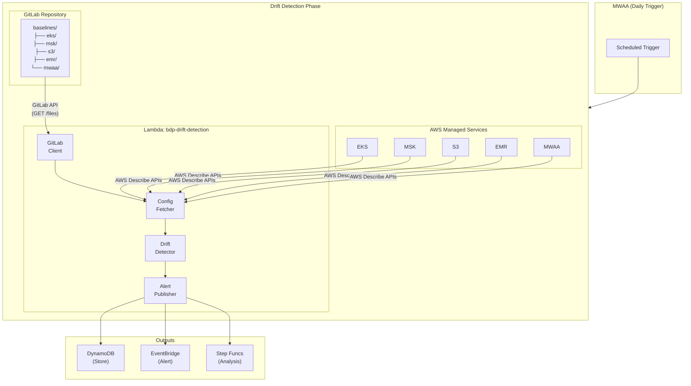
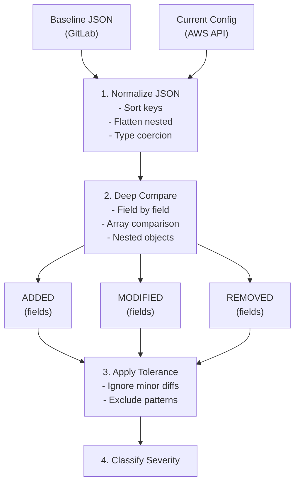

# Drift Agent - AWS Configuration Drift Detection

> **서브 에이전트**: Drift Agent (변경관리 Agent)
>
> GitLab 기준선 대비 AWS 리소스 구성 드리프트 탐지 시스템.

## 목차

1. [개요](#개요)
2. [아키텍처](#아키텍처)
3. [드리프트 탐지 알고리즘](#드리프트-탐지-알고리즘)
4. [GitLab 통합](#gitlab-통합)
5. [지원 리소스](#지원-리소스)
6. [환경 변수](#환경-변수)
7. [DynamoDB 테이블](#dynamodb-테이블)
8. [EventBridge 이벤트](#eventbridge-이벤트)
9. [사용법](#사용법)
10. [Mock 테스트](#mock-테스트)

---

## 개요

BDP Agent의 구성 드리프트 탐지 모듈은 AWS 관리형 서비스(EKS, MSK, S3, EMR, MWAA)의 현재 구성을 GitLab에 저장된 JSON 기준선 파일과 비교하여 의도치 않은 구성 변경을 감지합니다.

### 주요 기능

- **GitLab 기준선 관리**: JSON 형식의 구성 기준선 파일을 GitLab 저장소에서 버전 관리
- **다중 리소스 지원**: EKS, MSK, S3, EMR, MWAA 구성 드리프트 탐지
- **Cross-Account 지원**: AssumeRole을 통한 다중 계정 구성 조회
- **필드 레벨 비교**: JSON Diff 기반의 세분화된 드리프트 감지
- **심각도 분류**: 보안/스펙/스케일링/메타데이터 변경에 따른 심각도 자동 분류
- **자동 알림**: EventBridge를 통한 드리프트 알림
- **이력 관리**: DynamoDB 기반 드리프트 이력 추적

### 사용 사례

1. **Compliance 모니터링**: 프로덕션 환경의 구성이 승인된 기준선에서 벗어났는지 지속 확인
2. **변경 감지**: 수동 변경이나 자동화 오류로 인한 의도치 않은 구성 변경 탐지
3. **보안 감사**: 보안 관련 설정(암호화, 퍼블릭 액세스 등) 변경 즉시 알림
4. **용량 계획**: 리소스 스펙 변경 추적 및 비용 영향 분석

---

## 아키텍처



### 컴포넌트

| 컴포넌트 | 파일 | 설명 |
|---------|------|------|
| GitLab Client | `src/agents/drift/services/gitlab_client.py` | GitLab API 추상화 (기준선 파일 조회) |
| Config Fetcher | `src/agents/drift/services/config_fetcher.py` | AWS Describe API 추상화 |
| Drift Detector | `src/agents/drift/services/drift_detector.py` | JSON Diff 기반 드리프트 탐지 엔진 |
| Drift Detection Handler | `src/agents/drift/handler.py` | Lambda 핸들러 |

---

## 드리프트 탐지 알고리즘

### 탐지 흐름



### 1. JSON 정규화 (Normalize)

비교 전 양쪽 JSON을 정규화합니다.

```python
def normalize_config(config: dict) -> dict:
    """JSON 구성을 비교 가능한 형태로 정규화."""
    # 1. 키 정렬
    # 2. 중첩 객체 평탄화 (optional)
    # 3. 타입 변환 (string → number 등)
    # 4. 무시할 필드 제거 (예: 타임스탬프, ARN 등)
    pass
```

### 2. Deep Compare (필드별 비교)

```python
def compare_configs(baseline: dict, current: dict) -> DriftResult:
    """두 구성을 비교하여 드리프트 결과 반환."""
    added = []      # 기준선에 없고 현재에 있는 필드
    modified = []   # 값이 변경된 필드
    removed = []    # 기준선에 있고 현재에 없는 필드

    for key in all_keys:
        if key not in baseline:
            added.append(key)
        elif key not in current:
            removed.append(key)
        elif baseline[key] != current[key]:
            modified.append({
                "field": key,
                "baseline_value": baseline[key],
                "current_value": current[key]
            })

    return DriftResult(added, modified, removed)
```

### 3. 허용 범위 (Tolerance) 설정

일부 변경은 허용 가능한 범위로 설정할 수 있습니다.

```python
tolerance_rules = {
    "scaling_config.desired_size": {
        "type": "percentage",
        "threshold": 20  # 20% 이내 변경은 무시
    },
    "tags.*": {
        "type": "ignore"  # 태그 변경은 LOW로 분류
    },
    "last_modified_*": {
        "type": "ignore"  # 타임스탬프 필드 무시
    }
}
```

### 4. 심각도 분류 매트릭스

| 심각도 | 분류 기준 | 예시 |
|--------|----------|------|
| **CRITICAL** | 보안 설정 약화 | 암호화 비활성화, 퍼블릭 액세스 허용 |
| **HIGH** | 주요 스펙 변경 | 인스턴스 타입 변경, 버전 다운그레이드, 노드 50%+ 감소 |
| **MEDIUM** | 스케일링/용량 변경 | min/max 노드 수 변경, 스토리지 크기 변경 |
| **LOW** | 메타데이터 변경 | 태그 변경, 로깅 설정 변경 |

#### 필드별 심각도 매핑

```python
SEVERITY_MAPPING = {
    # CRITICAL - 보안 관련
    "encryption_config": "CRITICAL",
    "endpoint_public_access": "CRITICAL",
    "public_access_block": "CRITICAL",
    "encryption_at_rest": "CRITICAL",
    "encryption_in_transit": "CRITICAL",

    # HIGH - 주요 스펙
    "version": "HIGH",
    "release_label": "HIGH",
    "kafka_version": "HIGH",
    "airflow_version": "HIGH",
    "instance_type": "HIGH",
    "instance_types": "HIGH",
    "environment_class": "HIGH",
    "number_of_broker_nodes": "HIGH",

    # MEDIUM - 스케일링/용량
    "scaling_config": "MEDIUM",
    "min_size": "MEDIUM",
    "max_size": "MEDIUM",
    "min_workers": "MEDIUM",
    "max_workers": "MEDIUM",
    "volume_size": "MEDIUM",
    "disk_size": "MEDIUM",
    "storage_info": "MEDIUM",

    # LOW - 메타데이터
    "tags": "LOW",
    "logging": "LOW",
    "logging_configuration": "LOW",
}
```

---

## GitLab 통합

### GitLab API 설정

```python
class GitLabClient:
    """GitLab API 클라이언트."""

    def __init__(self, base_url: str, private_token: str):
        self.base_url = base_url
        self.headers = {"PRIVATE-TOKEN": private_token}

    def get_baseline_file(
        self,
        project_id: str,
        file_path: str,
        ref: str = "main"
    ) -> dict:
        """기준선 JSON 파일 조회."""
        url = f"{self.base_url}/projects/{project_id}/repository/files/{file_path}/raw"
        response = requests.get(url, headers=self.headers, params={"ref": ref})
        return json.loads(response.text)
```

### 기준선 파일 저장소 구조

```
gitlab-repo/
└── baselines/
    ├── eks/
    │   ├── production-cluster.json
    │   ├── staging-cluster.json
    │   └── _schema.json
    ├── msk/
    │   ├── production-kafka.json
    │   └── _schema.json
    ├── s3/
    │   ├── data-lake-bucket.json
    │   ├── logs-bucket.json
    │   └── _schema.json
    ├── emr/
    │   ├── analytics-cluster.json
    │   └── _schema.json
    └── mwaa/
        ├── orchestration-env.json
        └── _schema.json
```

### 인증 설정

| 환경 변수 | 설명 | 예시 |
|----------|------|------|
| `GITLAB_BASE_URL` | GitLab API URL | `https://gitlab.company.com/api/v4` |
| `GITLAB_PRIVATE_TOKEN` | Personal Access Token | `glpat-xxxxx` |
| `GITLAB_PROJECT_ID` | 프로젝트 ID | `12345` |
| `GITLAB_BASELINE_REF` | 브랜치/태그 | `main` |

---

## 지원 리소스

### EKS (Elastic Kubernetes Service)

#### AWS API

```python
# 클러스터 정보 조회
eks_client.describe_cluster(name="cluster-name")

# 노드그룹 정보 조회
eks_client.describe_nodegroup(
    clusterName="cluster-name",
    nodegroupName="nodegroup-name"
)
```

#### 기준선 스키마 예시

```json
{
  "cluster_name": "production-eks",
  "version": "1.29",
  "endpoint_public_access": false,
  "endpoint_private_access": true,
  "logging": {
    "api": true,
    "audit": true,
    "authenticator": true,
    "controllerManager": true,
    "scheduler": true
  },
  "node_groups": [
    {
      "name": "general-workload",
      "instance_types": ["m6i.xlarge", "m6i.2xlarge"],
      "scaling_config": {
        "min_size": 3,
        "max_size": 10,
        "desired_size": 5
      },
      "disk_size": 100,
      "ami_type": "AL2_x86_64",
      "capacity_type": "ON_DEMAND"
    }
  ],
  "tags": {
    "Environment": "production",
    "ManagedBy": "bdp-agent"
  }
}
```

### MSK (Managed Streaming for Apache Kafka)

#### AWS API

```python
# 클러스터 정보 조회
kafka_client.describe_cluster_v2(ClusterArn="arn:...")
```

#### 기준선 스키마 예시

```json
{
  "cluster_name": "production-kafka",
  "kafka_version": "3.5.1",
  "broker_config": {
    "instance_type": "kafka.m5.large",
    "number_of_broker_nodes": 3,
    "storage_info": {
      "ebs_storage_info": {
        "volume_size": 1000,
        "provisioned_throughput": {
          "enabled": true,
          "volume_throughput": 250
        }
      }
    }
  },
  "encryption_info": {
    "encryption_at_rest": true,
    "encryption_in_transit": "TLS"
  },
  "enhanced_monitoring": "PER_TOPIC_PER_BROKER",
  "open_monitoring": {
    "prometheus": {
      "jmx_exporter": true,
      "node_exporter": true
    }
  },
  "tags": {
    "Environment": "production"
  }
}
```

### S3 (Simple Storage Service)

#### AWS API

```python
# 버킷 정보 조회
s3_client.get_bucket_versioning(Bucket="bucket-name")
s3_client.get_bucket_encryption(Bucket="bucket-name")
s3_client.get_public_access_block(Bucket="bucket-name")
s3_client.get_bucket_lifecycle_configuration(Bucket="bucket-name")
```

#### 기준선 스키마 예시

```json
{
  "bucket_name": "company-data-lake-prod",
  "versioning": {
    "status": "Enabled"
  },
  "encryption": {
    "sse_algorithm": "aws:kms",
    "kms_master_key_id": "alias/data-lake-key",
    "bucket_key_enabled": true
  },
  "public_access_block": {
    "block_public_acls": true,
    "ignore_public_acls": true,
    "block_public_policy": true,
    "restrict_public_buckets": true
  },
  "lifecycle_rules": [
    {
      "id": "archive-old-data",
      "status": "Enabled",
      "transitions": [
        { "days": 90, "storage_class": "STANDARD_IA" },
        { "days": 365, "storage_class": "GLACIER" }
      ],
      "expiration_days": 2555
    }
  ],
  "logging": {
    "enabled": true,
    "target_bucket": "company-access-logs",
    "target_prefix": "s3/data-lake/"
  },
  "tags": {
    "Environment": "production",
    "DataClassification": "confidential"
  }
}
```

### EMR (Elastic MapReduce)

#### AWS API

```python
# 클러스터 정보 조회
emr_client.describe_cluster(ClusterId="j-XXXXX")
emr_client.list_instance_groups(ClusterId="j-XXXXX")
```

#### 기준선 스키마 예시

```json
{
  "cluster_name": "analytics-emr-prod",
  "release_label": "emr-7.0.0",
  "applications": ["Spark", "Hadoop", "Hive"],
  "instance_groups": {
    "master": {
      "instance_type": "m5.xlarge",
      "instance_count": 1,
      "ebs_config": {
        "volume_type": "gp3",
        "volume_size": 100,
        "volumes_per_instance": 1
      }
    },
    "core": {
      "instance_type": "r5.2xlarge",
      "instance_count": 4,
      "ebs_config": {
        "volume_type": "gp3",
        "volume_size": 500,
        "volumes_per_instance": 2
      }
    },
    "task": {
      "instance_type": "r5.2xlarge",
      "instance_count": 0,
      "market": "SPOT",
      "bid_price": "0.50"
    }
  },
  "auto_scaling_policy": {
    "min_capacity": 4,
    "max_capacity": 20
  },
  "configurations": [
    {
      "classification": "spark-defaults",
      "properties": {
        "spark.executor.memory": "8g",
        "spark.driver.memory": "4g"
      }
    }
  ],
  "tags": {
    "Environment": "production"
  }
}
```

### MWAA (Managed Workflows for Apache Airflow)

#### AWS API

```python
# 환경 정보 조회
mwaa_client.get_environment(Name="environment-name")
```

#### 기준선 스키마 예시

```json
{
  "environment_name": "bdp-airflow-prod",
  "airflow_version": "2.8.1",
  "environment_class": "mw1.medium",
  "min_workers": 2,
  "max_workers": 10,
  "schedulers": 2,
  "webserver_access_mode": "PRIVATE_ONLY",
  "weekly_maintenance_window_start": "SUN:03:00",
  "airflow_configuration_options": {
    "core.default_timezone": "Asia/Seoul",
    "core.parallelism": "32",
    "core.dag_concurrency": "16"
  },
  "logging_configuration": {
    "dag_processing_logs": {
      "enabled": true,
      "log_level": "INFO"
    },
    "scheduler_logs": {
      "enabled": true,
      "log_level": "WARNING"
    },
    "task_logs": {
      "enabled": true,
      "log_level": "INFO"
    },
    "webserver_logs": {
      "enabled": true,
      "log_level": "WARNING"
    },
    "worker_logs": {
      "enabled": true,
      "log_level": "INFO"
    }
  },
  "tags": {
    "Environment": "production"
  }
}
```

---

## 환경 변수

| 변수명 | 설명 | 기본값 |
|--------|------|--------|
| `AWS_MOCK` | Mock 모드 활성화 | `false` |
| `GITLAB_BASE_URL` | GitLab API URL | Required |
| `GITLAB_PRIVATE_TOKEN` | GitLab Access Token | Required |
| `GITLAB_PROJECT_ID` | 기준선 저장소 프로젝트 ID | Required |
| `GITLAB_BASELINE_REF` | Git 브랜치/태그 | `main` |
| `GITLAB_BASELINE_PATH` | 기준선 파일 경로 | `baselines/` |
| `CONFIG_DRIFT_TABLE` | 드리프트 이력 테이블 | `bdp-config-drift-tracking` |
| `EVENT_BUS_NAME` | EventBridge 버스 이름 | `default` |

### 리소스별 환경 변수

```bash
# EKS
export EKS_CLUSTERS='["production-eks", "staging-eks"]'

# MSK
export MSK_CLUSTER_ARNS='["arn:aws:kafka:..."]'

# S3
export S3_BUCKETS='["data-lake-prod", "logs-prod"]'

# EMR
export EMR_CLUSTER_IDS='["j-XXXXX"]'

# MWAA
export MWAA_ENVIRONMENTS='["bdp-airflow-prod"]'
```

---

## DynamoDB 테이블

### bdp-config-drift-tracking

드리프트 이력 추적 테이블.

| 속성 | 타입 | 설명 |
|------|------|------|
| `resource_id` (PK) | String | AWS 리소스 ARN 또는 이름 |
| `detected_at` (SK) | String | 탐지 시간 (ISO 8601) |
| `resource_type` | String | EKS / MSK / S3 / EMR / MWAA |
| `drift_type` | String | ADDED / MODIFIED / REMOVED |
| `drifted_fields` | List | 드리프트 발생 필드 목록 |
| `baseline_version` | String | GitLab 커밋 SHA |
| `baseline_values` | Map | 기준선 값 |
| `current_values` | Map | 현재 값 |
| `severity` | String | CRITICAL / HIGH / MEDIUM / LOW |
| `resolved` | Boolean | 해결 여부 |
| `resolved_at` | String | 해결 시간 |
| `ttl` | Number | TTL (90일 후 자동 삭제) |

**GSI**:
- `resource-type-index`: 리소스 타입별 조회
- `severity-date-index`: 심각도별 조회
- `unresolved-index`: 미해결 드리프트 조회

---

## EventBridge 이벤트

### 이벤트 타입

| DetailType | 조건 | 대상 |
|------------|------|------|
| `CONFIG_DRIFT_CRITICAL` | severity=CRITICAL | Slack + Email + PagerDuty |
| `CONFIG_DRIFT_HIGH` | severity=HIGH | Slack + Email |
| `CONFIG_DRIFT_MEDIUM` | severity=MEDIUM | Slack |
| `CONFIG_DRIFT_LOW` | severity=LOW | 로그 기록 |

### 이벤트 구조

```json
{
  "version": "0",
  "source": "bdp.config-drift",
  "detail-type": "CONFIG_DRIFT_HIGH",
  "detail": {
    "drift_id": "eks-production-cluster-2024-01-15-abc123",
    "resource_type": "EKS",
    "resource_id": "production-eks",
    "resource_arn": "arn:aws:eks:ap-northeast-2:123456789012:cluster/production-eks",
    "severity": "HIGH",
    "drift_summary": {
      "added_fields": 0,
      "modified_fields": 2,
      "removed_fields": 0
    },
    "drifted_fields": [
      {
        "field": "node_groups[0].instance_types",
        "baseline_value": ["m6i.xlarge"],
        "current_value": ["m5.large"],
        "severity": "HIGH"
      },
      {
        "field": "node_groups[0].scaling_config.desired_size",
        "baseline_value": 5,
        "current_value": 3,
        "severity": "MEDIUM"
      }
    ],
    "baseline_version": "abc123def456",
    "baseline_file": "baselines/eks/production-cluster.json",
    "detected_at": "2024-01-15T10:30:00Z"
  }
}
```

### EventBridge Rule 예시

```json
{
  "source": ["bdp.config-drift"],
  "detail-type": ["CONFIG_DRIFT_CRITICAL", "CONFIG_DRIFT_HIGH"],
  "detail": {
    "resource_type": ["EKS", "MSK"]
  }
}
```

---

## 사용법

### Lambda 호출

```python
import boto3
import json

lambda_client = boto3.client('lambda')

response = lambda_client.invoke(
    FunctionName='bdp-drift-detection',
    InvocationType='RequestResponse',
    Payload=json.dumps({
        "resource_types": ["EKS", "MSK", "S3"],
        "resources": {
            "EKS": ["production-eks"],
            "MSK": ["arn:aws:kafka:..."],
            "S3": ["data-lake-prod"]
        },
        "baseline_ref": "main",
        "severity_threshold": "MEDIUM"
    })
)

result = json.loads(response['Payload'].read())
print(result)
```

### 응답 예시

```json
{
  "statusCode": 200,
  "body": {
    "drifts_detected": true,
    "total_drift_count": 3,
    "severity_summary": {
      "CRITICAL": 0,
      "HIGH": 1,
      "MEDIUM": 2,
      "LOW": 0
    },
    "resources_analyzed": 5,
    "drift_details": [
      {
        "resource_type": "EKS",
        "resource_id": "production-eks",
        "severity": "HIGH",
        "drifted_fields": [
          {
            "field": "node_groups[0].instance_types",
            "baseline": ["m6i.xlarge"],
            "current": ["m5.large"]
          }
        ]
      }
    ],
    "baseline_info": {
      "ref": "main",
      "commit_sha": "abc123def456"
    },
    "execution_time_ms": 3250
  }
}
```

### Airflow DAG 예시

```python
from airflow import DAG
from airflow.providers.amazon.aws.operators.lambda_function import LambdaInvokeFunctionOperator
from datetime import datetime, timedelta

default_args = {
    'owner': 'bdp-team',
    'depends_on_past': False,
    'retries': 1,
    'retry_delay': timedelta(minutes=5),
}

with DAG(
    'bdp_config_drift_detection',
    default_args=default_args,
    description='Configuration Drift Detection DAG',
    schedule_interval='0 9 * * *',  # 매일 09:00 KST
    start_date=datetime(2024, 1, 1),
    catchup=False,
) as dag:

    detect_eks_drift = LambdaInvokeFunctionOperator(
        task_id='detect_eks_drift',
        function_name='bdp-drift-detection',
        payload=json.dumps({
            "resource_types": ["EKS"],
            "severity_threshold": "MEDIUM"
        }),
    )

    detect_msk_drift = LambdaInvokeFunctionOperator(
        task_id='detect_msk_drift',
        function_name='bdp-drift-detection',
        payload=json.dumps({
            "resource_types": ["MSK"],
            "severity_threshold": "MEDIUM"
        }),
    )

    [detect_eks_drift, detect_msk_drift]
```

---

## Mock 테스트

### 환경 설정

```bash
export AWS_MOCK=true
export GITLAB_MOCK=true
```

### GitLab Mock Client

```python
from src.agents.drift.services.gitlab_client import GitLabClient, GitLabProvider

# Mock Client 생성 (Mock Provider 사용)
gitlab_client = GitLabClient(provider=GitLabProvider.MOCK)

# 기준선 조회 테스트
baseline = gitlab_client.get_baseline_file(
    file_path="baselines/eks/production-cluster.json"
)
print(baseline)
```

### 드리프트 주입 테스트

```python
from src.agents.drift.services.config_fetcher import ConfigFetcher, ConfigProvider
from src.agents.drift.services.drift_detector import ConfigDriftDetector

# Mock Fetcher 생성
fetcher = ConfigFetcher(provider=ConfigProvider.MOCK)

# 현재 구성 조회 (Mock 데이터 사용)
current_config = fetcher.get_config(
    resource_type="EKS",
    resource_id="production-eks"
)

# 기준선 데이터 (예시)
baseline = {
    "cluster_name": "production-eks",
    "version": "1.29",
    "node_groups": [
        {
            "name": "general",
            "instance_types": ["m6i.xlarge"],
            "scaling_config": {"min_size": 3, "max_size": 10, "desired_size": 5}
        }
    ]
}

# 드리프트 탐지
detector = ConfigDriftDetector()
result = detector.detect(
    baseline=baseline,
    current=current_config.config,
    resource_type="EKS",
    resource_id="production-eks"
)

print(f"Drift detected: {result.has_drift}")
print(f"Severity: {result.max_severity}")
for field in result.drifted_fields:
    print(f"  - {field.field_path}: {field.baseline_value} → {field.current_value}")
```

### Handler 통합 테스트

```bash
python -c "
import os
os.environ['AWS_MOCK'] = 'true'
os.environ['GITLAB_MOCK'] = 'true'

from src.agents.drift.handler import handler as lambda_handler
import json

class MockContext:
    aws_request_id = 'test-123'

result = lambda_handler({
    'resource_types': ['EKS', 'MSK'],
    'severity_threshold': 'LOW'
}, MockContext())

print(json.dumps(json.loads(result['body']), indent=2))
"
```

---

## 관련 문서

- [Architecture Guide](ARCHITECTURE.md) - 전체 시스템 아키텍처
- [HDSP Detection](HDSP_DETECTION.md) - On-Prem K8s 장애 감지 (HDSP Agent)
- [Cost Anomaly Detection](COST_ANOMALY_DETECTION.md) - 비용 이상 탐지 (Cost Agent)

## 참고

- [AWS EKS API Reference](https://docs.aws.amazon.com/eks/latest/APIReference/)
- [AWS MSK API Reference](https://docs.aws.amazon.com/msk/latest/APIReference/)
- [AWS S3 API Reference](https://docs.aws.amazon.com/AmazonS3/latest/API/)
- [AWS EMR API Reference](https://docs.aws.amazon.com/emr/latest/APIReference/)
- [AWS MWAA API Reference](https://docs.aws.amazon.com/mwaa/latest/API/)
- [GitLab Repository Files API](https://docs.gitlab.com/ee/api/repository_files.html)
