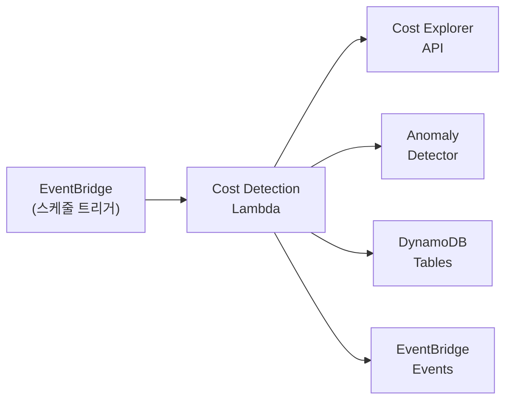
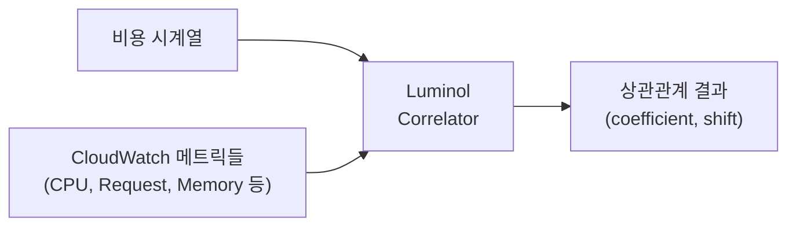

# Cost Agent - AWS Cost Anomaly Detection

> **서브 에이전트**: Cost Agent (비용 Anomaly 탐지 Agent)
>
> AWS Cost Explorer를 활용한 다중 계정 비용 이상 탐지 시스템.

## 목차

1. [개요](#개요)
2. [아키텍처](#아키텍처)
3. [이상 탐지 알고리즘](#이상-탐지-알고리즘)
4. [Cross-Account 설정](#cross-account-설정)
5. [환경 변수](#환경-변수)
6. [DynamoDB 테이블](#dynamodb-테이블)
7. [EventBridge 이벤트](#eventbridge-이벤트)
8. [사용법](#사용법)
9. [Mock 테스트](#mock-테스트)

---

## 개요

CD1 Agent의 비용 이상 탐지 모듈은 AWS Cost Explorer API를 통해 다중 AWS 계정의 비용을 분석하고, 복합적인 이상 탐지 알고리즘을 적용하여 비용 급증, 점진적 증가, 통계적 이상을 감지합니다.

### 주요 기능

- **Cross-Account 지원**: AssumeRole을 통한 다중 계정 비용 조회
- **복합 이상 탐지**: 비율/표준편차/추세/Luminol 분석 기반 탐지
- **Luminol 통합**: LinkedIn의 시계열 이상 탐지 라이브러리 활용
- **Root Cause 분석**: Luminol Correlator를 통한 메트릭 상관관계 기반 원인 추적
- **서비스별 분석**: AWS 서비스별 상세 비용 분석
- **자동 알림**: EventBridge를 통한 심각도별 알림
- **이력 관리**: DynamoDB 기반 비용 이력 및 이상 현상 추적

---

## 아키텍처



### 컴포넌트

| 컴포넌트 | 파일 | 설명 |
|---------|------|------|
| Cost Explorer Client | `src/agents/cost/services/cost_explorer_client.py` | Cost Explorer API 추상화 |
| Anomaly Detector | `src/agents/cost/services/anomaly_detector.py` | 이상 탐지 알고리즘 엔진 |
| Cost Detection Handler | `src/agents/cost/handler.py` | Lambda 핸들러 |

---

## 이상 탐지 알고리즘

### 1. 비율 기반 탐지 (Ratio)

전 기간 대비 비용 변화율을 분석합니다.

```python
ratio = (current_cost - previous_cost) / previous_cost

# 기본 임계값
- 증가 임계값: 50% (ratio_threshold: 0.5)
- 감소 임계값: 30% (ratio_decrease_threshold: 0.3)
```

**탐지 예시**:
- EC2 비용이 어제 $100 → 오늘 $160 (+60%) → **탐지됨**

### 2. 표준편차 기반 탐지 (StdDev)

과거 N일간 평균에서의 편차를 분석합니다.

```python
z_score = (current_cost - mean) / stdev

# 기본 임계값
- 표준편차 배수: 2.0 (2σ 이상 시 탐지)
```

**탐지 예시**:
- 평균 $100, 표준편차 $15인 서비스에서 $140 발생 (z=2.67) → **탐지됨**

### 3. 추세 분석 탐지 (Trend)

연속적인 비용 증가 패턴을 분석합니다.

```python
# 기본 임계값
- 연속 증가 일수: 3일 (trend_consecutive_days)
- 일 최소 증가율: 5% (trend_min_increase_rate)
```

**탐지 예시**:
- Day1 $100 → Day2 $108 (+8%) → Day3 $118 (+9%) → Day4 $130 (+10%) → **탐지됨**

### 4. Luminol 기반 탐지 (Luminol)

LinkedIn의 오픈소스 시계열 이상 탐지 라이브러리 [Luminol](https://github.com/linkedin/luminol)을 활용합니다.

```python
# Luminol 알고리즘 옵션
- default_detector: 기본 탐지기 (권장)
- bitmap_detector: 비트맵 기반 패턴 분석
- derivative_detector: 미분 기반 변화율 분석
- exp_avg_detector: 지수 이동 평균 기반

# 기본 임계값
- luminol_score_threshold: 2.0
- luminol_algorithm: "default_detector"
```

**장점**:
- 시계열 데이터에 최적화된 다양한 알고리즘
- 이상 현상의 시간 윈도우 (시작~종료) 제공
- 다른 시계열과의 상관관계 분석 (Correlator)

**탐지 예시**:
- Luminol이 비용 패턴에서 anomaly score 3.5 탐지 (임계값 2.0 초과) → **탐지됨**
- 이상 윈도우: 2024-01-10 ~ 2024-01-12

### 복합 점수 계산

각 방법의 점수를 가중 평균으로 결합합니다.

#### Luminol 활성화 시 (기본값)
```python
combined_score = (
    ratio_score * 0.30 +    # 30% 가중치
    stddev_score * 0.25 +   # 25% 가중치
    trend_score * 0.20 +    # 20% 가중치
    luminol_score * 0.25    # 25% 가중치
)
```

#### Luminol 비활성화 시
```python
combined_score = (
    ratio_score * 0.40 +    # 40% 가중치
    stddev_score * 0.35 +   # 35% 가중치
    trend_score * 0.25      # 25% 가중치
)
```

### 이상 판정 기준

- **2개 이상 방법에서 탐지** 또는 **combined_score > 0.6**

### 심각도 분류

| 심각도 | 조건 | 조치 |
|--------|------|------|
| HIGH | score ≥ 0.8 | Slack + Email 알림 |
| MEDIUM | 0.5 ≤ score < 0.8 | Slack 알림 |
| LOW | score < 0.5 | 로그 기록 |

---

## Root Cause 상관관계 분석

Luminol Correlator를 사용하여 비용 이상 현상의 잠재적 원인을 추적합니다.

### 작동 원리



### 상관관계 분석 파라미터

| 파라미터 | 설명 | 기본값 |
|----------|------|--------|
| `correlation_threshold` | 유의미한 상관계수 임계값 | 0.7 |
| `max_correlation_shift` | 최대 시간 이동 (일) | 3 |

### Shift 해석

- **shift < 0**: 해당 메트릭이 비용 변화보다 **먼저** 발생 → **원인 가능성 높음**
- **shift = 0**: 동시 발생 → 상관관계 있음
- **shift > 0**: 해당 메트릭이 비용 변화보다 **나중에** 발생 → 결과일 가능성

### 사용 예시

```python
from src.agents.cost.services.anomaly_detector import CostAnomalyDetector

detector = CostAnomalyDetector(use_luminol=True)

# 비용 데이터
cost_ts = {
    "2024-01-08": 100.0,
    "2024-01-09": 105.0,
    "2024-01-10": 180.0,  # 급증
    "2024-01-11": 175.0,
    "2024-01-12": 160.0,
}

# 관련 CloudWatch 메트릭
related_metrics = {
    "CPUUtilization": {
        "2024-01-08": 45.0,
        "2024-01-09": 85.0,  # CPU 먼저 증가
        "2024-01-10": 90.0,
        "2024-01-11": 88.0,
        "2024-01-12": 75.0,
    },
    "RequestCount": {
        "2024-01-08": 1000,
        "2024-01-09": 2500,  # 요청 먼저 증가
        "2024-01-10": 3000,
        "2024-01-11": 2800,
        "2024-01-12": 2200,
    }
}

# 상관관계 분석
correlations = detector.correlate_with_metrics(cost_ts, related_metrics)

for corr in correlations:
    print(f"{corr.metric_name}: coefficient={corr.coefficient:.3f}, "
          f"shift={corr.shift}, is_likely_cause={corr.is_likely_cause}")

# 출력 예시:
# RequestCount: coefficient=0.92, shift=-1, is_likely_cause=True
# CPUUtilization: coefficient=0.85, shift=-1, is_likely_cause=True
```

### Root Cause 분석 워크플로우

1. **이상 탐지**: CostAnomalyDetector로 비용 이상 현상 감지
2. **메트릭 수집**: CloudWatch에서 관련 메트릭 조회 (CPU, Memory, Request 등)
3. **상관관계 분석**: `correlate_with_metrics()`로 원인 후보 식별
4. **결과 해석**: `is_likely_cause=True`인 메트릭을 우선 조사

---

## Cross-Account 설정

### IAM Role 설정

각 대상 계정에 Cost Explorer 읽기 권한이 있는 IAM Role을 생성합니다.

```json
{
  "Version": "2012-10-17",
  "Statement": [
    {
      "Effect": "Allow",
      "Action": [
        "ce:GetCostAndUsage",
        "ce:GetCostForecast"
      ],
      "Resource": "*"
    }
  ]
}
```

### Trust Policy

```json
{
  "Version": "2012-10-17",
  "Statement": [
    {
      "Effect": "Allow",
      "Principal": {
        "AWS": "arn:aws:iam::MANAGEMENT_ACCOUNT_ID:root"
      },
      "Action": "sts:AssumeRole",
      "Condition": {
        "StringEquals": {
          "sts:ExternalId": "your-external-id"
        }
      }
    }
  ]
}
```

### Lambda 입력 예시

```json
{
  "start_date": "2024-01-01",
  "end_date": "2024-01-15",
  "granularity": "DAILY",
  "group_by": ["SERVICE"],
  "cross_accounts": [
    {
      "role_arn": "arn:aws:iam::111122223333:role/CostExplorerReadOnly",
      "account_alias": "Production",
      "external_id": "your-external-id"
    },
    {
      "role_arn": "arn:aws:iam::444455556666:role/CostExplorerReadOnly",
      "account_alias": "Staging"
    }
  ]
}
```

---

## 환경 변수

| 변수명 | 설명 | 기본값 |
|--------|------|--------|
| `AWS_MOCK` | Mock 모드 활성화 | `false` |
| `COST_HISTORY_TABLE` | 비용 이력 테이블 | `bdp-cost-history` |
| `COST_ANOMALY_TABLE` | 이상 현상 추적 테이블 | `bdp-cost-anomaly-tracking` |
| `COST_TARGET_ACCOUNTS` | Cross-Account 설정 (JSON) | `[]` |
| `EVENT_BUS_NAME` | EventBridge 버스 이름 | `default` |

### COST_TARGET_ACCOUNTS 형식

```bash
export COST_TARGET_ACCOUNTS='[
  {
    "role_arn": "arn:aws:iam::111122223333:role/CostExplorerReadOnly",
    "account_alias": "Production"
  }
]'
```

---

## DynamoDB 테이블

### bdp-cost-history

비용 이력 저장 테이블.

| 속성 | 타입 | 설명 |
|------|------|------|
| `account_id` (PK) | String | AWS 계정 ID |
| `date` (SK) | String | 날짜 (YYYY-MM-DD) |
| `total_cost` | String | 총 비용 |
| `top_services` | String (JSON) | 상위 5개 서비스 비용 |
| `anomaly_count` | Number | 탐지된 이상 현상 수 |
| `ttl` | Number | TTL (365일) |

**GSI**: `date-index` (날짜별 조회)

### bdp-cost-anomaly-tracking

이상 현상 추적 테이블.

| 속성 | 타입 | 설명 |
|------|------|------|
| `anomaly_id` (PK) | String | 이상 현상 고유 ID |
| `account_id` | String | AWS 계정 ID |
| `service_name` | String | AWS 서비스 이름 |
| `severity` | String | 심각도 (high/medium/low) |
| `confidence_score` | String | 신뢰도 점수 |
| `current_cost` | String | 현재 비용 |
| `previous_cost` | String | 이전 비용 |
| `cost_change_ratio` | String | 비용 변화율 |
| `detected_methods` | List | 탐지 방법 목록 |
| `analysis` | String | 분석 텍스트 |
| `date` | String | 분석 대상 날짜 |
| `ttl` | Number | TTL (90일) |

**GSI**:
- `account-date-index`: 계정별 날짜순 조회
- `severity-date-index`: 심각도별 조회

---

## EventBridge 이벤트

### 이벤트 타입

| DetailType | 조건 | 대상 |
|------------|------|------|
| `COST_ALERT_HIGH` | severity=high | Slack + Email |
| `COST_ALERT_MEDIUM` | severity=medium | Slack |
| `COST_ANOMALY_DETECTED` | severity=low | 로그 |

### 이벤트 구조

```json
{
  "version": "0",
  "source": "bdp.cost-detection",
  "detail-type": "COST_ALERT_HIGH",
  "detail": {
    "anomaly_id": "123456789012-Amazon EC2-2024-01-15-a1b2c3d4",
    "account_id": "123456789012",
    "account_alias": "Production",
    "service_name": "Amazon EC2",
    "severity": "high",
    "confidence_score": 0.85,
    "current_cost": 250.50,
    "previous_cost": 120.00,
    "cost_change_percent": 108.75,
    "detected_methods": ["ratio", "stddev"],
    "analysis": "Amazon EC2 cost increased by 108.8% ($120.00 → $250.50)...",
    "date": "2024-01-15",
    "detected_at": "2024-01-15T10:30:00Z"
  }
}
```

### EventBridge Rule 예시

```json
{
  "source": ["bdp.cost-detection"],
  "detail-type": ["COST_ALERT_HIGH", "COST_ALERT_MEDIUM"],
  "detail": {
    "severity": ["high", "medium"]
  }
}
```

---

## 사용법

### Lambda 호출

```python
import boto3
import json

lambda_client = boto3.client('lambda')

response = lambda_client.invoke(
    FunctionName='bdp-cost-detection',
    InvocationType='RequestResponse',
    Payload=json.dumps({
        "start_date": "2024-01-01",
        "end_date": "2024-01-15",
        "granularity": "DAILY",
        "group_by": ["SERVICE"],
        "thresholds": {
            "ratio_threshold": 0.3,
            "stddev_multiplier": 2.0,
            "trend_consecutive_days": 3
        },
        "min_cost_threshold": 5.0
    })
)

result = json.loads(response['Payload'].read())
print(result)
```

### 응답 예시

```json
{
  "statusCode": 200,
  "body": {
    "anomalies_detected": true,
    "total_anomaly_count": 3,
    "high_severity_count": 1,
    "medium_severity_count": 2,
    "accounts_analyzed": 2,
    "account_summaries": [
      {
        "account_id": "123456789012",
        "account_alias": "Production",
        "total_cost": 5420.50,
        "anomaly_count": 2,
        "high_severity_count": 1,
        "medium_severity_count": 1,
        "top_anomalies": [...]
      }
    ],
    "all_anomalies": [...],
    "analysis_period": {
      "start_date": "2024-01-01",
      "end_date": "2024-01-15",
      "granularity": "DAILY"
    },
    "execution_time_ms": 2540
  }
}
```

---

## Mock 테스트

### 환경 설정

```bash
export AWS_MOCK=true
```

### 코드 테스트

```python
# Cost Explorer Client 테스트
from src.agents.cost.services.cost_explorer_client import CostExplorerClient

client = CostExplorerClient()
costs = client.get_cost_and_usage(
    start_date="2024-01-01",
    end_date="2024-01-15",
    granularity="DAILY",
    group_by=["SERVICE"]
)
print(f"Total cost: ${costs['total_cost']:.2f}")
```

### 이상 현상 주입 테스트

```python
from src.agents.cost.services.cost_explorer_client import MockCostExplorerProvider

# Mock Provider 생성
provider = MockCostExplorerProvider(account_id="test-account")

# 이상 현상 주입
provider.inject_anomaly(
    date="2024-01-10",
    service="Amazon EC2",
    anomaly_type="spike",
    multiplier=3.0  # 3배 증가
)

# 비용 조회
costs = provider.get_cost_and_usage(
    start_date="2024-01-08",
    end_date="2024-01-12",
    granularity="DAILY",
    group_by=["SERVICE"]
)

# EC2 비용 확인 (2024-01-10에 3배 증가)
for date, services in costs['costs_by_date'].items():
    print(f"{date}: EC2 ${services.get('Amazon EC2', 0):.2f}")
```

### Handler 통합 테스트

```bash
python -c "
import os
os.environ['AWS_MOCK'] = 'true'

from src.agents.cost.handler import handler as lambda_handler
import json

class MockContext:
    aws_request_id = 'test-123'

result = lambda_handler({
    'start_date': '2024-01-01',
    'end_date': '2024-01-15',
    'granularity': 'DAILY',
    'group_by': ['SERVICE']
}, MockContext())

print(json.dumps(json.loads(result['body']), indent=2))
"
```

---

## 관련 문서

- [Architecture Guide](ARCHITECTURE.md) - 전체 시스템 아키텍처
- [HDSP Detection](HDSP_DETECTION.md) - On-Prem K8s 장애 감지 (HDSP Agent)
- [Config Drift Detection](CONFIG_DRIFT_DETECTION.md) - 설정 드리프트 감지 (Drift Agent)

## 참고

- [AWS Cost Explorer API](https://docs.aws.amazon.com/cost-management/latest/APIReference/API_Operations_AWS_Cost_Explorer_Service.html)
- [Cross-Account Access](https://docs.aws.amazon.com/IAM/latest/UserGuide/tutorial_cross-account-with-roles.html)
- [Luminol - LinkedIn Time Series Anomaly Detection](https://github.com/linkedin/luminol)
