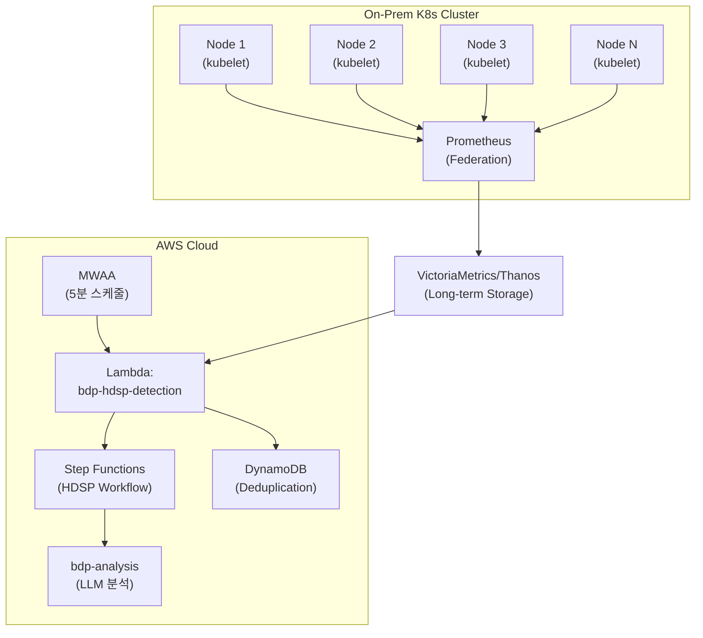
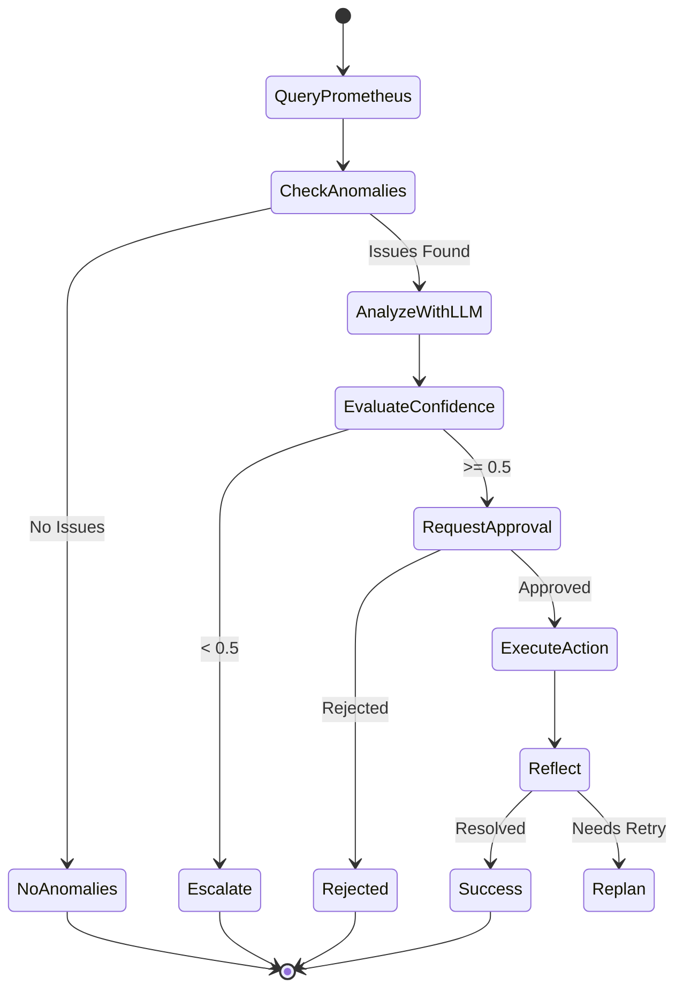

# HDSP Agent - On-Prem K8s 장애 감지

## Overview

HDSP (Hadoop/Spark Platform) Agent는 On-Premise Kubernetes 클러스터의 장애를 감지하고 분석하는 서브 에이전트입니다. Prometheus 메트릭을 수집하여 Pod/Node 상태, CPU/Memory 이상, OOMKill 등을 실시간으로 모니터링합니다.

## Architecture



## Lambda: bdp-hdsp-detection

| 속성 | 값 |
|------|-----|
| **Function** | `bdp-hdsp-detection` |
| **Runtime** | Python 3.12 |
| **Architecture** | ARM64 (Graviton2) |
| **Memory** | 512MB |
| **Timeout** | 60s |
| **Trigger** | MWAA (bdp_hdsp_detection_dag) |

## Prometheus 메트릭 수집

### 연동 방식

HDSP Agent는 VictoriaMetrics 또는 Thanos를 통해 Prometheus 메트릭을 조회합니다.

```python
# Prometheus Query API 호출
PROMETHEUS_URL = os.environ.get('PROMETHEUS_URL', 'http://victoriametrics:8428')

def query_prometheus(query: str, time_range: str = '5m') -> dict:
    """Prometheus PromQL 쿼리 실행."""
    response = requests.get(
        f"{PROMETHEUS_URL}/api/v1/query_range",
        params={
            'query': query,
            'start': (datetime.now() - timedelta(minutes=5)).isoformat(),
            'end': datetime.now().isoformat(),
            'step': '15s'
        }
    )
    return response.json()
```

### 수집 메트릭

#### Pod 상태 메트릭

| 메트릭 | PromQL | 설명 |
|--------|--------|------|
| Pod 재시작 | `kube_pod_container_status_restarts_total` | 컨테이너 재시작 횟수 |
| Pod 상태 | `kube_pod_status_phase` | Running/Pending/Failed 등 |
| OOMKilled | `kube_pod_container_status_last_terminated_reason{reason="OOMKilled"}` | 메모리 초과로 종료된 Pod |
| CrashLoopBackOff | `kube_pod_container_status_waiting_reason{reason="CrashLoopBackOff"}` | 반복 크래시 |

#### Node 상태 메트릭

| 메트릭 | PromQL | 설명 |
|--------|--------|------|
| Node 상태 | `kube_node_status_condition{condition="Ready"}` | Node Ready 상태 |
| CPU 압력 | `kube_node_status_condition{condition="MemoryPressure"}` | 메모리 압력 상태 |
| 디스크 압력 | `kube_node_status_condition{condition="DiskPressure"}` | 디스크 압력 상태 |

#### 리소스 사용량 메트릭

| 메트릭 | PromQL | 설명 |
|--------|--------|------|
| CPU 사용률 | `sum(rate(container_cpu_usage_seconds_total{...}[5m])) by (pod)` | Pod별 CPU 사용률 |
| Memory 사용량 | `container_memory_working_set_bytes` | 컨테이너 메모리 사용량 |
| Memory Limit | `kube_pod_container_resource_limits{resource="memory"}` | 메모리 한도 |

## 탐지 타입

### 1. Pod 장애 탐지 (pod_failure)

**탐지 조건**:
- `CrashLoopBackOff` 상태인 Pod
- `OOMKilled` 종료 사유로 재시작된 Pod
- 5분 내 3회 이상 재시작된 Pod

```python
# CrashLoopBackOff 탐지
query = '''
  kube_pod_container_status_waiting_reason{reason="CrashLoopBackOff"} == 1
'''

# OOMKilled 탐지
query = '''
  increase(kube_pod_container_status_restarts_total{
    container!="POD"
  }[5m]) > 0
  and on(namespace, pod, container)
  kube_pod_container_status_last_terminated_reason{reason="OOMKilled"} == 1
'''
```

### 2. Node 리소스 압박 탐지 (node_pressure)

**탐지 조건**:
- Node `MemoryPressure` = True
- Node `DiskPressure` = True
- Node `PIDPressure` = True
- Node `NotReady` 상태

```python
# Node 압력 상태 탐지
query = '''
  kube_node_status_condition{
    condition=~"MemoryPressure|DiskPressure|PIDPressure",
    status="true"
  } == 1
'''

# Node NotReady 탐지
query = '''
  kube_node_status_condition{condition="Ready", status="true"} == 0
'''
```

### 3. 리소스 이상 탐지 (resource_anomaly)

**탐지 조건**:
- CPU 사용률 > 90% (5분 평균)
- Memory 사용률 > 85% (Limit 대비)
- 갑작스러운 리소스 사용량 급증

```python
# 높은 CPU 사용률 탐지
query = '''
  sum(rate(container_cpu_usage_seconds_total{container!="POD"}[5m])) by (namespace, pod)
  /
  sum(kube_pod_container_resource_limits{resource="cpu"}) by (namespace, pod)
  > 0.9
'''

# 높은 Memory 사용률 탐지
query = '''
  sum(container_memory_working_set_bytes{container!="POD"}) by (namespace, pod)
  /
  sum(kube_pod_container_resource_limits{resource="memory"}) by (namespace, pod)
  > 0.85
'''
```

## 환경 변수

| Variable | Description | Default |
|----------|-------------|---------|
| `PROMETHEUS_URL` | Prometheus/VictoriaMetrics 엔드포인트 | Required |
| `PROMETHEUS_AUTH_TOKEN` | 인증 토큰 (선택) | - |
| `HDSP_NAMESPACES` | 모니터링 대상 네임스페이스 (콤마 구분) | `default,hdsp,spark` |
| `HDSP_EXCLUDE_PODS` | 제외할 Pod 패턴 (regex) | - |
| `RESTART_THRESHOLD` | 재시작 임계값 | `3` |
| `CPU_THRESHOLD` | CPU 임계값 (%) | `90` |
| `MEMORY_THRESHOLD` | Memory 임계값 (%) | `85` |

## 알림 및 에스컬레이션

### 심각도 분류

| Severity | 조건 | 대응 |
|----------|------|------|
| **Critical** | OOMKilled, Node NotReady | 즉시 알림 + 자동 분석 |
| **High** | CrashLoopBackOff, Memory > 95% | 5분 내 알림 |
| **Medium** | Node Pressure, CPU > 90% | 15분 내 알림 |
| **Low** | 재시작 횟수 증가 | 일일 리포트 포함 |

### EventBridge 알림

```json
{
  "source": "cd1-agent.hdsp",
  "detail-type": "K8s Anomaly Detected",
  "detail": {
    "agent": "hdsp",
    "anomaly_type": "pod_failure",
    "severity": "critical",
    "namespace": "spark",
    "pod": "spark-executor-123",
    "reason": "OOMKilled",
    "metrics": {
      "memory_usage": "4.2Gi",
      "memory_limit": "4Gi",
      "restart_count": 5
    },
    "timestamp": "2024-01-15T10:30:00Z"
  }
}
```

## Step Functions 워크플로우

HDSP Agent는 독립적인 Step Functions 워크플로우(`bdp-hdsp-workflow`)를 사용합니다.



## 지원 복구 조치

| Action | 설명 | 예시 |
|--------|------|------|
| `pod_restart` | Pod 재시작 요청 (K8s API) | 장애 Pod 재시작 |
| `resource_adjustment` | 리소스 조정 권장 (수동) | Memory Limit 증가 권장 |
| `node_drain` | Node Drain 요청 (수동) | 장애 Node 격리 |
| `investigate` | 추가 조사 요청 | 로그 수집, 메트릭 상세 분석 |

> **Note**: K8s 클러스터에 대한 직접적인 조치(Pod 재시작, Node Drain 등)는 승인 후 API를 통해 실행되거나, 담당자에게 권장 사항으로 전달됩니다.

## 관련 문서

- [Architecture Guide](ARCHITECTURE.md) - 전체 시스템 아키텍처
- [Cost Anomaly Detection](COST_ANOMALY_DETECTION.md) - 비용 이상 탐지 (Cost Agent)
- [Config Drift Detection](CONFIG_DRIFT_DETECTION.md) - 설정 드리프트 감지 (Drift Agent)
