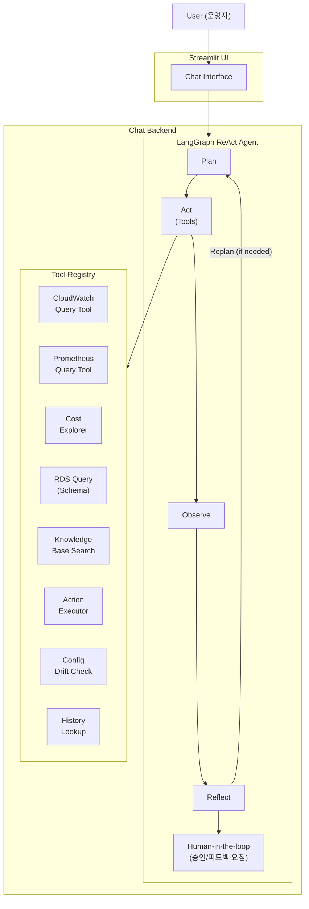
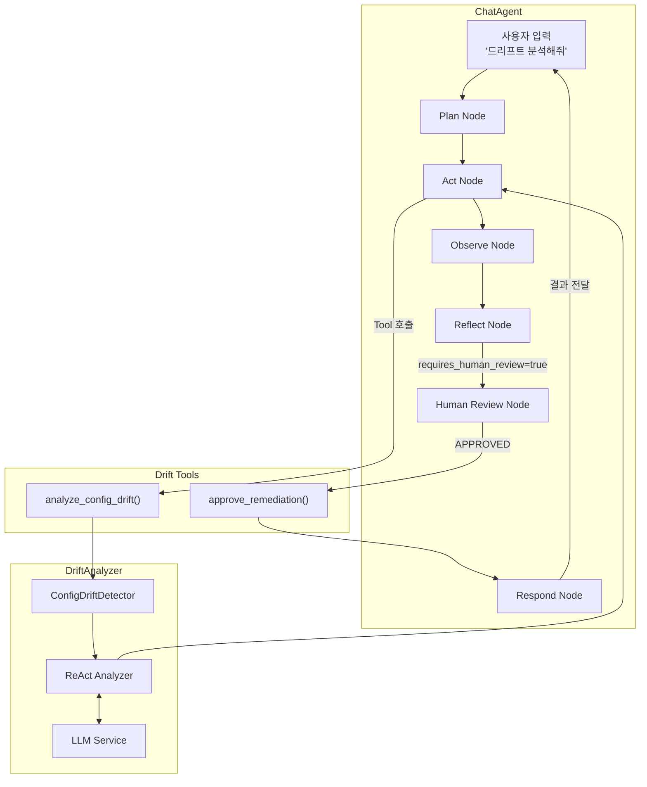
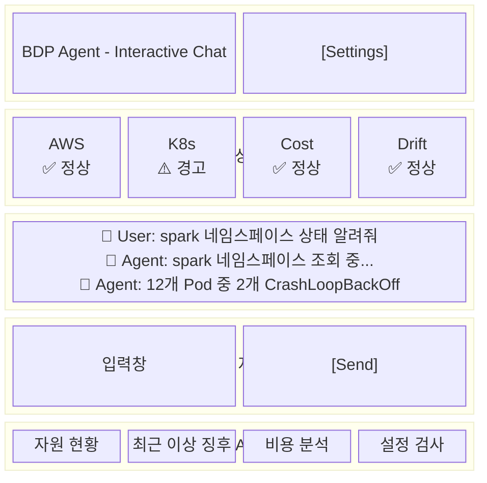

# Interactive Chat Interface - Streamlit 기반 대화형 에이전트

## Overview

기존 Lambda 배치 실행 방식 외에 **Streamlit 기반 대화형 인터페이스**를 제공하여, 운영자가 직접 채팅을 통해 자원 현황 조회, 원인분석 의뢰, Human-in-the-loop 승인 등을 수행할 수 있습니다.

### 핵심 기능

| 기능 | 설명 |
|------|------|
| **자원 현황 조회** | 대화로 AWS/K8s 자원 상태 실시간 조회 |
| **원인분석 의뢰** | 이상 징후에 대한 LLM 기반 근본 원인 분석 (멀티턴) |
| **ReAct 자체 검증** | 에이전트가 자신의 분석을 검증하고 재계획 |
| **Human-in-the-loop** | 조치 실행 전 운영자 승인/피드백 수집 |

---

## Architecture



---

## 실행 모드 비교

| 항목 | Lambda 배치 | Streamlit Chat |
|------|-------------|----------------|
| **트리거** | MWAA 5분 주기 | 사용자 입력 |
| **상호작용** | 단방향 (알림만) | 양방향 (대화) |
| **멀티턴** | ❌ 단일 실행 | ✅ 대화 컨텍스트 유지 |
| **승인 방식** | EventBridge → 외부 시스템 | 채팅 내 직접 승인 |
| **용도** | 자동 모니터링 | 수동 조사/분석 |

---

## Chat Flow

### 1. 자원 현황 조회

```
┌────────────────────────────────────────────────────────────────────────────┐
│ User: "현재 spark 네임스페이스의 Pod 상태 알려줘"                             │
│                                                                             │
│ Agent: [Plan] Prometheus에서 spark 네임스페이스 Pod 상태 조회 필요          │
│        [Act]  prometheus_query_tool 실행                                   │
│        [Observe] 결과: 12개 Pod 중 2개 CrashLoopBackOff                     │
│        [Reflect] Pod 장애 감지됨, 상세 분석 필요 여부 확인                   │
│                                                                             │
│ Agent: spark 네임스페이스에 12개 Pod가 있습니다.                            │
│        ⚠️ 2개 Pod가 CrashLoopBackOff 상태입니다:                            │
│        - spark-executor-7a3b: 메모리 부족 의심                              │
│        - spark-driver-2x9f: 연결 오류                                       │
│                                                                             │
│        상세 원인 분석을 진행할까요?                                          │
│                                                                             │
│ User: "네, spark-executor-7a3b 분석해줘"                                    │
└────────────────────────────────────────────────────────────────────────────┘
```

### 2. 멀티턴 원인분석

```
┌────────────────────────────────────────────────────────────────────────────┐
│ User: "spark-executor-7a3b 분석해줘"                                        │
│                                                                             │
│ Agent: [Plan] OOMKilled 가능성 검토 → 메모리 사용량 조회 → 로그 확인        │
│        [Act]  prometheus_query_tool(memory metrics)                        │
│        [Observe] 메모리 99% 사용, OOMKilled 기록 있음                        │
│        [Reflect] OOMKilled 확인, 원인 분석 진행                             │
│                                                                             │
│ Agent: 🔍 분석 결과:                                                        │
│        - 상태: OOMKilled                                                    │
│        - 메모리 사용: 3.9Gi / 4Gi (99%)                                     │
│        - 마지막 재시작: 5분 전                                               │
│        - 재시작 횟수: 7회 (최근 1시간)                                       │
│                                                                             │
│        💡 추정 원인:                                                        │
│        1. Spark 작업의 메모리 요구량 증가                                   │
│        2. Memory Limit 설정 부족                                            │
│                                                                             │
│        📋 권장 조치:                                                        │
│        1. Memory Limit 6Gi로 증가                                          │
│        2. spark.executor.memory 설정 조정                                  │
│                                                                             │
│        이 분석이 맞는지 확인해 주세요. 추가 정보가 필요하신가요?             │
│                                                                             │
│ User: "최근 어떤 작업이 돌았는지도 확인해줘"                                 │
│                                                                             │
│ Agent: [Act] rds_query_tool(spark job history)                             │
│        ...                                                                  │
└────────────────────────────────────────────────────────────────────────────┘
```

### 3. Human-in-the-loop 승인

```
┌────────────────────────────────────────────────────────────────────────────┐
│ Agent: ✅ 분석 완료. 다음 조치를 권장합니다:                                 │
│                                                                             │
│        ┌─────────────────────────────────────────────────────────────┐     │
│        │ 권장 조치: spark-executor-7a3b Memory Limit 증가            │     │
│        │                                                              │     │
│        │ • 현재: 4Gi → 변경: 6Gi                                     │     │
│        │ • 신뢰도: 0.82                                               │     │
│        │ • 예상 영향: Pod 재시작, 약 30초 다운타임                    │     │
│        │                                                              │     │
│        │ [승인]  [수정 후 승인]  [거부]  [추가 분석 요청]             │     │
│        └─────────────────────────────────────────────────────────────┘     │
│                                                                             │
│ User: [수정 후 승인] "8Gi로 변경해줘"                                       │
│                                                                             │
│ Agent: [Reflect] 사용자 피드백 반영: 6Gi → 8Gi로 수정                       │
│        [Act] action_executor_tool(modify_resource_limit, 8Gi)              │
│                                                                             │
│ Agent: ✅ 조치 완료:                                                        │
│        - spark-executor-7a3b Memory Limit: 4Gi → 8Gi                       │
│        - Pod 재시작 진행 중...                                              │
│        - 예상 복구 시간: 30초                                               │
│                                                                             │
│        30초 후 상태를 다시 확인해 드릴까요?                                  │
└────────────────────────────────────────────────────────────────────────────┘
```

---

## 4. Config Drift 분석 및 HITL

```
┌────────────────────────────────────────────────────────────────────────────┐
│ User: "production-eks 클러스터 드리프트 분석해줘"                           │
│                                                                             │
│ Agent: [Plan] EKS 클러스터 드리프트 탐지 및 LLM 원인 분석 필요             │
│        [Act]  analyze_config_drift(EKS, production-eks)                    │
│        [Observe] 드리프트 감지됨 - instance_types, desired_size 변경       │
│        [Reflect] HIGH 심각도, 복구 승인 필요                               │
│                                                                             │
│ Agent: 🔍 드리프트 분석 결과:                                              │
│        - 리소스: EKS/production-eks                                        │
│        - 최대 심각도: HIGH                                                 │
│        - 변경된 필드:                                                      │
│          • instance_types: ["m6i.xlarge"] → ["m5.large"] (HIGH)           │
│          • desired_size: 5 → 3 (MEDIUM)                                   │
│                                                                             │
│        🤖 LLM 원인 분석:                                                   │
│        - 원인 카테고리: MANUAL_CHANGE                                      │
│        - 근본 원인: AWS Console에서 비용 절감 목적 수동 변경 추정          │
│        - 신뢰도: 0.85                                                      │
│        - 긴급도: 0.7                                                       │
│                                                                             │
│        ┌─────────────────────────────────────────────────────────────┐     │
│        │ ⚠️ 권장 조치: 기준선으로 복원                                │     │
│        │                                                              │     │
│        │ 명령: terraform apply -target=module.eks                    │     │
│        │ 예상 영향: 노드그룹 스케일업, 약 5분 소요                    │     │
│        │                                                              │     │
│        │ [승인]  [수정 후 승인]  [거부]  [추가 분석 요청]             │     │
│        └─────────────────────────────────────────────────────────────┘     │
│                                                                             │
│ User: [승인]                                                                │
│                                                                             │
│ Agent: [Act]  approve_remediation(APPROVED)                                │
│        ✅ 복구 작업이 승인되었습니다.                                      │
│        Terraform 적용이 시작됩니다. 완료 후 상태를 확인해 드릴까요?        │
│                                                                             │
│ User: "네, 5분 후에 확인해줘"                                              │
│                                                                             │
│ Agent: 5분 후 EKS 클러스터 상태를 확인하겠습니다. ⏰                       │
└────────────────────────────────────────────────────────────────────────────┘
```

### Drift 도구 목록

| 도구 | 함수명 | 설명 |
|-----|--------|------|
| **드리프트 분석** | `analyze_config_drift` | 기준선 대비 현재 설정 비교 + LLM 원인 분석 |
| **상태 조회** | `check_drift_status` | 감지된 드리프트 목록 조회 |
| **복구 계획** | `get_remediation_plan` | 드리프트별 복구 계획 조회 |
| **승인 처리** | `approve_remediation` | 복구 작업 APPROVED/MODIFIED/REJECTED |

### Drift 분석 플로우 (LangGraph)



---

## ReAct 자체 검증 패턴

### Reflect & Replan Loop

```python
class ChatAgent:
    """Streamlit Chat용 LangGraph ReAct 에이전트."""

    def __init__(self):
        self.graph = self._build_graph()
        self.conversation_history: List[Message] = []

    def _build_graph(self) -> StateGraph:
        """ReAct + Reflect 그래프 구성."""
        graph = StateGraph(ChatState)

        # 노드 정의
        graph.add_node("plan", self.plan_node)
        graph.add_node("act", self.act_node)
        graph.add_node("observe", self.observe_node)
        graph.add_node("reflect", self.reflect_node)
        graph.add_node("human_review", self.human_review_node)
        graph.add_node("respond", self.respond_node)

        # 엣지 정의
        graph.add_edge("plan", "act")
        graph.add_edge("act", "observe")
        graph.add_edge("observe", "reflect")

        # 조건부 엣지: Reflect 결과에 따라 분기
        graph.add_conditional_edges(
            "reflect",
            self.should_continue,
            {
                "replan": "plan",           # 재계획 필요
                "human_review": "human_review",  # 승인 필요
                "respond": "respond",       # 응답 가능
            }
        )

        graph.add_edge("human_review", "respond")
        graph.add_edge("respond", END)

        return graph.compile()

    async def reflect_node(self, state: ChatState) -> ChatState:
        """자체 검증 노드: 분석 결과의 신뢰성 평가."""
        reflection_prompt = f"""
        분석 결과를 검토하세요:

        계획: {state.plan}
        실행 결과: {state.observation}

        다음을 평가하세요:
        1. 분석이 충분한가? (정보 누락 여부)
        2. 결론이 논리적인가? (인과관계 검증)
        3. 추가 조사가 필요한가?
        4. 사용자 승인이 필요한 조치인가?

        응답 형식:
        - confidence: 0.0-1.0
        - needs_replan: bool
        - needs_human_review: bool
        - reasoning: str
        """

        reflection = await self.llm.invoke(reflection_prompt)
        state.reflection = reflection
        state.confidence = reflection.confidence

        return state

    def should_continue(self, state: ChatState) -> str:
        """Reflect 결과에 따른 다음 단계 결정."""
        if state.reflection.needs_replan:
            return "replan"
        if state.reflection.needs_human_review:
            return "human_review"
        return "respond"
```

### 자체 검증 체크리스트

| 검증 항목 | 기준 | 실패 시 동작 |
|----------|------|-------------|
| **정보 충분성** | 필요한 메트릭/로그 수집 완료 | Replan (추가 Tool 호출) |
| **인과관계 검증** | 원인 → 결과 논리적 연결 | Replan (대안 가설 탐색) |
| **신뢰도 임계값** | confidence >= 0.5 | Human Review 요청 |
| **위험도 평가** | 조치의 영향 범위 평가 | Human Review 필수 |

---

## Streamlit UI 구성

### 페이지 레이아웃



### 주요 컴포넌트

```python
# src/chat/streamlit_app.py

import streamlit as st
from src.chat.agent import ChatAgent
from src.chat.components import StatusDashboard, ChatHistory, ApprovalDialog

def main():
    st.set_page_config(
        page_title="BDP Agent - Interactive Chat",
        page_icon="🤖",
        layout="wide"
    )

    # 세션 상태 초기화
    if "agent" not in st.session_state:
        st.session_state.agent = ChatAgent()
    if "messages" not in st.session_state:
        st.session_state.messages = []

    # 헤더
    st.title("🤖 BDP Agent - Interactive Chat")

    # 상태 대시보드
    with st.container():
        StatusDashboard.render()

    # 채팅 히스토리
    chat_container = st.container()
    with chat_container:
        ChatHistory.render(st.session_state.messages)

    # Human-in-the-loop 승인 다이얼로그
    if st.session_state.get("pending_approval"):
        ApprovalDialog.render(st.session_state.pending_approval)

    # 입력창
    user_input = st.chat_input("메시지를 입력하세요...")
    if user_input:
        asyncio.run(handle_user_input(user_input))

    # Quick Actions
    col1, col2, col3, col4 = st.columns(4)
    with col1:
        if st.button("📊 자원 현황"):
            asyncio.run(handle_user_input("현재 자원 현황을 알려줘"))
    with col2:
        if st.button("⚠️ 최근 이상 징후"):
            asyncio.run(handle_user_input("최근 1시간 이상 징후를 보여줘"))
    with col3:
        if st.button("💰 비용 분석"):
            asyncio.run(handle_user_input("오늘 비용 현황을 분석해줘"))
    with col4:
        if st.button("🔧 설정 검사"):
            asyncio.run(handle_user_input("설정 드리프트 검사해줘"))


async def handle_user_input(user_input: str):
    """사용자 입력 처리 및 에이전트 응답."""
    # 사용자 메시지 추가
    st.session_state.messages.append({
        "role": "user",
        "content": user_input
    })

    # 에이전트 실행 (스트리밍)
    agent = st.session_state.agent

    with st.spinner("분석 중..."):
        async for event in agent.stream(user_input):
            if event.type == "thinking":
                st.status(f"🔄 {event.content}")
            elif event.type == "tool_call":
                st.status(f"🛠️ {event.tool_name} 실행 중...")
            elif event.type == "approval_request":
                st.session_state.pending_approval = event.data
            elif event.type == "response":
                st.session_state.messages.append({
                    "role": "assistant",
                    "content": event.content
                })

    st.rerun()
```

---

## 구현 계획

### Phase 1: 기본 채팅 인프라 (Week 1-2)

- [ ] `src/chat/` 디렉토리 구조 생성
- [ ] ChatAgent 클래스 구현 (LangGraph 기반)
- [ ] 기본 Streamlit UI 구현
- [ ] 대화 컨텍스트 관리 (세션 상태)

### Phase 2: Tool 연동 (Week 2-3)

- [ ] 기존 Tool을 Chat용으로 래핑
- [ ] RDS 스키마 동적 로딩 연동 (Task #7)
- [ ] Tool 실행 상태 스트리밍

### Phase 3: ReAct + Reflect (Week 3-4)

- [ ] Reflect 노드 구현
- [ ] Replan 로직 구현
- [ ] 신뢰도 평가 시스템

### Phase 4: Human-in-the-loop (Week 4-5)

- [ ] 승인 다이얼로그 컴포넌트
- [ ] 피드백 수집 및 반영
- [ ] 조치 실행 및 결과 보고

### Phase 5: 통합 및 배포 (Week 5-6)

- [ ] Docker 이미지 빌드
- [ ] ECS/EKS 배포 구성
- [ ] 인증/권한 연동 (Cognito/OIDC)

---

## 디렉토리 구조 (예상)

```
src/
├── chat/                          # NEW: Chat 기능
│   ├── __init__.py
│   ├── agent.py                   # ChatAgent (LangGraph)
│   ├── state.py                   # ChatState 정의
│   ├── nodes/                     # 그래프 노드들
│   │   ├── plan.py
│   │   ├── act.py
│   │   ├── observe.py
│   │   ├── reflect.py
│   │   └── human_review.py
│   ├── tools/                     # Chat용 Tool 래퍼
│   │   ├── cloudwatch.py
│   │   ├── prometheus.py
│   │   ├── rds.py
│   │   ├── drift.py               # 드리프트 분석 + HITL
│   │   ├── service_health.py
│   │   └── action_tool.py
│   ├── components/                # Streamlit 컴포넌트
│   │   ├── dashboard.py
│   │   ├── chat_history.py
│   │   └── approval_dialog.py
│   └── streamlit_app.py           # 메인 앱
│
├── agent/                         # 기존 배치 에이전트
├── handlers/
├── models/
└── services/
```

---

## 환경 변수

| Variable | Description | Default |
|----------|-------------|---------|
| `CHAT_ENABLED` | Chat 기능 활성화 | `false` |
| `STREAMLIT_PORT` | Streamlit 서버 포트 | `8501` |
| `CHAT_SESSION_TIMEOUT` | 세션 타임아웃 (분) | `30` |
| `CHAT_MAX_HISTORY` | 최대 대화 히스토리 수 | `100` |
| `CHAT_APPROVAL_TIMEOUT` | 승인 대기 타임아웃 (분) | `10` |

---

## 관련 문서

- [Architecture Guide](ARCHITECTURE.md) - 전체 시스템 아키텍처
- [Config Drift Detection](CONFIG_DRIFT_DETECTION.md) - 드리프트 탐지 및 LLM 분석 + HITL
- [Task #7: RDS 스키마 동적 로딩](../issues/tasks.md) - 스키마 기반 동적 쿼리
- [HDSP Detection](HDSP_DETECTION.md) - K8s 장애 감지 (Chat에서 조회 가능)
- [Cost Anomaly Detection](COST_ANOMALY_DETECTION.md) - 비용 분석 (Chat에서 조회 가능)

---

## 보안 고려사항

| 항목 | 대응 방안 |
|------|----------|
| **인증** | Cognito/OIDC 연동, 세션 토큰 검증 |
| **권한** | RBAC 기반 Tool 접근 제어 |
| **감사** | 모든 대화/조치 이력 DynamoDB 저장 |
| **데이터** | 민감 정보 마스킹, TLS 암호화 |

---

*최종 업데이트: 2025-12-19*
