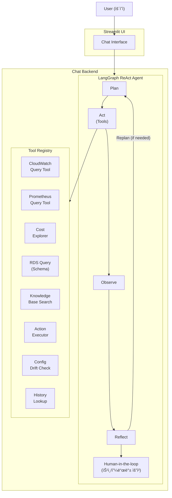
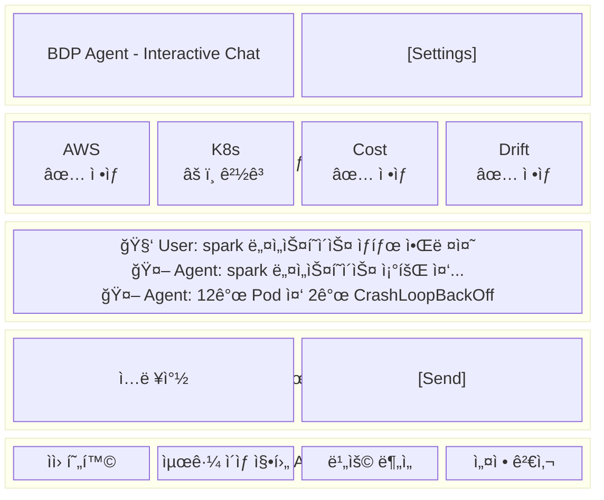

# Interactive Chat Interface - Streamlit 기반 대화형 ì—ì´ì „트

## Overview

기존 Lambda 배치 실행 ë°©ì‹ ì™¸ì— **Streamlit 기반 대화형 ì¸í„°í˜ì´ìŠ¤**를 제공하여, ìš´ì˜ìê°€ ì§ì ‘ ì±„íŒ…ì„ í†µí•´ ìì› í˜„í™© 조회, ì›ì¸ë¶„ì„ ì˜ë¢°, Human-in-the-loop ìŠ¹ì¸ ë“±ì„ ìˆ˜í–‰í•  수 ìˆìŠµë‹ˆë‹¤.

### 핵심 기능

| 기능 | 설명 |
|------|------|
| **ìì› í˜„í™© 조회** | 대화로 AWS/K8s ìì› ìƒíƒœ 실시간 조회 |
| **ì›ì¸ë¶„ì„ ì˜ë¢°** | ì´ìƒ ì§•í›„ì— ëŒ€í•œ LLM 기반 근본 ì›ì¸ ë¶„ì„ (멀티턴) |
| **ReAct ìì²´ ê²€ì¦** | ì—ì´ì „트가 ìì‹ ì˜ ë¶„ì„ì„ ê²€ì¦í•˜ê³  ì¬ê³„íš |
| **Human-in-the-loop** | 조치 실행 ì „ ìš´ì˜ì 승ì¸/피드백 수집 |

---

## Architecture



---

## 실행 모드 비êµ

| 항목 | Lambda 배치 | Streamlit Chat |
|------|-------------|----------------|
| **트리거** | MWAA 5분 주기 | 사용ì ì…ë ¥ |
| **ìƒí˜¸ì‘ìš©** | 단방향 (알림만) | ì–‘ë°©í–¥ (대화) |
| **멀티턴** | âŒ ë‹¨ì¼ ì‹¤í–‰ | ✅ 대화 컨í…스트 유지 |
| **ìŠ¹ì¸ ë°©ì‹** | EventBridge → 외부 시스템 | 채팅 ë‚´ ì§ì ‘ ìŠ¹ì¸ |
| **ìš©ë„** | ìë™ ëª¨ë‹ˆí„°ë§ | ìˆ˜ë™ ì¡°ì‚¬/ë¶„ì„ |

---

## Chat Flow

### 1. ìì› í˜„í™© 조회

```
┌────────────────────────────────────────────────────────────────────────────â”
│ User: "í˜„ì¬ spark 네ì„스í˜ì´ìŠ¤ì˜ Pod ìƒíƒœ 알려줘"                             │
│                                                                             │
│ Agent: [Plan] Prometheusì—ì„œ spark 네ì„스í˜ì´ìŠ¤ Pod ìƒíƒœ 조회 í•„ìš”          │
│        [Act]  prometheus_query_tool 실행                                   │
│        [Observe] 결과: 12개 Pod 중 2개 CrashLoopBackOff                     │
│        [Reflect] Pod ì¥ì•  ê°ì§€ë¨, ìƒì„¸ ë¶„ì„ í•„ìš” 여부 í™•ì¸                   │
│                                                                             │
│ Agent: spark 네ì„스í˜ì´ìŠ¤ì— 12ê°œ Podê°€ ìˆìŠµë‹ˆë‹¤.                            │
│        âš ï¸ 2ê°œ Podê°€ CrashLoopBackOff ìƒíƒœì…니다:                            │
│        - spark-executor-7a3b: 메모리 부족 ì˜ì‹¬                              │
│        - spark-driver-2x9f: 연결 오류                                       │
│                                                                             │
│        ìƒì„¸ ì›ì¸ 분ì„ì„ ì§„í–‰í• ê¹Œìš”?                                          │
│                                                                             │
│ User: "네, spark-executor-7a3b 분ì„해줘"                                    │
└────────────────────────────────────────────────────────────────────────────┘
```

### 2. 멀티턴 ì›ì¸ë¶„ì„

```
┌────────────────────────────────────────────────────────────────────────────â”
│ User: "spark-executor-7a3b 분ì„해줘"                                        │
│                                                                             │
│ Agent: [Plan] OOMKilled 가능성 검토 → 메모리 사용량 조회 → 로그 í™•ì¸        │
│        [Act]  prometheus_query_tool(memory metrics)                        │
│        [Observe] 메모리 99% 사용, OOMKilled ê¸°ë¡ ìˆìŒ                        │
│        [Reflect] OOMKilled 확ì¸, ì›ì¸ ë¶„ì„ ì§„í–‰                             │
│                                                                             │
│ Agent: ğŸ” ë¶„ì„ ê²°ê³¼:                                                        │
│        - ìƒíƒœ: OOMKilled                                                    │
│        - 메모리 사용: 3.9Gi / 4Gi (99%)                                     │
│        - 마지막 ì¬ì‹œì‘: 5분 ì „                                               │
│        - ì¬ì‹œì‘ 횟수: 7회 (최근 1시간)                                       │
│                                                                             │
│        💡 추정 ì›ì¸:                                                        │
│        1. Spark ì‘ì—…ì˜ ë©”ëª¨ë¦¬ 요구량 ì¦ê°€                                   │
│        2. Memory Limit 설정 부족                                            │
│                                                                             │
│        📋 ê¶Œì¥ ì¡°ì¹˜:                                                        │
│        1. Memory Limit 6Gië¡œ ì¦ê°€                                          │
│        2. spark.executor.memory 설정 조정                                  │
│                                                                             │
│        ì´ ë¶„ì„ì´ ë§ëŠ”지 확ì¸í•´ 주세요. 추가 ì •ë³´ê°€ 필요하신가요?             │
│                                                                             │
│ User: "최근 ì–´ë–¤ ì‘ì—…ì´ ëŒì•˜ëŠ”ì§€ë„ í™•ì¸í•´ì¤˜"                                 │
│                                                                             │
│ Agent: [Act] rds_query_tool(spark job history)                             │
│        ...                                                                  │
└────────────────────────────────────────────────────────────────────────────┘
```

### 3. Human-in-the-loop 승ì¸

```
┌────────────────────────────────────────────────────────────────────────────â”
│ Agent: ✅ ë¶„ì„ ì™„ë£Œ. ë‹¤ìŒ ì¡°ì¹˜ë¥¼ 권ì¥í•©ë‹ˆë‹¤:                                 │
│                                                                             │
│        ┌─────────────────────────────────────────────────────────────┠    │
│        │ ê¶Œì¥ ì¡°ì¹˜: spark-executor-7a3b Memory Limit ì¦ê°€            │     │
│        │                                                              │     │
│        │ • 현ì¬: 4Gi → 변경: 6Gi                                     │     │
│        │ • 신뢰ë„: 0.82                                               │     │
│        │ • ì˜ˆìƒ ì˜í–¥: Pod ì¬ì‹œì‘, 약 30ì´ˆ ë‹¤ìš´íƒ€ì„                    │     │
│        │                                                              │     │
│        │ [승ì¸]  [수정 후 승ì¸]  [거부]  [추가 ë¶„ì„ ìš”ì²­]             │     │
│        └─────────────────────────────────────────────────────────────┘     │
│                                                                             │
│ User: [수정 후 승ì¸] "8Gië¡œ 변경해줘"                                       │
│                                                                             │
│ Agent: [Reflect] 사용ì 피드백 ë°˜ì˜: 6Gi → 8Gië¡œ 수정                       │
│        [Act] action_executor_tool(modify_resource_limit, 8Gi)              │
│                                                                             │
│ Agent: ✅ 조치 완료:                                                        │
│        - spark-executor-7a3b Memory Limit: 4Gi → 8Gi                       │
│        - Pod ì¬ì‹œì‘ 진행 중...                                              │
│        - ì˜ˆìƒ ë³µêµ¬ 시간: 30ì´ˆ                                               │
│                                                                             │
│        30ì´ˆ 후 ìƒíƒœë¥¼ 다시 확ì¸í•´ 드릴까요?                                  │
└────────────────────────────────────────────────────────────────────────────┘
```

---

## 4. Config Drift ë¶„ì„ ë° HITL

```
┌────────────────────────────────────────────────────────────────────────────â”
│ User: "production-eks í´ëŸ¬ìŠ¤í„° 드리프트 분ì„해줘"                           │
│                                                                             │
│ Agent: [Plan] EKS í´ëŸ¬ìŠ¤í„° 드리프트 íƒì§€ ë° LLM ì›ì¸ ë¶„ì„ í•„ìš”             │
│        [Act]  analyze_config_drift(EKS, production-eks)                    │
│        [Observe] 드리프트 ê°ì§€ë¨ - instance_types, desired_size 변경       │
│        [Reflect] HIGH 심ê°ë„, 복구 ìŠ¹ì¸ í•„ìš”                               │
│                                                                             │
│ Agent: 🔠드리프트 ë¶„ì„ ê²°ê³¼:                                              │
│        - 리소스: EKS/production-eks                                        │
│        - 최대 심ê°ë„: HIGH                                                 │
│        - ë³€ê²½ëœ í•„ë“œ:                                                      │
│          • instance_types: ["m6i.xlarge"] → ["m5.large"] (HIGH)           │
│          • desired_size: 5 → 3 (MEDIUM)                                   │
│                                                                             │
│        🤖 LLM ì›ì¸ 분ì„:                                                   │
│        - ì›ì¸ 카테고리: MANUAL_CHANGE                                      │
│        - 근본 ì›ì¸: AWS Consoleì—ì„œ 비용 ì ˆê° ëª©ì  ìˆ˜ë™ ë³€ê²½ 추정          │
│        - 신뢰ë„: 0.85                                                      │
│        - 긴급ë„: 0.7                                                       │
│                                                                             │
│        ┌─────────────────────────────────────────────────────────────┠    │
│        │ âš ï¸ ê¶Œì¥ ì¡°ì¹˜: 기준선으로 ë³µì›                                │     │
│        │                                                              │     │
│        │ 명령: terraform apply -target=module.eks                    │     │
│        │ ì˜ˆìƒ ì˜í–¥: 노드그룹 스케ì¼ì—…, 약 5분 소요                    │     │
│        │                                                              │     │
│        │ [승ì¸]  [수정 후 승ì¸]  [거부]  [추가 ë¶„ì„ ìš”ì²­]             │     │
│        └─────────────────────────────────────────────────────────────┘     │
│                                                                             │
│ User: [승ì¸]                                                                │
│                                                                             │
│ Agent: [Act]  approve_remediation(APPROVED)                                │
│        ✅ 복구 ì‘ì—…ì´ ìŠ¹ì¸ë˜ì—ˆìŠµë‹ˆë‹¤.                                      │
│        Terraform ì ìš©ì´ ì‹œì‘ë©ë‹ˆë‹¤. 완료 후 ìƒíƒœë¥¼ 확ì¸í•´ 드릴까요?        │
│                                                                             │
│ User: "네, 5분 í›„ì— í™•ì¸í•´ì¤˜"                                              │
│                                                                             │
│ Agent: 5분 후 EKS í´ëŸ¬ìŠ¤í„° ìƒíƒœë¥¼ 확ì¸í•˜ê² ìŠµë‹ˆë‹¤. â°                       │
└────────────────────────────────────────────────────────────────────────────┘
```

### Drift ë„구 목ë¡

| ë„구 | 함수명 | 설명 |
|-----|--------|------|
| **드리프트 분ì„** | `analyze_config_drift` | 기준선 대비 í˜„ì¬ ì„¤ì • ë¹„êµ + LLM ì›ì¸ ë¶„ì„ |
| **ìƒíƒœ 조회** | `check_drift_status` | ê°ì§€ëœ 드리프트 ëª©ë¡ ì¡°íšŒ |
| **복구 계íš** | `get_remediation_plan` | 드리프트별 복구 ê³„íš ì¡°íšŒ |
| **ìŠ¹ì¸ ì²˜ë¦¬** | `approve_remediation` | 복구 ì‘ì—… APPROVED/MODIFIED/REJECTED |

### Drift ë¶„ì„ í”Œë¡œìš° (LangGraph)


---

## ReAct ìì²´ ê²€ì¦ íŒ¨í„´

### Reflect & Replan Loop

```python
class ChatAgent:
    """Streamlit Chatìš© LangGraph ReAct ì—ì´ì „트."""

    def __init__(self):
        self.graph = self._build_graph()
        self.conversation_history: List[Message] = []

    def _build_graph(self) -> StateGraph:
        """ReAct + Reflect ê·¸ë˜í”„ 구성."""
        graph = StateGraph(ChatState)

        # 노드 ì •ì˜
        graph.add_node("plan", self.plan_node)
        graph.add_node("act", self.act_node)
        graph.add_node("observe", self.observe_node)
        graph.add_node("reflect", self.reflect_node)
        graph.add_node("human_review", self.human_review_node)
        graph.add_node("respond", self.respond_node)

        # 엣지 ì •ì˜
        graph.add_edge("plan", "act")
        graph.add_edge("act", "observe")
        graph.add_edge("observe", "reflect")

        # 조건부 엣지: Reflect ê²°ê³¼ì— ë”°ë¼ ë¶„ê¸°
        graph.add_conditional_edges(
            "reflect",
            self.should_continue,
            {
                "replan": "plan",           # ì¬ê³„íš í•„ìš”
                "human_review": "human_review",  # ìŠ¹ì¸ í•„ìš”
                "respond": "respond",       # ì‘답 가능
            }
        )

        graph.add_edge("human_review", "respond")
        graph.add_edge("respond", END)

        return graph.compile()

    async def reflect_node(self, state: ChatState) -> ChatState:
        """ìì²´ ê²€ì¦ ë…¸ë“œ: ë¶„ì„ ê²°ê³¼ì˜ ì‹ ë¢°ì„± í‰ê°€."""
        reflection_prompt = f"""
        ë¶„ì„ ê²°ê³¼ë¥¼ 검토하세요:

        계íš: {state.plan}
        실행 결과: {state.observation}

        다ìŒì„ í‰ê°€í•˜ì„¸ìš”:
        1. 분ì„ì´ ì¶©ë¶„í•œê°€? (ì •ë³´ ëˆ„ë½ ì—¬ë¶€)
        2. ê²°ë¡ ì´ ë…¼ë¦¬ì ì¸ê°€? (ì¸ê³¼ê´€ê³„ ê²€ì¦)
        3. 추가 조사가 필요한가?
        4. 사용ì 승ì¸ì´ 필요한 조치ì¸ê°€?

        ì‘답 형ì‹:
        - confidence: 0.0-1.0
        - needs_replan: bool
        - needs_human_review: bool
        - reasoning: str
        """

        reflection = await self.llm.invoke(reflection_prompt)
        state.reflection = reflection
        state.confidence = reflection.confidence

        return state

    def should_continue(self, state: ChatState) -> str:
        """Reflect ê²°ê³¼ì— ë”°ë¥¸ ë‹¤ìŒ ë‹¨ê³„ ê²°ì •."""
        if state.reflection.needs_replan:
            return "replan"
        if state.reflection.needs_human_review:
            return "human_review"
        return "respond"
```

### ìì²´ ê²€ì¦ ì²´í¬ë¦¬ìŠ¤íŠ¸

| ê²€ì¦ í•­ëª© | 기준 | 실패 ì‹œ ë™ì‘ |
|----------|------|-------------|
| **정보 충분성** | 필요한 메트릭/로그 수집 완료 | Replan (추가 Tool 호출) |
| **ì¸ê³¼ê´€ê³„ ê²€ì¦** | ì›ì¸ → ê²°ê³¼ ë…¼ë¦¬ì  ì—°ê²° | Replan (대안 가설 íƒìƒ‰) |
| **ì‹ ë¢°ë„ ì„계값** | confidence >= 0.5 | Human Review 요청 |
| **ìœ„í—˜ë„ í‰ê°€** | ì¡°ì¹˜ì˜ ì˜í–¥ 범위 í‰ê°€ | Human Review 필수 |

---

## Streamlit UI 구성

### í˜ì´ì§€ ë ˆì´ì•„웃



### 주요 ì»´í¬ë„ŒíŠ¸

```python
# src/chat/streamlit_app.py

import streamlit as st
from src.chat.agent import ChatAgent
from src.chat.components import StatusDashboard, ChatHistory, ApprovalDialog

def main():
    st.set_page_config(
        page_title="BDP Agent - Interactive Chat",
        page_icon="🤖",
        layout="wide"
    )

    # 세션 ìƒíƒœ 초기화
    if "agent" not in st.session_state:
        st.session_state.agent = ChatAgent()
    if "messages" not in st.session_state:
        st.session_state.messages = []

    # í—¤ë”
    st.title("🤖 BDP Agent - Interactive Chat")

    # ìƒíƒœ 대시보드
    with st.container():
        StatusDashboard.render()

    # 채팅 íˆìŠ¤í† ë¦¬
    chat_container = st.container()
    with chat_container:
        ChatHistory.render(st.session_state.messages)

    # Human-in-the-loop ìŠ¹ì¸ ë‹¤ì´ì–¼ë¡œê·¸
    if st.session_state.get("pending_approval"):
        ApprovalDialog.render(st.session_state.pending_approval)

    # ì…력창
    user_input = st.chat_input("메시지를 ì…력하세요...")
    if user_input:
        asyncio.run(handle_user_input(user_input))

    # Quick Actions
    col1, col2, col3, col4 = st.columns(4)
    with col1:
        if st.button("📊 ìì› í˜„í™©"):
            asyncio.run(handle_user_input("í˜„ì¬ ìì› í˜„í™©ì„ ì•Œë ¤ì¤˜"))
    with col2:
        if st.button("âš ï¸ ìµœê·¼ ì´ìƒ 징후"):
            asyncio.run(handle_user_input("최근 1시간 ì´ìƒ 징후를 보여줘"))
    with col3:
        if st.button("💰 비용 분ì„"):
            asyncio.run(handle_user_input("오늘 비용 í˜„í™©ì„ ë¶„ì„해줘"))
    with col4:
        if st.button("🔧 설정 검사"):
            asyncio.run(handle_user_input("설정 드리프트 검사해줘"))


async def handle_user_input(user_input: str):
    """사용ì ì…ë ¥ 처리 ë° ì—ì´ì „트 ì‘답."""
    # 사용ì 메시지 추가
    st.session_state.messages.append({
        "role": "user",
        "content": user_input
    })

    # ì—ì´ì „트 실행 (스트리ë°)
    agent = st.session_state.agent

    with st.spinner("ë¶„ì„ ì¤‘..."):
        async for event in agent.stream(user_input):
            if event.type == "thinking":
                st.status(f"🔄 {event.content}")
            elif event.type == "tool_call":
                st.status(f"ğŸ› ï¸ {event.tool_name} 실행 중...")
            elif event.type == "approval_request":
                st.session_state.pending_approval = event.data
            elif event.type == "response":
                st.session_state.messages.append({
                    "role": "assistant",
                    "content": event.content
                })

    st.rerun()
```

---

## 구현 계íš

### Phase 1: 기본 채팅 ì¸í”„ë¼ (Week 1-2)

- [ ] `src/chat/` 디렉토리 구조 ìƒì„±
- [ ] ChatAgent í´ë˜ìŠ¤ 구현 (LangGraph 기반)
- [ ] 기본 Streamlit UI 구현
- [ ] 대화 컨í…스트 관리 (세션 ìƒíƒœ)

### Phase 2: Tool ì—°ë™ (Week 2-3)

- [ ] 기존 Toolì„ Chat용으로 ë˜í•‘
- [ ] RDS 스키마 ë™ì  로딩 ì—°ë™ (Task #7)
- [ ] Tool 실행 ìƒíƒœ 스트리ë°

### Phase 3: ReAct + Reflect (Week 3-4)

- [ ] Reflect 노드 구현
- [ ] Replan ë¡œì§ êµ¬í˜„
- [ ] ì‹ ë¢°ë„ í‰ê°€ 시스템

### Phase 4: Human-in-the-loop (Week 4-5)

- [ ] ìŠ¹ì¸ ë‹¤ì´ì–¼ë¡œê·¸ ì»´í¬ë„ŒíŠ¸
- [ ] 피드백 수집 ë° ë°˜ì˜
- [ ] 조치 실행 ë° ê²°ê³¼ ë³´ê³ 

### Phase 5: 통합 ë° ë°°í¬ (Week 5-6)

- [ ] Docker ì´ë¯¸ì§€ 빌드
- [ ] ECS/EKS ë°°í¬ êµ¬ì„±
- [ ] ì¸ì¦/권한 ì—°ë™ (Cognito/OIDC)

---

## 디렉토리 구조 (예ìƒ)

```
src/
├── chat/                          # NEW: Chat 기능
│   ├── __init__.py
│   ├── agent.py                   # ChatAgent (LangGraph)
│   ├── state.py                   # ChatState ì •ì˜
│   ├── nodes/                     # ê·¸ë˜í”„ 노드들
│   │   ├── plan.py
│   │   ├── act.py
│   │   ├── observe.py
│   │   ├── reflect.py
│   │   └── human_review.py
│   ├── tools/                     # Chatìš© Tool ë˜í¼
│   │   ├── cloudwatch.py
│   │   ├── prometheus.py
│   │   ├── rds.py
│   │   ├── drift.py               # 드리프트 ë¶„ì„ + HITL
│   │   ├── service_health.py
│   │   └── action_tool.py
│   ├── components/                # Streamlit ì»´í¬ë„ŒíŠ¸
│   │   ├── dashboard.py
│   │   ├── chat_history.py
│   │   └── approval_dialog.py
│   └── streamlit_app.py           # ë©”ì¸ ì•±
│
├── agent/                         # 기존 배치 ì—ì´ì „트
├── handlers/
├── models/
└── services/
```

---

## 환경 변수

| Variable | Description | Default |
|----------|-------------|---------|
| `CHAT_ENABLED` | Chat 기능 활성화 | `false` |
| `STREAMLIT_PORT` | Streamlit 서버 í¬íŠ¸ | `8501` |
| `CHAT_SESSION_TIMEOUT` | 세션 타ì„아웃 (분) | `30` |
| `CHAT_MAX_HISTORY` | 최대 대화 íˆìŠ¤í† ë¦¬ 수 | `100` |
| `CHAT_APPROVAL_TIMEOUT` | ìŠ¹ì¸ ëŒ€ê¸° 타ì„아웃 (분) | `10` |

---

## 관련 문서

- [Architecture Guide](ARCHITECTURE.md) - ì „ì²´ 시스템 아키í…처
- [Config Drift Detection](CONFIG_DRIFT_DETECTION.md) - 드리프트 íƒì§€ ë° LLM ë¶„ì„ + HITL
- [Task #7: RDS 스키마 ë™ì  로딩](../issues/tasks.md) - 스키마 기반 ë™ì  쿼리
- [HDSP Detection](HDSP_DETECTION.md) - K8s ì¥ì•  ê°ì§€ (Chatì—ì„œ 조회 가능)
- [Cost Anomaly Detection](COST_ANOMALY_DETECTION.md) - 비용 ë¶„ì„ (Chatì—ì„œ 조회 가능)

---

## 보안 고려사항

| 항목 | ëŒ€ì‘ ë°©ì•ˆ |
|------|----------|
| **ì¸ì¦** | Cognito/OIDC ì—°ë™, 세션 í† í° ê²€ì¦ |
| **권한** | RBAC 기반 Tool 접근 제어 |
| **ê°ì‚¬** | 모든 대화/조치 ì´ë ¥ DynamoDB ì €ì¥ |
| **ë°ì´í„°** | ë¯¼ê° ì •ë³´ 마스킹, TLS 암호화 |

---

*최종 ì—…ë°ì´íŠ¸: 2025-12-19*
