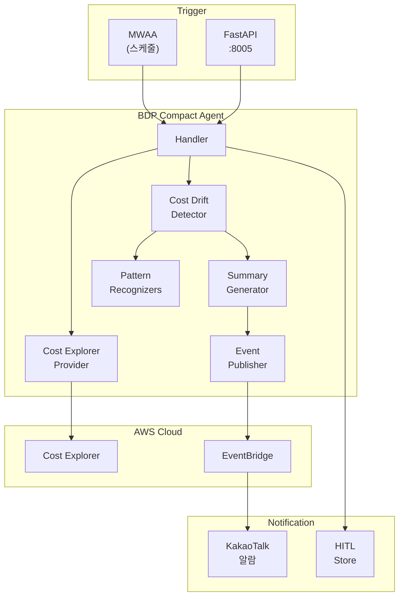
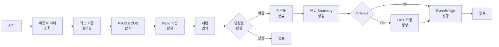

# BDP Compact Agent - 아키텍처

## 시스템 구성



## 탐지 플로우



## 계정 설정

### Lambda 실행 역할 권한

Lambda 실행 역할에 Cost Explorer 읽기 권한이 필요합니다:

```json
{
  "Version": "2012-10-17",
  "Statement": [
    {
      "Effect": "Allow",
      "Action": [
        "ce:GetCostAndUsage",
        "ce:GetCostForecast"
      ],
      "Resource": "*"
    }
  ]
}
```

### 배포 구조

각 AWS 계정에 개별 Lambda가 배포됩니다:

```
Account A (111111111111)
├── Lambda: bdp-compact-agent
└── IAM Role: bdp-compact-execution-role
    └── Cost Explorer 읽기 권한

Account B (222222222222)
├── Lambda: bdp-compact-agent
└── IAM Role: bdp-compact-execution-role
    └── Cost Explorer 읽기 권한
```

> **참고**: Cross-account 권한 획득(STS AssumeRole)이 불필요합니다.
> 각 Lambda는 자체 계정의 Cost Explorer API에 직접 접근합니다.

## 환경 변수

### 핵심 설정

| 변수명 | 설명 | 기본값 |
|--------|------|--------|
| `BDP_PROVIDER` | Provider 타입 (real/localstack/mock) | `mock` |
| `BDP_ACCOUNT_NAME` | 계정 식별 이름 (로그/알람용) | `default` |
| `BDP_SENSITIVITY` | 탐지 민감도 (0.0-1.0) | `0.7` |
| `BDP_CURRENCY` | 통화 단위 (KRW/USD) | `KRW` |
| `BDP_MIN_COST_THRESHOLD` | 최소 비용 임계값 | `10000` |
| `BDP_HITL_ON_CRITICAL` | Critical시 HITL 요청 생성 | `true` |

### 패턴 인식 설정

| 변수명 | 설명 | 기본값 |
|--------|------|--------|
| `BDP_PATTERN_RECOGNITION` | 패턴 인식 활성화 | `true` |
| `BDP_PATTERN_MODE` | 모드 (shadow/active) | `active` |
| `BDP_PATTERN_MAX_ADJUSTMENT` | 최대 신뢰도 조정폭 | `0.4` |

### EventBridge 설정

| 변수명 | 설명 | 기본값 |
|--------|------|--------|
| `EVENT_PROVIDER` | Event Provider (real/mock) | `mock` |
| `EVENT_BUS` | EventBridge 버스 이름 | `cd1-agent-events` |
| `AWS_REGION` | AWS 리전 | `ap-northeast-2` |

### HITL 설정

| 변수명 | 설명 | 기본값 |
|--------|------|--------|
| `RDS_PROVIDER` | RDS Provider (real/mock) | `mock` |

### LocalStack 설정 (테스트용)

| 변수명 | 설명 | 기본값 |
|--------|------|--------|
| `LOCALSTACK_ENDPOINT` | LocalStack 엔드포인트 | `http://localhost:4566` |
