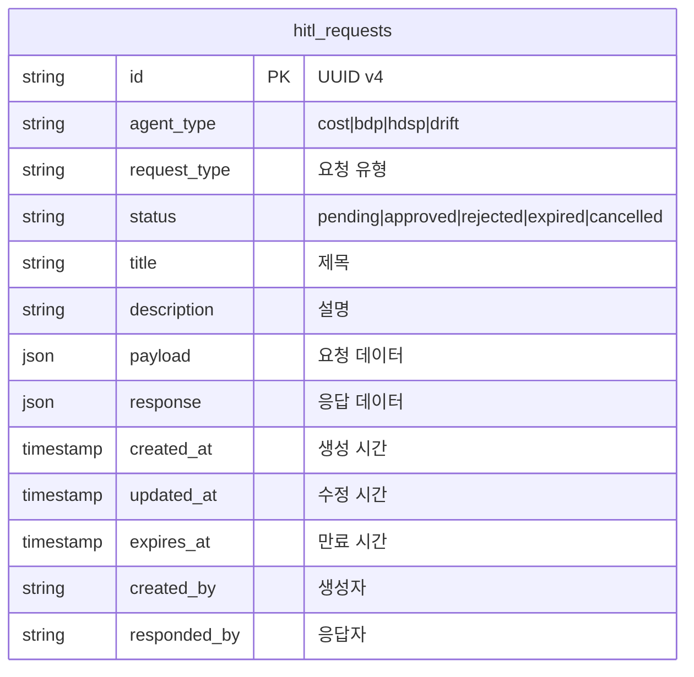
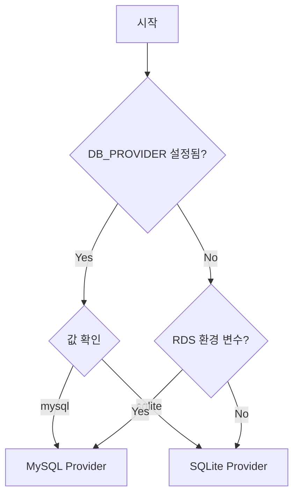

# BDP Compact Agent - HITL 데이터베이스 스키마

## 개요

HITL (Human-in-the-Loop) 요청을 저장하기 위한 데이터베이스 스키마입니다.

- **스키마 버전**: 1.0.0
- **지원 데이터베이스**: MySQL 8.0+, SQLite 3.35+
- **스키마 파일 위치**: `/schemas/` 디렉토리

```
schemas/
├── hitl_mysql.sql   # MySQL/Amazon RDS용
└── hitl_sqlite.sql  # SQLite용 (Public Network)
```

## 테이블 구조

### hitl_requests



### 필드 정의

| 필드 | MySQL 타입 | SQLite 타입 | 제약 | 설명 |
|------|-----------|-------------|------|------|
| `id` | VARCHAR(36) | TEXT | PK, UUID v4 | 요청 고유 식별자 |
| `agent_type` | ENUM | TEXT | NOT NULL, CHECK | 에이전트 유형 (`cost`, `bdp`, `hdsp`, `drift`) |
| `request_type` | VARCHAR(50) | TEXT | NOT NULL | HITL 요청 유형 |
| `status` | ENUM | TEXT | DEFAULT 'pending' | 요청 상태 |
| `title` | VARCHAR(255) | TEXT | NOT NULL | 사람이 읽을 수 있는 제목 |
| `description` | TEXT | TEXT | - | 요청 상세 설명 |
| `payload` | JSON | TEXT | NOT NULL, json_valid | 에이전트별 요청 데이터 |
| `response` | JSON | TEXT | json_valid | 승인/거절 후 응답 데이터 |
| `created_at` | TIMESTAMP | TEXT | DEFAULT NOW | 요청 생성 시간 (UTC) |
| `updated_at` | TIMESTAMP | TEXT | DEFAULT NOW | 마지막 수정 시간 (UTC) |
| `expires_at` | TIMESTAMP | TEXT | NOT NULL | 요청 만료 시간 (UTC) |
| `created_by` | VARCHAR(100) | TEXT | - | 요청 생성자 (시스템/사용자) |
| `responded_by` | VARCHAR(100) | TEXT | - | 응답자 |

### 상태 값 (status)

| 값 | 설명 |
|----|------|
| `pending` | 대기 중 - 응답 필요 |
| `approved` | 승인됨 |
| `rejected` | 거절됨 |
| `expired` | 만료됨 - 응답 기한 초과 |
| `cancelled` | 취소됨 |

### 인덱스

| 인덱스 | 컬럼 | 용도 |
|--------|------|------|
| `idx_hitl_status` | status | 상태별 조회 |
| `idx_hitl_agent_status` | agent_type, status | 에이전트별 대기 요청 조회 |
| `idx_hitl_expires` | expires_at | 만료 처리 스케줄러 |
| `idx_hitl_created_at` | created_at | 시간순 정렬 |

## MySQL vs SQLite 비교

| 항목 | MySQL (RDS) | SQLite |
|------|-------------|--------|
| **용도** | 프로덕션 (AWS 환경) | Public Network / 개발 |
| **JSON 타입** | 네이티브 JSON | TEXT + json_valid() |
| **ENUM 타입** | 네이티브 ENUM | TEXT + CHECK |
| **타임스탬프** | TIMESTAMP | TEXT (ISO8601) |
| **자동 업데이트** | ON UPDATE CURRENT_TIMESTAMP | TRIGGER |
| **만료 처리** | EVENT 스케줄러 (옵션) | 애플리케이션 레벨 |
| **문자셋** | utf8mb4_unicode_ci | UTF-8 (기본) |

### 타임스탬프 형식

- **MySQL**: `2024-01-15 10:30:00` (TIMESTAMP)
- **SQLite**: `2024-01-15T10:30:00.000Z` (ISO8601 TEXT)

## 환경별 사용 가이드

### AWS 환경 (MySQL/RDS)

```bash
# 환경 변수 설정
export DB_PROVIDER=mysql
export RDS_HOST=your-rds-endpoint.amazonaws.com
export RDS_PORT=3306
export RDS_DATABASE=cd1_agent
export RDS_USERNAME=admin
export RDS_PASSWORD=your-password
```

스키마 적용:

```bash
mysql -h $RDS_HOST -u $RDS_USERNAME -p$RDS_PASSWORD $RDS_DATABASE < schemas/hitl_mysql.sql
```

### Public Network 환경 (SQLite)

```bash
# 환경 변수 설정
export DB_PROVIDER=sqlite
export SQLITE_DB_PATH=/path/to/hitl.db
```

스키마 적용:

```bash
sqlite3 $SQLITE_DB_PATH < schemas/hitl_sqlite.sql
```

### Provider 선택 로직



## 쿼리 예시

### 대기 중인 요청 조회

```sql
-- MySQL
SELECT * FROM hitl_requests
WHERE status = 'pending'
  AND expires_at > NOW()
ORDER BY created_at DESC;

-- SQLite
SELECT * FROM hitl_requests
WHERE status = 'pending'
  AND expires_at > datetime('now')
ORDER BY created_at DESC;
```

### 특정 에이전트의 요청 조회

```sql
SELECT * FROM hitl_requests
WHERE agent_type = 'bdp'
  AND status = 'pending';
```

### 요청 응답 처리

```sql
-- MySQL
UPDATE hitl_requests
SET status = 'approved',
    response = '{"action": "investigate"}',
    responded_by = 'operator@example.com'
WHERE id = 'uuid-here';

-- SQLite (updated_at은 트리거로 자동 갱신)
UPDATE hitl_requests
SET status = 'approved',
    response = '{"action": "investigate"}',
    responded_by = 'operator@example.com'
WHERE id = 'uuid-here';
```

### 만료된 요청 처리

```sql
-- MySQL
UPDATE hitl_requests
SET status = 'expired'
WHERE status = 'pending'
  AND expires_at < NOW();

-- SQLite
UPDATE hitl_requests
SET status = 'expired'
WHERE status = 'pending'
  AND expires_at < datetime('now');
```

## 마이그레이션

### 버전 관리

스키마 변경 시 버전을 업데이트하고 마이그레이션 스크립트를 별도로 관리합니다:

```
schemas/
├── hitl_mysql.sql      # 현재 버전 (1.0.0)
├── hitl_sqlite.sql     # 현재 버전 (1.0.0)
└── migrations/
    └── v1.0.0/         # 버전별 마이그레이션 (필요시)
```

### 주의사항

1. **프로덕션 환경**: 스키마 변경 전 반드시 백업 수행
2. **인덱스 추가**: 대용량 테이블에서는 온라인 DDL 사용 권장
3. **JSON 필드**: 조회 성능을 위해 자주 사용하는 키는 별도 컬럼으로 분리 고려

## 관련 문서

- [HITL 연동 가이드](./hitl.md) - HITL 요청 생성 및 응답 처리
- [EventBridge 연동](./eventbridge.md) - 이벤트 발행 구조
